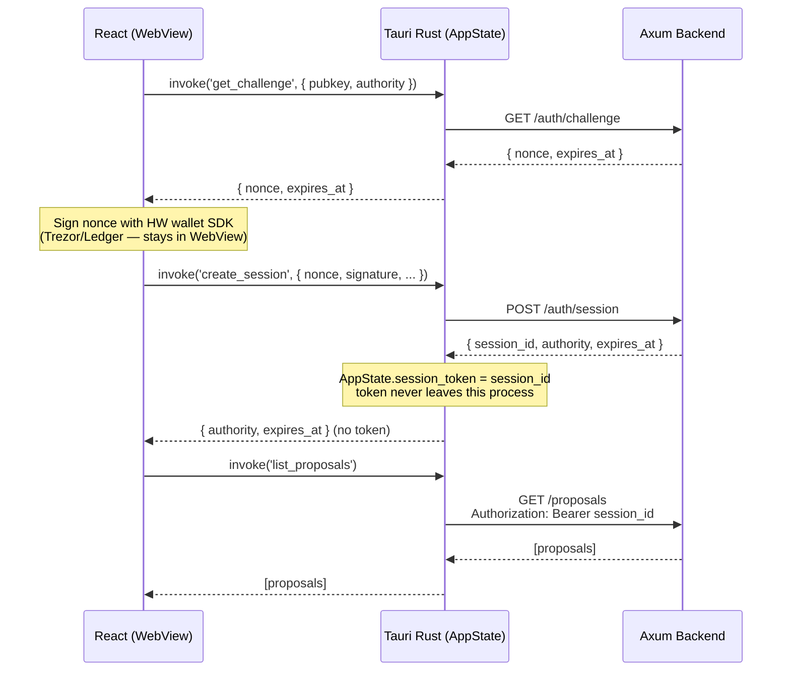

# POC 2 Findings — Tauri Desktop App & Wallet Integration

> **Post-discovery note (2026-04-17).** The hardware-wallet integration conclusions here (WebView-hosted JS SDKs such as Trezor Connect / Ledger Connect Kit) were **superseded** in POC-5. The production implementation is a Rust-native integration (`desktop-app/src-tauri/src/infrastructure/hw_wallet/`) driven by `hwi-rs` + `trezor-client`, chosen for SPS-65 sighash compatibility and on-device display guarantees. See [`06-hardware-wallet-architecture.md`](./06-hardware-wallet-architecture.md), [`07-hardware-wallet-library-analysis.md`](./07-hardware-wallet-library-analysis.md), and [`16-poc5-trezor-findings.md`](./16-poc5-trezor-findings.md). The stack / IPC / session-auth findings in §1–§3 below are still current and remain the basis for ADR-005 and the `secure_storage` module.

## Overview

This document captures findings from POC 2: validating the desktop app stack (Tauri + React + Rust) and identifying the correct architecture for frontend-to-backend communication in the context of a hardware wallet signing application.

---

## 1. Stack Validation

The chosen stack is **Tauri 2 + React + Rust**. Key properties:

- React runs inside a **WebView** (the UI layer).
- Rust runs as a **native process** alongside the WebView (the Tauri shell).
- The two communicate via **IPC** using `invoke()` / `#[tauri::command]`.
- The app ships as a single native binary — no separate server, no browser dependency.

This setup is well-suited for a signing application because the native Rust process can hold sensitive state (session tokens, signing keys) that the WebView never touches.

---

## 2. Key Decision — Where Do Backend Calls Live?

The central architectural question for the desktop app is: **should React call the Axum backend directly, or should it go through the Tauri Rust layer?**

### Option A — React → HTTP → Backend (direct)

```
React (WebView)  ──fetch()──>  Axum Backend (:3000)
```

| Pros | Cons |
|------|------|
| Simple, familiar pattern | Backend exposed as an open HTTP service |
| No extra Rust code | CORS configuration required |
| | Session token lives in JavaScript (WebView memory) |
| | Frontend directly touches the network |

### Option B — React → IPC → Tauri Rust → HTTP → Backend (recommended)

```
React (WebView)  ──invoke()──>  Tauri Rust  ──reqwest──>  Axum Backend (:3000)
```

| Pros | Cons |
|------|------|
| Session token never leaves the Rust process | Slightly more Rust boilerplate |
| No CORS — backend only accepts local Rust connections | |
| Crypto and signing logic co-located in Rust | |
| Frontend calls named commands, not arbitrary URLs | |
| Aligns with signer safety principles | |

### Decision: Option B

Option B is the right choice for this project because:

- **Signing already lives in Rust.** Sighash computation, signature verification, and key operations belong in the native layer — not in a WebView.
- **Session tokens stay in Rust.** The bearer token is stored in `AppState` and injected into every `reqwest` call internally. React receives only session metadata (`authority`, `expires_at`) — never the token itself.
- **The backend stays private.** Axum only needs to accept connections from the local Rust process, not expose itself as a public HTTP service.
- **Semantic commands over open proxy.** The Tauri layer exposes named, typed commands (`list_proposals`, `create_session`). React cannot call arbitrary backend endpoints — only what is explicitly declared.

---

## 3. IPC Pattern — Boilerplate Example

The following diagram shows how a frontend action flows through the full stack using Option B, as implemented in the boilerplate.

```
┌─────────────────────────────────────────────────────────────────────────┐
│  WebView (React)                                                         │
│                                                                          │
│  const result = await invoke('greet', { name: 'Alice' })                 │
│                          │                                               │
└──────────────────────────┼───────────────────────────────────────────────┘
                           │  Tauri IPC (invoke / tauri-bridge.ts)
┌──────────────────────────┼───────────────────────────────────────────────┐
│  Tauri Rust Process      │                                               │
│                          ▼                                               │
│  #[tauri::command]                                                       │
│  async fn greet(name: String) -> String {                                │
│      format!("Hello, {}! You've been greeted from Rust!", name)          │
│  }                                                                       │
│                                                                          │
│  — For authenticated commands:                                           │
│                                                                          │
│  #[tauri::command]                                                       │
│  async fn list_proposals(state: State<AppState>, ...) -> Result<...> {   │
│      let token = state.session_token.lock().unwrap().clone();  ← token   │
│      reqwest::Client::new()                                              │
│          .get(".../proposals")                                           │
│          .bearer_auth(token)   ← injected here, never in JS             │
│          .send().await                                                   │
│  }                                                                       │
│                          │                                               │
└──────────────────────────┼───────────────────────────────────────────────┘
                           │  HTTP / reqwest (local only)
┌──────────────────────────┼───────────────────────────────────────────────┐
│  Axum Backend (:3000)    │                                               │
│                          ▼                                               │
│  GET /api/v1/proposals                                                   │
│  Authorization: Bearer <token>                                           │
│                                                                          │
└─────────────────────────────────────────────────────────────────────────┘
```

### Auth flow detail

The session token never crosses the IPC boundary back to React. `create_session` stores it in `AppState` and returns only `SessionInfo`:



> **Note:** Hardware wallet SDKs (Trezor Connect, Ledger WebHID) run in the WebView because they rely on browser APIs. The nonce signature produced by the wallet is passed to `create_session` via IPC — the session token it produces never returns to the WebView.

---

## 4. Boilerplate Structure

The current boilerplate demonstrates the pattern with a minimal working example:

| File | Role |
|------|------|
| `src-tauri/src/main.rs` | `AppState`, `greet` hello world, `create_session` / `list_proposals` as pattern examples |
| `src/api/tauri-bridge.ts` | Thin `invoke()` wrapper that normalises results into `ApiResult<T>` |
| `src/App.tsx` | React hello world — calls `invoke('greet')` directly |

The remaining API and hook files (`auth.ts`, `proposals.ts`, `useAuth.ts`) show how the pattern extends to the full auth and proposal flows, with `TODO` markers where the hardware wallet signing step connects.
