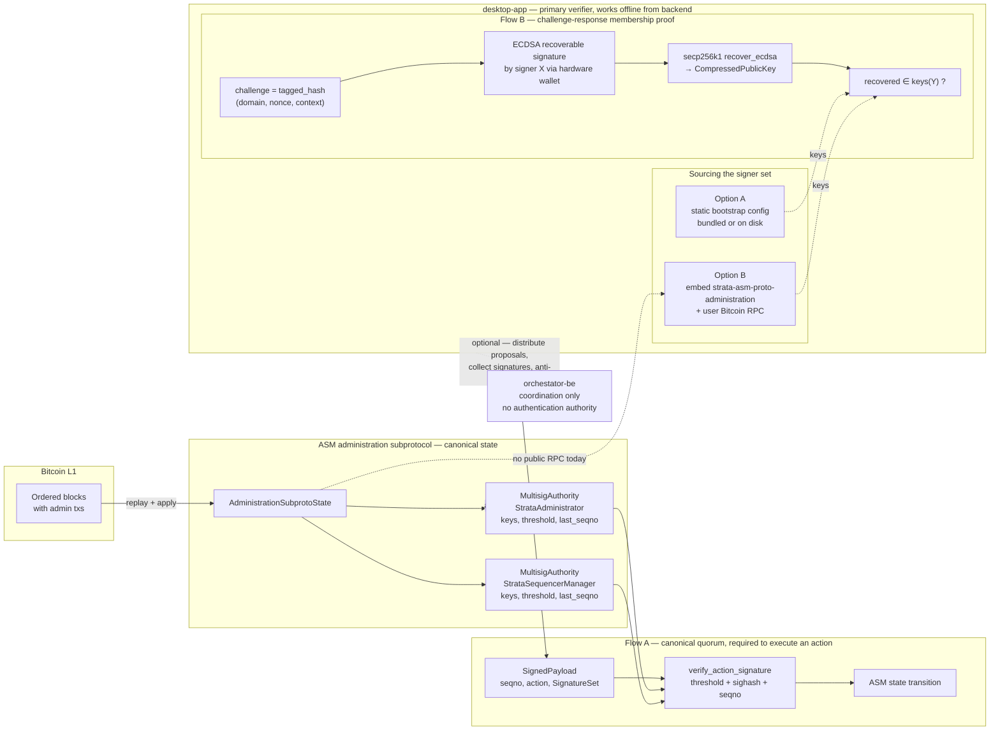

# 13 — Authority Verification Findings

> **Status:** Complete
> **Scope:** Research on whether, and how, the application can determine that a given address/key X belongs to a multisig authority Y in the upstream Alpen/Strata protocol, with particular focus on challenge-response (individual membership proof) flows.
> **Sources pinned:** `alpenlabs/asm` rev `a8559d3` (tag `v0.1-alpha.5`) and `alpenlabs/strata-common` tag `v0.1.0-alpha-rc16` (rev `a0c3466`), matching `Cargo.lock` of this workspace.

---

## 1. Research question

> Given an address/public key `X` held by a signer, how can the application determine that `X` is part of the multisig authority `Y` (e.g. Strata Administrator, Strata Sequencer Manager)? Can this be proven via a challenge-response flow where `X` signs an arbitrary message, or only via the canonical on-chain quorum verification?

Two verification paths are analysed side by side:

1. **Canonical quorum verification** — the only path the protocol itself recognises to execute an authority action.
2. **Individual membership proof via challenge-response** — an off-chain, application-level check to assert that `X` controls one of the keys currently configured for role `Y`.

---

## 2. Executive summary

- The canonical source of authority membership is the upstream type `AdministrationSubprotoState`: a list of `MultisigAuthority` values, each carrying a `Role`, a `ThresholdConfig { keys: Vec<CompressedPublicKey>, threshold: NonZero<u8> }`, and a `last_seqno`. (`crates/subprotocols/admin/src/state.rs:16-40`; `crates/subprotocols/admin/src/authority.rs:24-31`.)
- The only upstream verification API related to authority is `MultisigAuthority::verify_action_signature`, which is a **quorum** check (ECDSA, threshold met, signatures valid on an SPS-65 sighash). It does not answer the question "is X a member of Y?" in isolation. (`crates/subprotocols/admin/src/authority.rs:66-97`.)
- Individual membership verification by challenge-response **is technically possible today**, reusing the ECDSA recoverable primitives already used for threshold verification, but **no dedicated helper is shipped upstream** that takes `(pubkey, message, signature)` on its own. The application would have to implement a small wrapper, following the same `secp256k1::ecdsa::RecoverableSignature` path already present in `strata-crypto`. (`crates/crypto/src/threshold_signature/indexed/verification/ecdsa.rs:44-96`.)
- A challenge-response proof is strong enough for **desktop-side authentication** (wallet discovery, role-based UI gating, authority selection at sign time) and, optionally, for backend anti-abuse checks layered on top. It is **not** sufficient, by itself, to execute a governance action — that always requires an SPS-65 tagged quorum payload verified on-chain by the ASM.
- The desktop app must remain operational without the coordination backend (manual fallback requirement, `AGENTS.md`). This places the membership verifier **primarily on the desktop**, not on the backend, and rules out relying on a backend-published signer set as the only source. Two standalone sourcing options are viable today: **(A)** static bootstrap configuration bundled with or loaded by the desktop, and **(B)** embedding the administration subprotocol (`strata-asm-proto-administration`) inside the desktop against a user-configured Bitcoin RPC.
- Three practical risks apply to any challenge-response design: replay (use a fresh nonce), domain separation (tag the challenge so a signature cannot be reused for a real governance action), and key-set rotation (membership changes without warning — the application must re-query the canonical state).
- The upstream readiness gaps captured in [`12-upstream-readiness-findings.md`](./12-upstream-readiness-findings.md) and [`08-alpen-crate-prd-coverage.md`](./08-alpen-crate-prd-coverage.md) remain: 2 of the 5 PRD roles are implemented, there is no RPC to fetch `AdministrationSubprotoState`, and the `strata-asm-proto-administration` crate exists upstream (`crates/subprotocols/admin/Cargo.toml:2`) but is not yet adopted in this workspace.

---

## 3. Verification of prior findings

All eight claims from the earlier investigation were re-verified against the pinned upstream revisions and **none were invalidated**. The authoritative data points that matter for the decision in §7 are:

- **Authority storage.** `AdministrationSubprotoState` holds `Vec<MultisigAuthority>`, each with a `ThresholdConfig { keys: Vec<CompressedPublicKey>, threshold }` and a `last_seqno` (`crates/subprotocols/admin/src/state.rs:15-40`; `crates/subprotocols/admin/src/authority.rs:23-31`).
- **Roles available today.** Only `StrataAdministrator` and `StrataSequencerManager` (`crates/params/src/subprotocols/admin.rs:38-59`). The other three PRD authorities are absent upstream — see [`08-alpen-crate-prd-coverage.md:103-110`](./08-alpen-crate-prd-coverage.md).
- **Verification API shipped.** Only the quorum path `MultisigAuthority::verify_action_signature(payload, max_seqno_gap) -> Result<SeqNoToken, _>` (`crates/subprotocols/admin/src/authority.rs:66-97`). There is no individual-membership predicate (`is_member`, `is_authorized`, `verify_signature`) in `strata-common/crates/crypto` nor in any `strata-asm-*` crate.
- **Membership is a data-structure lookup.** `state.authority(role)` returns `Option<&MultisigAuthority>` (`state.rs:69-71`); the manual check is `authority.config().keys().contains(&x_pubkey)`.
- **No RPC for the state.** The public RPC trait exposes only `getAssignments`, `getDeposits`, `getStatus`, `getAsmProof`, `getMohoProof` (`crates/rpc/src/traits.rs:1-32`).
- **`strata-asm-proto-administration` not adopted.** The crate exists upstream (`crates/subprotocols/admin/Cargo.toml:2`) but `Cargo.toml:10-13` in this workspace does not depend on it.

---

## 4. What "authority" is, in code

An authority in the ASM is a `MultisigAuthority` — a `Role`, a `ThresholdConfig { keys, threshold }`, and a replay-protection `last_seqno`. All authorities live inside `AdministrationSubprotoState`, the canonical on-chain state produced by the ASM from Bitcoin (file references in §3 and §9).

The membership question reduces to a data-structure lookup:

```rust
let authority = state.authority(role)?;          // Option<&MultisigAuthority>
let keys = authority.config().keys();            // &[CompressedPublicKey]
let is_member = keys.contains(&x_pubkey);
```

This presumes the caller already has an authentic `AdministrationSubprotoState`. Because there is no public RPC for it today, the caller must either embed the administration subprotocol (`strata-asm-proto-administration`) and replay Bitcoin, or rely on a trusted bootstrap config — see §7.2.

The only verification API shipped upstream is the **quorum path** `MultisigAuthority::verify_action_signature`. It checks threshold + SPS-65 sighash + seqno gap for an entire signed payload; it does not answer "is X a member of Y?" in isolation and is only used to execute governance actions.

---

## 5. Challenge-response membership proof

### 5.1 The flow

1. The verifier issues `challenge = tagged_hash(domain, nonce, context)`.
2. The signer signs `challenge` with their private key. The existing hardware-wallet BIP-137 format works directly — the verification code already normalises header bytes (`crates/crypto/src/threshold_signature/indexed/verification/ecdsa.rs:23-33`).
3. The verifier recovers the pubkey with `secp256k1::recover_ecdsa`, serialises it as a `CompressedPublicKey`, and checks `config.keys().contains(&recovered)`.

**No upstream helper ships this.** The three recovery lines already live inside `verify_ecdsa_signatures` (`ecdsa.rs:70-92`); the app just needs to extract them into an individual-verification wrapper.

ECDSA is the right primitive here because authority keys are stored as 33-byte compressed secp256k1 points. A Schnorr/BIP-340 path is possible but would need an adapter to reconcile x-only pubkeys with the canonical `CompressedPublicKey` form.

### 5.2 What this proves — and what it doesn't

A successful challenge-response proves that the holder of `X` controls the private key of one of the pubkeys currently in `config.keys()` of role `Y` at the moment the state was read.

It does **not** prove that the holder can execute a governance action alone (that still requires quorum), nor that `X` will remain a member later (rotations happen), nor that the message was meant for this app (unless a domain-separating tag is used — §7.4).

**Valid uses:**

- **Desktop (primary)** — wallet discovery ("your hardware key belongs to Strata Administrator"), role-based UI gating, authority selection before a sign request. The desktop runs the full loop against its own copy of the signer set, no network required.
- **Backend (optional, layered)** — anti-abuse checks on write endpoints like "create proposal". Strictly additive to the desktop-side check.

**Invalid uses:** executing a governance action, bypassing SPS-65 sighash/seqno/threshold, any on-chain decision.

---

## 6. Diagram



Reading the diagram:

- **Flow A (canonical quorum)** is the only path the ASM recognises for executing an action. It requires the full SPS-65 payload and threshold met, and is terminated by a state transition inside the ASM.
- **Flow B (challenge-response membership)** lives entirely inside the desktop: a single signer proves control of one key currently listed in `ThresholdConfig::keys` for a role. It never mutates ASM state and does not depend on the backend.
- **Sourcing the signer set** has two viable options today: **A** static bootstrap config shipped with the desktop, or **B** embedding `strata-asm-proto-administration` and replaying Bitcoin locally. The dashed line from `AdministrationSubprotoState` to Option B marks the current gap: there is no public RPC to fetch this state, so Option B needs its own Bitcoin data source.
- **The backend** is a coordinator, not an authenticator. Its link to the desktop is dashed and optional: it distributes proposals, aggregates signatures, and can layer its own anti-abuse checks, but the desktop must remain fully usable when the backend is absent.

---

## 7. Implications for Alpen Multisig

### 7.1 The desktop is the primary verifier

`AGENTS.md` fixes two architectural constraints that decide where authority verification must live:

- **"Backend is coordination only"** — the coordination backend must not re-implement protocol rules or act as an authentication authority for governance actions.
- **"Manual fallback"** — users must be able to aggregate signatures and broadcast without the backend.

Together, these put the challenge-response verifier **on the desktop**. On wallet connect, the desktop derives the signer's `CompressedPublicKey`, runs Flow B against its own copy of the signer set, and from there drives: role display ("your key belongs to the Strata Administrator set"), UI gating, and authority selection at sign time. No network call is required for this to work.

### 7.2 Sourcing the signer set on the desktop

The membership check needs a trusted view of `state.authority(role).config().keys()`. Because the desktop must work offline from the backend, only two options are viable today:

- **Option A — static bootstrap config.** The desktop ships with the initial signer sets (per role) as part of its configuration: bundled into the binary, or read from a config file on first run. Pros: simplest, no external dependency, fully offline. Cons: becomes stale when on-chain membership rotates; requires a release/config update to refresh.
- **Option B — embed the administration subprotocol.** `src-tauri` adopts `strata-asm-proto-administration` and runs the administration STF locally against a user-configured Bitcoin RPC (either the user's own `bitcoind` or a public Bitcoin RPC provider). Pros: keeps pace with on-chain rotations automatically. Cons: heavier — upstream crate not yet adopted in this workspace (`Cargo.toml:10-13`), and requires configuring a Bitcoin data source.
- **Option C (rejected) — backend publishes the set.** Having the backend read the state and expose it via an endpoint to the desktop would violate the offline-without-backend constraint, so it is not viable as the sole source. A hybrid where the backend only mirrors the set for anti-abuse at its own endpoints is acceptable, but the desktop still needs A or B as its authoritative source.

**Recommendation while research is open.** Start with **Option A** for the authentication flow — it is enough to build and exercise end-to-end the UX (wallet connect, membership display, authority selection, local gating) without taking a dependency on a Bitcoin node. Plan migration to **Option B** when the product needs live rotation handling and when upstream adoption of `strata-asm-proto-administration` is comfortable.

### 7.3 The backend is a coordinator, not an authenticator

The coordination backend can layer its own membership check at its write endpoints as an **anti-abuse measure** (e.g. drop a "create proposal" request whose caller's signed challenge does not recover to a key in the relevant role), but:

- This is strictly additive to the desktop-side check, not a replacement for it.
- The backend must not be the single source of truth for "who is an authority".
- If the backend is unreachable, the user can still use the desktop to produce, aggregate and broadcast SPS-65 payloads manually.

If the backend opts into this check, it needs its own sourcing path (A or B) independently of the desktop — sharing the bootstrap config file across deployments is an acceptable shortcut while Option B is not yet adopted.

### 7.4 Replay, domain separation, key-set rotation

The three challenge-response risks carry over unchanged regardless of where the verifier lives:

- **Replay.** The challenge must include a fresh, short-lived nonce (server-issued if the verifier is the backend, desktop-issued if local), and the verifier must reject reuse.
- **Domain separation.** The challenge must be a tagged hash with a domain string disjoint from every `AdminTxType::sighash_tag` used by SPS-65 (tags listed at [`08-alpen-crate-prd-coverage.md:30-40`](./08-alpen-crate-prd-coverage.md)). A safe shape is `SHA256(SHA256("alpen-multisig/auth-challenge") || nonce || context)`. This prevents an auth signature from being reusable as a governance signature.
- **Key-set rotation.** Authority keys change via `ThresholdConfigUpdate` (`crates/crypto/src/threshold_signature/indexed/config.rs:260-321`). A successful challenge-response at time `t0` carries no guarantee at time `t1 > t0`. Any membership-gated decision should be refreshed against the current state; Option A must publish a config update, Option B will pick it up on the next Bitcoin block.

---

## 8. Confirmed upstream gaps

These are restatements of gaps captured previously, verified again in this pass:

- **Two of five PRD roles implemented.** Only `StrataAdministrator` and `StrataSequencerManager` exist upstream (`crates/params/src/subprotocols/admin.rs:45-59`). Alpen Administrator, Security Council, and Payout Administrator are absent. See [`08-alpen-crate-prd-coverage.md:103-110`](./08-alpen-crate-prd-coverage.md) and [`12-upstream-readiness-findings.md`](./12-upstream-readiness-findings.md) §1.
- **No RPC for `AdministrationSubprotoState`.** The public RPC trait exposes only assignments, deposits, status, ASM proof, and Moho proof (`crates/rpc/src/traits.rs:1-32`). An application that needs the current signer sets has no supported client path today.
- **`strata-asm-proto-administration` not adopted in this workspace.** The upstream crate is published under that name (`crates/subprotocols/admin/Cargo.toml:2`), but `Cargo.toml` in this repository does not depend on it (see `Cargo.toml:10-13` for the current Alpen pin list). Adopting it would give the application direct access to `AdministrationSubprotoState`, `MultisigAuthority`, and the apply/verify APIs without re-implementing the administration STF.
- **No individual signature helper.** As noted in §5.2, `strata-crypto` provides only threshold ECDSA verification and x-only Schnorr verification. A small application-side wrapper over `secp256k1::ecdsa::RecoverableSignature::recover_ecdsa` is needed for individual ECDSA membership proofs.

---

## 9. References

### This workspace

- `Cargo.toml:10-20` — Alpen and strata-common pins; SSZ crate pin.
- `docs/2-discovery/08-alpen-crate-prd-coverage.md:30-40,103-110,135` — AdminTxType sighash tags, role-coverage gap table, crates-to-add row.
- `docs/2-discovery/10-asm-bitcoin-state-model.md:259-302` — three signature layers and hardware wallet scope.
- `docs/2-discovery/11-asm-repo-migration.md:1-60` — context for the migration to `alpenlabs/asm`.
- `docs/2-discovery/12-upstream-readiness-findings.md:9-30` — upstream readiness executive findings.

### `alpenlabs/asm` rev `a8559d3` (`~/.cargo/git/checkouts/asm-d60519b04c8576c0/a8559d3/`)

- `crates/params/src/subprotocols/admin.rs:9-36` — `AdministrationInitConfig`.
- `crates/params/src/subprotocols/admin.rs:38-59` — `Role` enum and its variants.
- `crates/subprotocols/admin/src/state.rs:15-40` — `AdministrationSubprotoState` fields.
- `crates/subprotocols/admin/src/state.rs:69-76` — `authority` / `authority_mut`.
- `crates/subprotocols/admin/src/authority.rs:18-19` — `SeqNoToken`.
- `crates/subprotocols/admin/src/authority.rs:23-31` — `MultisigAuthority` fields.
- `crates/subprotocols/admin/src/authority.rs:52-59` — `config` / `config_mut`.
- `crates/subprotocols/admin/src/authority.rs:66-97` — `verify_action_signature`.
- `crates/subprotocols/admin/Cargo.toml:2` — package name `strata-asm-proto-administration`.
- `crates/txs/admin/src/parser.rs:13-21` — `SignedPayload` structure.
- `crates/txs/admin/src/actions/sighash.rs:15-46` — `Sighash` trait and tagged hash.
- `crates/rpc/src/traits.rs:1-32` — public RPC trait, no administration method.

### `alpenlabs/strata-common` tag `v0.1.0-alpha-rc16` (`~/.cargo/git/checkouts/strata-common-e8492590f525284e/a0c3466/`)

- `crates/crypto/src/lib.rs:1-23` — module graph of `strata-crypto`.
- `crates/crypto/src/keys/compressed.rs:12-44` — `CompressedPublicKey` (33 bytes, SSZ-serialised).
- `crates/crypto/src/threshold_signature/mod.rs:1-13` — re-exports of the indexed module.
- `crates/crypto/src/threshold_signature/indexed/config.rs:33-39` — `ThresholdConfig` fields.
- `crates/crypto/src/threshold_signature/indexed/config.rs:140-251` — `ThresholdConfig::try_new`, `keys`, `threshold`, `apply_update`.
- `crates/crypto/src/threshold_signature/indexed/config.rs:260-321` — `ThresholdConfigUpdate`.
- `crates/crypto/src/threshold_signature/indexed/signature.rs:30-84` — `IndexedSignature` layout and accessors.
- `crates/crypto/src/threshold_signature/indexed/verification.rs:27-45` — `verify_threshold_signatures`.
- `crates/crypto/src/threshold_signature/indexed/verification/ecdsa.rs:23-33` — `normalize_recovery_id` (BIP-137 handling).
- `crates/crypto/src/threshold_signature/indexed/verification/ecdsa.rs:44-96` — `verify_ecdsa_signatures` (template for the individual helper proposed in §5.2).
- `crates/crypto/src/schnorr.rs:15-49` — `sign_schnorr_sig` / `verify_schnorr_sig` (alternative primitive; does not match `CompressedPublicKey` directly).
- `crates/crypto/src/hash.rs:6-47` — `raw`, `sha256_iter`, `sha256d` used by SPS-65 sighash.
