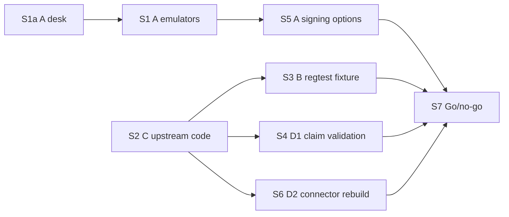

# Block Payouts — Spike Plan

> **Status:** S1a desk research recorded (2026-10-07). Remaining steps not started. Discovery material — not SSOT,
> not committed scope. Findings: [`22-block-payouts-spike-findings.md`](./22-block-payouts-spike-findings.md).
> **Goal:** evidence that produces a go/no-go, with blockers named, before full implementation of the Payout
> Administrator flow ([PRD §6](../0-prd/06-prd-hardware-signer-and-block-payouts-update.md)).
> **Upstream pin:** `strata-bridge` @ `3b69ece` (contains the connector, `AdminBurnTx` and the false claim reference;
> the admin leaf is identical at `70cc4e8`). `3b69ece` is the head of the unmerged draft
> [PR #800](https://github.com/alpenlabs/strata-bridge/pull/800); `main` @ `5d3c8dc` (checked 2026-10-05) has the same
> connector, leaf, `AdminBurnTx` and sighash, but not the false claim reference.

## What the spike validates

1. **A — Hardware signing:** whether payout-blocking transactions can be signed safely on hardware wallets, including
   what signers see on the device.
2. **B — End-to-end transaction:** whether we can build and broadcast a real block payout in our local environment.
3. **C — Upstream code:** whether we can integrate `strata-bridge` code into the app without dependency issues.
4. **D — Input data:** where the data comes from to construct each payout input.

Domain background: [`20-block-payouts-domain-overview.md`](./20-block-payouts-domain-overview.md).

## Technical context

Facts from `strata-bridge` @ `3b69ece` that shape the steps:

- **The `AdminBurn` leaf is not miniscript.** `threshold_multisig_script` ends in `<K> OP_EQUAL`
  ([`general.rs`](https://github.com/alpenlabs/strata-bridge/blob/3b69ece5068b76def66dda15ef6f4fa747087b54/crates/primitives/src/scripts/general.rs));
  miniscript `multi_a` ends in `OP_NUMEQUAL`.
- **Stock firmware cannot sign it** (S1a, 2026-10-07). Trezor core 2.12.5, including Safe 7, signs taproot by
  key-path only. Ledger Bitcoin app 2.5.1, with or without the miniscript line, cannot register this output: the
  leaf ends in `OP_EQUAL`, the N/N internal key is a raw aggregate that no derived key expression can produce, and
  the `UnstakingBurn` sibling (`sha256(h)`) fails the sanity check because it requires no signature.
  Detail and the disassembled script: [`22-block-payouts-spike-findings.md`](./22-block-payouts-spike-findings.md).
- **Upstream builds the transaction** with [`AdminBurnTx`](https://github.com/alpenlabs/strata-bridge/blob/3b69ece5068b76def66dda15ef6f4fa747087b54/crates/tx-graph/src/transactions/not_presigned.rs):
  one connector in input 0, version 3 (TRUC, 10,000 vB limit). PRD §6.4.2 needs several connectors per transaction.
- **Sighash is `TapSighashType::Default`** for every connector spend.
- **New verification work:** `verify_threshold` is ECDSA (`infrastructure/signing.rs`); admin signatures are Schnorr
  over a script-path sighash.
- **Fee inputs are covered:** key-path signing from the Admin Wallet already works on Ledger and Trezor.
- **The false claim reference is not on `main`.** `verify_contest` / `verify_ack` exist only in draft
  [PR #800](https://github.com/alpenlabs/strata-bridge/pull/800) ("[DO NOT MERGE]", opened for comments). They assume
  a flat operator list (`n_watchtowers = operators.len() - 1`).
- **Admin keys and threshold are bridge params.** On `main`, `[keys.admin]` (`pubkeys`, `threshold`) lives in the
  bridge `params.toml`
  ([`params.rs`](https://github.com/alpenlabs/strata-bridge/blob/5d3c8dc4bef3246b88b2aa0cdfbe857891422e03/crates/common/src/params.rs)),
  which is consensus-critical and fixed at genesis.
- **The operator set is a schedule on `main`.** Each operator has an activation and optional deactivation height; the
  N/N is a `CovenantId` (aggregate key + admin activation height) that changes when an operator exits
  ([`covenant.rs`](https://github.com/alpenlabs/strata-bridge/blob/5d3c8dc4bef3246b88b2aa0cdfbe857891422e03/crates/primitives/src/covenant.rs)).
- **New lifecycle paths on `main`:** safe-harbour sweep (`SweepTx`) races the payout, and `bridge-sm` rejects claims
  that confirm before their graph is signed.

## Tracks

### A — Hardware signing

- **S1a (done, desk):** stock Trezor (including Safe 7 at core 2.12.5) and stock Ledger (Bitcoin app through 2.5.1,
  with or without miniscript) cannot sign the `AdminBurn` leaf. Software signing can. See the findings doc.
- Confirm on emulators where signing fails: template parse, registration sanity, or `scriptPubKey` mismatch.
- Evaluate the signing options that remain (upstream script change, other HWI devices, requirement change).
- If any device can sign: physical-device run, recording what co-signers see (external fee input, unknown change
  address).
- Exit criterion is a signature that verifies against our own recomputed script-path sighash, not "the device signed".

**No-go if** no supported device can sign the leaf and no option is accepted.

### B — End-to-end transaction

- Build the connector directly in regtest with local keys (as upstream's connector test does); do not run the full
  bridge (`functional-tests` / `compose.yml` need FoundationDB, SP1, secret-service).
- Real shape: N `AdminBurn` inputs + Admin Wallet fee input(s) (key-path) + one change output. Decide version 2 vs. 3.
- Bar: `testmempoolaccept`, broadcast, mined.

**No-go if** `bitcoind` rejects a correctly built spend.

### C — Upstream code

Known collisions at `3b69ece`: `asm` @ `93b5ca8c` (ours `b84eb28`); strata-common `v0.4.0-rc.2` (ours
`v0.1.0-alpha-rc23`); `bitcoin-bosd` v0.12 (ours v0.11); `musig2` git fork with a `[patch]` not inherited by
dependents; unpinned `bitcoin-script`; toolchain `nightly-2026-05-01` (ours `nightly-2026-01-01`).

The gap is wider on `main` @ `5d3c8dc`: `asm` `v0.5.0-rc.1`, strata-common `v0.4.0` (plus `v0.4.0-rc.3` for
`strata-identifiers` via alpen), toolchain `nightly-2026-09-01`.

Needed surface: `threshold_multisig_script`, `ClaimPayoutConnector`, `AdminBurnTx`, `ContestProofConnector`,
`verify_contest`, `verify_ack`, `ClaimTx` / `ContestTx` output indices.

- Default: vendor that subset verbatim, with upstream tests and signet hex fixtures as differential tests.
- Alternative: git dependency, attempted once to measure the conflict cost.
- The source revision is an external input: `3b69ece` (draft PR #800) or a `main` commit once the false claim
  reference lands there.

**No-go** not expected; the cost of the chosen option must be named.

### D — Input data

**D1 — Which claims to block.** `verify_contest` / `verify_ack` offline on upstream's signet hex fixtures;
`GraphTxSource` over electrs (`blockchain.scripthash.get_history`) for regtest/production and over Esplora for signet;
operator-set config modelled on upstream's operator set schedule (operators active at the claim height), not a flat
list.

**D2 — How to rebuild each input.**

| Field | Source |
|---|---|
| Claim outpoint | Claim txid (user input) + `ClaimTx::PAYOUT_VOUT` |
| Amount | Chain (prevout) |
| N/N internal key | Bridge `params.toml` operator schedule — aggregate of the operators active at the claim height |
| Admin pubkeys (ordered) + threshold | Bridge `params.toml` `[keys.admin]` — order matters, the script does not sort |
| Unstaking image | Per operator stake (`KeyData.unstaking_image`, exchanged at setup); not on chain nor in params; needed as the sibling leaf hash in the control block — external input |

Self-check: the rebuilt connector's `script_pubkey` must equal the on-chain output at `ClaimTx::PAYOUT_VOUT`.

**No-go if** any field has no obtainable source.

## Execution sequence

One step per branch, cut from the latest `develop`. Every step adds its section to a single findings doc,
`docs/2-discovery/22-block-payouts-spike-findings.md` (opened by S1a), and updates the track
verdict here. Code is merged only when it will be reused (vendored subset, regtest fixture, validation adapters) and
then passes the full CI checklist. Throwaway probes stay on their branch.

| Step | Track | Branch | Depends on |
|---|---|---|---|
| S1a | A | docs only (this plan's findings doc) | — |
| S1 | A | `spike/block-payouts-a1-emulators` | — |
| S2 | C | `spike/block-payouts-c-strata-bridge` | — |
| S3 | B | `spike/block-payouts-b-regtest-fixture` | S2 |
| S4 | D1 | `spike/block-payouts-d1-claim-validation` | S2 |
| S5 | A | `spike/block-payouts-a2-signing-options` | S1, signing decision (external) |
| S6 | D2 | `spike/block-payouts-d2-connector-rebuild` | S2, signet connector parameters (external) |
| S7 | — | `docs/block-payouts-spike-verdict` | S3–S6 |

S1a is recorded. S1 and S2 start together. S1 does not wait on S1a; the desk verdict tells S1 which error to expect.

### S1a — Desk research: `AdminBurn` against current Trezor and Ledger apps

Docs only. No emulator and no code.

- Disassemble the claim payout connector (leaf 0, leaf 1, internal key, witness, sighash) at `3b69ece` and `main`
  @ `5d3c8dc`.
- Check production Trezor firmware, including Safe 7, and the Ledger Bitcoin app with and without miniscript.
- **Done when:** the findings doc states whether an admin can sign the leaf in software and on each device family,
  with the script hex and the firmware versions pinned. Recorded 2026-10-07: software yes; stock Trezor and stock
  Ledger no.

### S1 — Confirm the hardware signing finding on emulators

- Ledger on Speculos (`scripts/ledger-up.sh`), through the `ledger_bitcoin_client` path the app already uses.
  Ledger registers a descriptor template, not a script, and the on-chain connector has no descriptor. Build the real
  connector and a PSBT spending it, then submit the closest policies, one per blocker:
  1. Raw internal key or raw admin keys: expect the template parse error ("Expected /** or /<M;N>/* in key
     expression").
  2. Derived keys, `multi_a` leaf, `UnstakingBurn` as `sha256(h)`: expect `EC_REGISTER_WALLET_POLICY_NOT_SANE`.
  3. A registrable stand-in (derived keys, `multi_a`, a signed sibling): expect a `scriptPubKey` mismatch with the
     PSBT input, so the input is treated as external and is not signed.
- Trezor emulator (`scripts/trezor-up.sh`): confirm no script-path signing is available.
- **Done when:** the findings doc states, per device and per probe, what was submitted and the exact error or
  device behaviour, with logs. A result that differs from the expected outcome reopens S1a.

### S2 — Vendor or depend on `strata-bridge`

- Attempt the git dependency on `strata-bridge-tx-graph` @ `3b69ece` once; record every conflict. Repeat the
  conflict list against `main` so the cost of moving the pin is known.
- Vendor the Track C subset into a workspace crate with upstream tests (including the signet hex fixtures). Measure
  what it takes to pass `cargo fmt`, `cargo clippy --workspace --all-targets -- -D warnings` and our toolchain.
- **Done when:** the decision is recorded with its evidence and the chosen option builds with upstream tests green.

### S3 — Regtest block payout fixture

- In `e2e-tests/` (its harness starts `bitcoind` through `corepc-node`), fund N claim payout connectors with locally
  generated keys.
- Build N `AdminBurn` inputs + fee input from a test Admin Wallet + change; sign the admin leaf with software keys.
  Upstream's `admin_burn_payout` test in `tx-graph/src/game_graph.rs` is the single-input reference.
- Verify each signature against the recomputed script-path sighash; `testmempoolaccept`, broadcast, mine.
- **Done when:** the test passes in CI and the findings doc records the witness layout and the version decision.

### S4 — Claim validation

- Run `verify_contest` / `verify_ack` offline on the signet hex fixtures.
- Implement `GraphTxSource` over electrs and test it on regtest; add an Esplora source and validate both signet claims
  live.
- **Done when:** `f599a165…` gives no Ack and `eaf25a3e…` gives an Ack through a live source, and the electrs adapter
  returns correct outspends on regtest.

### S5 — Signing options and physical device

- With S1 evidence, evaluate the remaining options (upstream script change, other HWI devices, requirement change).
- If any device can sign, run it on a physical device and record what co-signers see.
- **Done when:** one option is chosen, or the track is closed as a named blocker.

### S6 — Connector reconstruction

- With the signet connector parameters (signet bridge `params.toml` and the unstaking image of each claim's stake),
  rebuild the claim payout connector for both signet claims and compare its `script_pubkey` with the chain.
- **Done when:** both match and the D2 table has a confirmed source per field, or a named blocker.

### S7 — Go/no-go

- Roll the track verdicts into one decision in the findings doc and in the Outcome section below.
- **Done when:** the go/no-go is recorded with its blockers.

## Inputs

- False claim report contract: [`07-supplementary-false-claim-reports.md`](../0-prd/07-supplementary-false-claim-reports.md).
- `ClaimPayoutConnector` unit test: [`claim_payout.rs` L296-314 @ `70cc4e8`](https://github.com/alpenlabs/strata-bridge/blob/70cc4e82d13c15285e4ade371499f0a6f31cd239/crates/connectors/src/claim_payout.rs#L296-L314).
- Reference implementation, `strata-bridge` @ `3b69ece` (draft [PR #800](https://github.com/alpenlabs/strata-bridge/pull/800)):
  [`verify_contest.rs`](https://github.com/alpenlabs/strata-bridge/blob/3b69ece5068b76def66dda15ef6f4fa747087b54/crates/tx-graph/src/verify_contest.rs#L210-L241),
  [`verify_ack.rs`](https://github.com/alpenlabs/strata-bridge/blob/3b69ece5068b76def66dda15ef6f4fa747087b54/crates/tx-graph/src/verify_ack.rs#L190-L217),
  [`VerifyParams`](https://github.com/alpenlabs/strata-bridge/blob/3b69ece5068b76def66dda15ef6f4fa747087b54/crates/tx-graph/src/verify_contest.rs#L24-L38),
  [`AdminBurnTx`](https://github.com/alpenlabs/strata-bridge/blob/3b69ece5068b76def66dda15ef6f4fa747087b54/crates/tx-graph/src/transactions/not_presigned.rs).
- `strata-bridge` `main` @ `5d3c8dc`:
  [`params.rs`](https://github.com/alpenlabs/strata-bridge/blob/5d3c8dc4bef3246b88b2aa0cdfbe857891422e03/crates/common/src/params.rs)
  (admin multisig, operator schedule),
  [`game_graph.rs`](https://github.com/alpenlabs/strata-bridge/blob/5d3c8dc4bef3246b88b2aa0cdfbe857891422e03/crates/tx-graph/src/game_graph.rs)
  (`KeyData`, `admin_burn_payout` test).
- Signet test claims:
  [`f599a165…`](https://mempool.space/signet/tx/f599a16569f0ad0fdafb4fa0dabcb4be4776447afe327a14deff63f0a41671e9)
  (operator 3, deposit 1, no Ack) and
  [`eaf25a3e…`](https://mempool.space/signet/tx/eaf25a3ef1a0ada03f8864dd65adb8367333ac050aedd2e4a2f835cc2b607716)
  (operator 2, deposit 0, with Ack).

## Outcome

One verdict per track (answer or named blocker), rolled up into a single go/no-go for full implementation.
