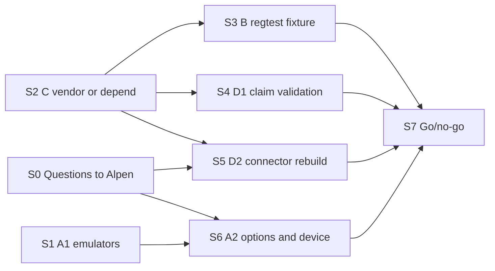

# Block Payouts — Spike Plan

> **Status:** Planned, not started. Discovery material — not SSOT, not committed scope.
> **Goal:** evidence that produces a go/no-go, with blockers named, before full implementation of the Payout
> Administrator flow ([PRD §6](../0-prd/06-prd-hardware-signer-and-block-payouts-update.md)).
> **Upstream pin used for this plan:** `strata-bridge` @ `3b69ece` (contains the connector, `AdminBurnTx` and the
> false claim reference; the admin leaf is identical at `70cc4e8`).

## Why a spike

Unlike the governance flow, a `block_payout` is **not** an admin-subprotocol action: no SSZ envelope, no OP_RETURN, no
ASM. It is a **pure Bitcoin spend** of the `AdminBurn` **taproot script-path** leaf of the `ClaimPayoutConnector`,
witnessed with Schnorr signatures indexed by key position. The signer set lives in the **bridge script on L1**, not in
ASM state — see [`20-block-payouts-domain-overview.md`](./20-block-payouts-domain-overview.md).

What carries over from governance: PSBT plumbing and **key-path** signing from the Admin Wallet on Ledger and Trezor
(commit funding, send). That covers the fee input. What is new: **script-path** signing of the connector inputs,
Schnorr verification against a BIP-341/342 script-path sighash, and the false claim validation.

## Scope communicated to Alpen

October 2026, reply on the delivery document. Tracks A–D below map one-to-one to it:

> The spike will validate whether payout-blocking transactions can be signed safely on hardware wallets (including what
> signers see on the device), whether we can build and broadcast a real end-to-end test transaction in our local
> environment, whether we can integrate Alpen's bridge code into our app without dependency issues, and where the data
> comes from to construct each payout input. The outcome is a clear go/no-go with blockers identified before we commit
> to full implementation.

## Desk findings before the spike starts

Reviewing the upstream code already answers part of the spike. These findings reshape the tracks below.

1. **The `AdminBurn` leaf is not miniscript.** `threshold_multisig_script` ends in `<K> OP_EQUAL`
   ([`general.rs` @ `3b69ece`](https://github.com/alpenlabs/strata-bridge/blob/3b69ece5068b76def66dda15ef6f4fa747087b54/crates/primitives/src/scripts/general.rs)),
   matching [PRD 04](../0-prd/04-relevant-block-payouts-transactions.md). Miniscript `multi_a` compiles to
   `<k> OP_NUMEQUAL`. Upstream tests pin this shape (`threshold_multisig_script_matches_spec_shape`), so it is deliberate.
2. **Ledger cannot express the connector as a wallet policy.** Per the
   [Ledger wallet policy docs](https://github.com/LedgerHQ/app-bitcoin-new/blob/master/doc/wallet.md) (BIP-388), each
   tap leaf must be `multi_a`, `sortedmulti_a` or valid taproot miniscript — the `OP_EQUAL` leaf is not. In addition,
   every key must be an `xpub` with a derivation (`@i/**`); the connector's internal key is the raw N/N key, which has no
   such form. The second point is high-confidence but must be confirmed on Speculos.
3. **Trezor signs taproot by key-path only.** Our adapter marks every taproot input `SPENDTAPROOT`
   (`desktop-app/src-tauri/src/infrastructure/hw_wallet/trezor.rs`), which is what the firmware supports.
4. **Upstream already builds the transaction:** `AdminBurnTx`
   ([`not_presigned.rs` @ `3b69ece`](https://github.com/alpenlabs/strata-bridge/blob/3b69ece5068b76def66dda15ef6f4fa747087b54/crates/tx-graph/src/transactions/not_presigned.rs)).
   It spends **one** connector in input 0, leaves other inputs and outputs malleable, and uses **version 3 (TRUC)**.
   PRD §6.4.2 needs several connectors per transaction, so we extend it or build our own. If we keep version 3, the
   size limit drops from the standard ~100k vB to TRUC's 10,000 vB, which changes the batching rule.
5. **Sighash is settled:** `TapSighashType::Default` for every connector spend (`Connector::get_signing_info`). Every
   signer commits to the whole transaction, fee input and change included.
6. **`verify_threshold` is ECDSA** (`desktop-app/src-tauri/src/infrastructure/signing.rs`). Only its idea carries over:
   recompute the sighash ourselves and verify against it. A Schnorr (BIP-340) verifier over the script-path sighash is
   new work.

**Consequence:** with stock firmware, hardware signing of the `AdminBurn` leaf is very likely a no-go by script design,
not by lack of testing. Resolving it needs Alpen (script change) and/or a PRD decision. This must be raised before the
spike, not discovered in its second week.

## Track 0 — Questions for Alpen and desk verification (before the spike)

Send these first; the answers decide whether the spike runs as planned.

- **Admin leaf shape.** Would Alpen change `OP_EQUAL` to `OP_NUMEQUAL` (making it `multi_a`)? Necessary for Ledger,
  not sufficient (internal key, below).
- **Internal key on Ledger.** The raw N/N internal key cannot be a BIP-388 key. Is there a protocol-side alternative,
  or is a PRD change acceptable (other device, software signer for Payout Admin)?
- **Which key goes in the leaf.** The BIP-86 internal key at `m/86'/0'/73'/0/0` (untweaked) or the output key of the
  Admin ID address (tweaked)? No device signs a script-path spend with the tweaked key.
- **Frozen revision.** Propose `3b69ece` as the frozen `strata-bridge` revision.
- **Signet parameters** for the two test claims: ordered admin pubkeys, threshold, unstaking image. Lets us check our
  connector reconstruction against real chain data.
- **Claims without a Contest.** Expected behaviour when the Claim to block has no Contest yet (`AckError::NoContest`).

**Output:** written answers or explicit "unknown" per question. **No-go if** Alpen will not change the script and the
PRD cannot be relaxed — the spike would then only confirm a known blocker.

## Track A — Safe hardware-wallet signing, including what the signer sees

- **Confirm the desk findings on emulators first (1–2 days).** Speculos: try to register `tr(N/N, {leaf, sha256})` with
  the real leaf, then with an `OP_NUMEQUAL` variant, to separate the leaf problem from the internal key problem. Trezor
  emulator: confirm there is no script-path signing.
- **Then evaluate options with Alpen, not by blind device probing.** Possible paths: script change, other devices
  supported by HWI (Coldcard miniscript, etc.), PRD relaxation. Each needs its own verdict.
- **What the signer sees.** Co-signers will see the creator's fee input as external and the change as an unknown
  address. Record what each device shows for that shape, on a physical device, not only on emulators.
- **Sighash recomputation.** The exit criterion is not "the device signed" but "we recomputed the script-path sighash
  independently and the Schnorr signature verifies against it".

**Output:** device signing verdict per vendor (stock app works / works after script change / not possible), the option
chosen with Alpen, and a description of what the signer sees. **No-go if** no supported device can sign the leaf and
neither a script change nor a PRD change is accepted.

## Track B — Real end-to-end test transaction in our local environment

- **Build the connector directly in regtest; do not run the full bridge.** `strata-bridge`'s `functional-tests` and
  `compose.yml` start the whole bridge (FoundationDB, SP1, secret-service). Upstream's own connector test instead funds
  the connector on a bitcoind with locally generated keys; mirror that on our `bitcoind` 28.1.
- **Use the real transaction shape:** several connector inputs (script-path) + fee input(s) from an Admin Wallet
  (key-path) + one change output. Decide version 2 vs version 3 (TRUC) and record the size limit that follows.
- **Mempool acceptance is the bar:** `testmempoolaccept`, then broadcast and confirm. Not our own verifier.
- Software keys are fine for the admin signatures here; device signing is Track A.

**Output:** a reproducible regtest fixture producing a confirmed block payout with N connectors, plus the witness layout
(signatures in descending key index, empty placeholders for absent keys, leaf script, control block). **No-go if**
`bitcoind` rejects a correctly built spend.

## Track C — Integrating Alpen's bridge code without dependency issues

Known collisions at `3b69ece` (from `Cargo.toml` of `tx-graph`, `connectors`, `primitives`):

- `asm` @ `93b5ca8c` vs ours @ `b84eb28`; strata-common `v0.4.0-rc.2` vs ours `v0.1.0-alpha-rc23`.
- `bitcoin-bosd` v0.12 vs ours v0.11 (we already pin it to avoid a unification problem).
- `musig2` from a git fork with a `[patch.crates-io]` that dependents do not inherit; `bitcoin-script` from BitVM git,
  unpinned; `zkaleido`, `libp2p-identity`, `rkyv` pulled by `primitives`.
- Toolchain `nightly-2026-05-01` vs ours `nightly-2026-01-01`.

The surface we need is small: `threshold_multisig_script`, `ClaimPayoutConnector`, `AdminBurnTx`, `ContestProofConnector`,
`verify_contest`, `verify_ack`, plus `ClaimTx` / `ContestTx` output indices.

- **Default hypothesis: vendor that subset verbatim at `3b69ece`** (MIT/Apache), with upstream tests and signet hex
  fixtures kept as differential tests. Copying verbatim and testing against upstream is what keeps us from
  re-implementing protocol rules.
- **Alternative:** consume as git dependency. Attempt it once, timeboxed, to measure the conflict cost.

**Output:** decision (vendor or depend) with the evidence for it. **No-go** is not expected; the cost must be named.

## Track D — Where the data comes from to construct each payout input

**D1 — Which claims to block (report validation).**

- Logic can be validated **offline**: upstream tests embed the signet claim, contest, timeout and ack transactions as
  hex. Run `verify_contest` / `verify_ack` against them (`f599a165…` timeout, `eaf25a3e…` ack).
- `GraphTxSource` adapters: regtest/production over our electrs (outspend derived from `blockchain.scripthash.get_history`);
  signet over an Esplora API (mempool.space has a direct outspend endpoint). Our stack has no signet node or indexer.
- Config versioning: the operator count is part of the contest structure check, so a changed operator set must keep
  older configs.

**D2 — How to rebuild each input (connector metadata).**

| Field | Source |
|---|---|
| Claim outpoint | Claim txid (user input) + `ClaimTx::PAYOUT_VOUT` |
| Amount | Chain (prevout; minimal non-dust, 330 sats on signet) |
| N/N internal key | Bridge config |
| Admin pubkeys (ordered) + threshold | Payout Admin config — order matters, the script does not sort |
| Unstaking image | Not on chain; only needed as the sibling leaf hash for the control block — Alpen |

- **Self-check:** the rebuilt connector's `script_pubkey` must equal the on-chain output at `ClaimTx::PAYOUT_VOUT`.
  With Alpen's signet parameters this can be tested on the two signet claims.

**Output:** for every field, its source, and both signet claims validated (D1) and reconstructed (D2). **No-go if** any
field has no obtainable source.

## Execution sequence

One step per branch, cut from the latest `develop`. Every step ends by adding its section to a single findings doc,
`docs/2-discovery/22-block-payouts-spike-findings.md` (created by the first step that merges), and by updating the
track verdict in this plan. Code is merged only when it will be reused (the vendored subset, the regtest fixture, the
validation adapters) and then it must pass the full CI checklist. Throwaway probes stay on their branch.

S0, S1 and S2 start together. S0 waits on Alpen, so nothing that can run without its answers should wait for it.

| Step | Track | Branch | Depends on | Timebox |
|---|---|---|---|---|
| S0 | 0 | — (issue only) | — | Send day 1 |
| S1 | A1 | `spike/block-payouts-a1-emulators` | — | 2 days |
| S2 | C | `spike/block-payouts-c-strata-bridge` | — | 3 days |
| S3 | B | `spike/block-payouts-b-regtest-fixture` | S2 | 3 days |
| S4 | D1 | `spike/block-payouts-d1-claim-validation` | S2 | 3 days |
| S5 | D2 | `spike/block-payouts-d2-connector-rebuild` | S2, S0 (signet parameters) | 2 days |
| S6 | A2 | `spike/block-payouts-a2-signing-options` | S0, S1 | 3 days |
| S7 | — | `docs/block-payouts-spike-verdict` | S3–S6 | 1 day |

### S0 — Questions to Alpen (Track 0)

- Send the six Track 0 questions. Attach the S1 evidence when it lands; do not wait for it to send.
- **Done when:** the questions are sent and each has an answer or an explicit "unknown".

### S1 — Confirm the hardware signing finding on emulators (Track A, part 1)

- Ledger on Speculos (`scripts/ledger-up.sh`), through the `ledger_bitcoin_client` path the app already uses:
  1. Build the real connector (`OP_EQUAL` leaf + unstaking leaf, raw N/N internal key) and a PSBT spending it.
  2. Try to express it as a wallet policy and sign. Record exactly where it fails: template rejected (leaf), key
     rejected (internal key), or signing refused.
  3. Repeat with an `OP_NUMEQUAL` (`multi_a`) variant, to separate the leaf problem from the internal key problem.
- Trezor emulator (`scripts/trezor-up.sh`): confirm no script-path signing is available.
- **Done when:** the findings doc states, per device, what was tried and the exact error, with logs. Code stays on the
  branch.

### S2 — Vendor or depend on `strata-bridge` (Track C)

- Attempt the git dependency on `strata-bridge-tx-graph` @ `3b69ece` once, timeboxed to one day; record every conflict.
- Vendor the subset listed in Track C into a workspace crate, with upstream tests (including the signet hex fixtures).
  Measure what it takes to pass `cargo fmt`, `cargo clippy --workspace --all-targets -- -D warnings` and our toolchain.
- **Done when:** the decision is recorded with its evidence and the chosen option builds in the workspace with upstream
  tests green. If vendored, the crate is merged.

### S3 — Regtest block payout fixture (Track B)

- In `e2e-tests/` (its harness already starts `bitcoind` through `corepc-node`), mirror upstream's connector test:
  fund N claim payout connectors with locally generated keys.
- Build the full shape: N `AdminBurn` inputs + fee input from a test Admin Wallet (key-path) + change. Sign the admin
  leaf with software keys. Decide version 2 vs version 3 and record the size limit.
- Verify each admin signature ourselves against the recomputed script-path sighash, then `testmempoolaccept`, broadcast
  and mine.
- **Done when:** the test passes in CI and the findings doc records the witness layout and the version decision.

### S4 — Claim validation (Track D1)

- Run `verify_contest` / `verify_ack` offline on the signet hex fixtures.
- Implement `GraphTxSource` over electrs (`blockchain.scripthash.get_history`) and test it on regtest; add an Esplora
  source for signet and validate both signet claims live.
- **Done when:** both claims give the expected result (`f599a165…` no Ack, `eaf25a3e…` Ack) through a live source, and
  the electrs adapter returns correct outspends on regtest.

### S5 — Connector reconstruction (Track D2)

- With Alpen's signet parameters, rebuild the claim payout connector for both signet claims and compare its
  `script_pubkey` with the on-chain output at `ClaimTx::PAYOUT_VOUT`.
- **Done when:** both match, and the D2 field table states the confirmed source of each field. If Alpen cannot provide
  the parameters, record it as a named blocker.

### S6 — Signing options and physical device (Track A, part 2)

- With S1 evidence and Alpen's answers, evaluate the open options (script change, other HWI devices, PRD relaxation).
- If any device can sign, run it on a physical device and record what co-signers see (external fee input, unknown
  change address).
- **Done when:** one option is chosen with Alpen, or the track is closed as a named blocker.

### S7 — Go/no-go

- Roll the track verdicts into one decision in the findings doc and in this plan's Outcome section.
- **Done when:** the go/no-go is recorded with its blockers, ready to update the estimate.

## Inputs

- False claim report contract: [`07-supplementary-false-claim-reports.md`](../0-prd/07-supplementary-false-claim-reports.md)
  ([Notion](https://app.notion.com/p/Strata-multisig-app-supplementary-info-3c8901ba000f80839664e0189abc9c4c)).
- `ClaimPayoutConnector` unit test: [`claim_payout.rs` L296-314 @ `70cc4e8`](https://github.com/alpenlabs/strata-bridge/blob/70cc4e82d13c15285e4ade371499f0a6f31cd239/crates/connectors/src/claim_payout.rs#L296-L314).
- Reference implementation, `strata-bridge` @ `3b69ece`:
  [`verify_contest.rs`](https://github.com/alpenlabs/strata-bridge/blob/3b69ece5068b76def66dda15ef6f4fa747087b54/crates/tx-graph/src/verify_contest.rs#L210-L241),
  [`verify_ack.rs`](https://github.com/alpenlabs/strata-bridge/blob/3b69ece5068b76def66dda15ef6f4fa747087b54/crates/tx-graph/src/verify_ack.rs#L190-L217),
  [`VerifyParams`](https://github.com/alpenlabs/strata-bridge/blob/3b69ece5068b76def66dda15ef6f4fa747087b54/crates/tx-graph/src/verify_contest.rs#L24-L38),
  [`AdminBurnTx`](https://github.com/alpenlabs/strata-bridge/blob/3b69ece5068b76def66dda15ef6f4fa747087b54/crates/tx-graph/src/transactions/not_presigned.rs).
- Signet test claims:
  [`f599a165…`](https://mempool.space/signet/tx/f599a16569f0ad0fdafb4fa0dabcb4be4776447afe327a14deff63f0a41671e9)
  (operator 3, deposit 1, no Ack) and
  [`eaf25a3e…`](https://mempool.space/signet/tx/eaf25a3ef1a0ada03f8864dd65adb8367333ac050aedd2e4a2f835cc2b607716)
  (operator 2, deposit 0, with Ack).

## Outcome

One verdict per track (answer or named blocker), rolled up into a single go/no-go for full implementation. Track 0
can end the spike early: if the hardware signing blocker has no accepted resolution, the go/no-go is decided there.
