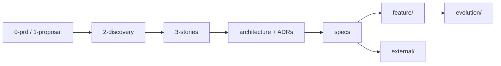

# Internal documentation map

**Audience:** WakeUp Labs engineers and agents working in this repository.

Client-facing deliverables live in [`external/`](./external/README.md). Frozen client inputs are in [`0-prd/`](./0-prd/) and [`1-proposal/`](./1-proposal/) — do not modify.

## Document flow

## Where to look (SSOT by topic)

| If you need… | Read first | Status |
|--------------|------------|--------|
| System architecture (internal) | [`architecture/overview.md`](./architecture/overview.md) + [`architecture/adrs/`](./architecture/adrs/) | Vigente |
| Client-facing architecture | [`external/architecture-overview.md`](./external/architecture-overview.md) | Cliente |
| Coordination boundary (backend vs desktop) | [ADR-006](./architecture/adrs/006-backend-coordination-boundary.md) | Vigente |
| Admin Wallet PRD §4 compliance | [`specs/admin-wallet-prd-compliance.md`](./specs/admin-wallet-prd-compliance.md) | Vigente |
| Capability / coverage pointers | [`architecture/overview.md`](./architecture/overview.md#capability-status-where-to-look), [`3-stories/README.md`](./3-stories/README.md#capability-status-where-to-look) | Vigente |
| Open backlog (user stories + NFRs) | [`assessment/deferred-backlog.md`](./assessment/deferred-backlog.md) | Vigente |
| Wave / P-ID closure tracking | [`assessment/action-plan-progress.md`](./assessment/action-plan-progress.md) | Vigente |
| Ops (runbook, local stack) | [`operations/runbook.md`](./operations/runbook.md) | Vigente |
| Release program (internal tracking) | [`operations/executable-delivery-plan.md`](./operations/executable-delivery-plan.md) | Vigente |
| Verify releases / reproducible builds (client steps) | [`external/verifying-releases.md`](./external/verifying-releases.md), [`external/reproducible-builds.md`](./external/reproducible-builds.md) | Cliente |
| Security model | [`security/threat-model.md`](./security/threat-model.md), [`specs/signer-safety-model.md`](./specs/signer-safety-model.md) | Vigente |
| Phase 1 research evidence | [`2-discovery/README.md`](./2-discovery/README.md) | Histórico / referencia |
| POC / walking-skeleton specs | `specs/poc*.md` (bannered historical) | Histórico |
| Point-in-time code reviews | [`reviews/`](./reviews/) (see resolution banners) | Histórico |
| Implementation audits | [`analysis/`](./analysis/) | Referencia |

## Conflict resolution

When documents disagree, use this order:

1. **Protocol:** SPS-50, SPS-51, SPS-65 (via Alpen crates and PRDs).
2. **Architecture decisions:** `architecture/adrs/` (e.g. ADR-006 over legacy assessment claims).
3. **Feature contract:** `specs/<feature>.md` (functional spec wins over implementation spec if they conflict).
4. **Admin Wallet PRD status:** `admin-wallet-prd-compliance.md` over phase checkmarks in `admin-wallet-implementation-plan.md`.
5. **Client deliverables:** `docs/external/` over internal stubs in `operations/` and `deliverable/`.
6. **Backlog truth:** `deferred-backlog.md` + `action-plan-progress.md` over historical `action-plan-2026-05-14.md` severity tables.

## Directory index

| Path | Purpose |
|------|---------|
| `0-prd/`, `1-proposal/` | Frozen client inputs |
| `2-discovery/` | Phase 1 research and POC findings (historical context) |
| `3-stories/` | Story map and non-functional items |
| `architecture/` | Overview + ADRs |
| `specs/` | Per-feature contracts and implementation notes |
| `feature/` | nWave DELIVER artifacts (`roadmap.json`, deltas) |
| `evolution/` | Archived feature summaries post-merge |
| `assessment/` | Backlog, wave tracks, action-plan synthesis |
| `external/` | Client deliverables (canonical for delivery) |
| `operations/` | Runbook, delivery plan; short pointers to `external/` |
| `security/` | Threat model |
| `deliverable/` | Internal indexes → `external/` |
| `reviews/` | Dated codebase audits |
| `analysis/` | Targeted implementation audits |

## Agent rules

**SSOT:** [`.cursor/rules/`](../.cursor/rules/) (Cursor). [`.claude/rules/`](../.claude/rules/) is a maintained mirror for Claude Code — keep in sync when editing agent conventions.

| Rule file | Scope |
|-----------|--------|
| `general.mdc` | Global conventions (minimal; see also root `AGENTS.md`) |
| `typescript-standards` | `desktop-app/src/**/*.{ts,tsx}` |
| `react-frontend-patterns` | React screens and hooks |
| `rust-backend-standards` | `orchestrator-be`, `desktop-app/src-tauri` |
| `backend-api-conventions` | `orchestrator-be` HTTP handlers |

Project commands and architecture summary: [`AGENTS.md`](../AGENTS.md).
