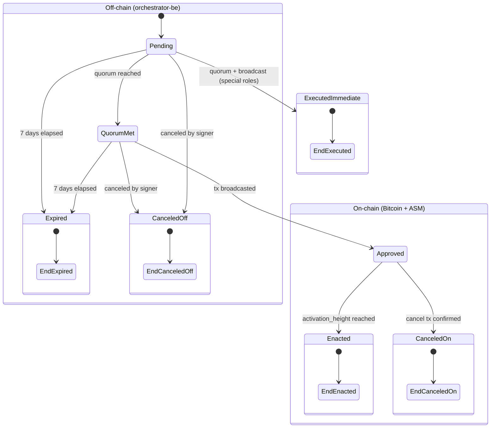

# Architecture Overview

This document defines the baseline architecture for the Strata Multisig application. It serves as the reference for all implementation decisions going forward.

### Documentation SSOT

| Topic | SSOT | Do not use for current architecture |
|-------|------|-------------------------------------|
| System design | This document + [`adrs/`](./adrs/) | [`archive/poc-specs/`](../archive/poc-specs/) (historical POC) |
| Accepted decisions | [`adrs/`](./adrs/) | [`2-discovery/`](../2-discovery/) notes, dated assessments |

Full internal map and conflict rules: [`docs/README.md`](../README.md).

## System Context

Strata Multisig is a desktop application that enables authorized signers to manage on-chain governance of the Strata bridge and Alpen rollup. The system coordinates signature collection off-chain, constructs Bitcoin transactions embedding governance payloads (SPS-50/51/65), and broadcasts them for the ASM (Administration State Machine) to process deterministically.

```
┌──────────────────────────────────────────────────────────────────────┐
│                         Desktop App (Tauri)                          │
│                                                                      │
│  ┌───────────────────────┐  Tauri IPC  ┌──────────────────────────┐  │
│  │  React Frontend (UI)  │────────────>│  Tauri Rust Shell        │  │
│  │  - Proposal mgmt      │  invoke()   │  - Signing library       │  │
│  │  - Signature collect.  │             │  - Backend proxy (reqwest│) │
│  │  - Wallet connect     │             │  - HW wallet adapters     │  │
│  └───────────────────────┘             └─────────┬────────────────┘  │
│                                                   │                   │
│   Key material stays in Rust/device boundary;      │ HTTP (reqwest)    │
│   React receives only non-secret response fields    │                   │
└───────────────────────────────────────────────────┼──────────────────┘
                                                    │
                                                    ▼
                                     ┌──────────────────────────┐
                                     │   Orchestrator Backend   │
                                     │   (Axum, in-memory repo) │
                                     │   - Proposal CRUD        │
                                     │   - Signature aggregation│
                                     │   - Lifecycle tracking   │
                                     └──────────────────────────┘
                                                    │
                                                    │ (signers broadcast
                                                    │  independently)
                                                    ▼
┌──────────────────────────────────────────────────────────────────────┐
│                           Bitcoin (L1)                                │
│   OP_RETURN (SPS-50) + Witness Envelope (SPS-51)                     │
│   ┌────────────────────────────────────────────────────────────────┐ │
│   │ Strata Node → ASM (Administration State Machine)               │ │
│   │   - Parses admin txs from Bitcoin blocks                       │ │
│   │   - Verifies threshold signatures (SPS-65)                     │ │
│   │   - Manages queued updates + confirmation depth                │ │
│   │   - Enacts governance changes deterministically                │ │
│   └────────────────────────────────────────────────────────────────┘ │
└──────────────────────────────────────────────────────────────────────┘

Hardware Wallet integration — partially implemented (Trezor PoC)
  - Taproot-style account discovery flow via Tauri commands (m/86'/0'/73'/0/n)
  - Device address listing and on-device address verification
  - SPS-65 signing via synthetic tx binding PoC path
  - Ledger path remains documented but not wired to UI flows yet
```

## Governance Model — Five Authorities

Each authority is an independent multisig with its own signer set, threshold, and sequence number. They are fully isolated — no cross-authority data leakage.

| Authority | Role | Key Actions |
|-----------|------|-------------|
| **Alpen Admin** | Rollup governance | Verification keys, admin signer set updates |
| **Strata Admin** | Bridge governance | Safe harbor, verification keys, signer sets, security council, operators, bridge params |
| **Sequencer Manager** | Sequencer ops | Sequencer key rotation |
| **Security Council** | Emergency response | Defcon 1/3 emergency actions |
| **Payout Admin** | Payout operations | `block_payout` transaction construction and broadcast |

## Component Architecture

### 1. Orchestrator Backend (`orchestrator-be`)

**Role:** Off-chain coordination service only. It does NOT enforce protocol validity rules — that is the ASM's job.

**Allowed:** Hygiene checks (malformed input, duplicate signatures, structural consistency).
**Forbidden:** Re-implementing signature threshold verification, sequence number validation, or any canonical SPS-65 logic.

```
orchestrator-be/src/
├── main.rs              # Axum app setup, router, CORS + tracing layers
├── config.rs            # Env-based configuration (host, port)
├── state.rs             # AppState (shared in-memory repo)
├── error.rs             # AppError → HTTP status mapping
├── domain/
│   ├── authority.rs     # Authority enum (5 roles)
│   └── proposal.rs      # Proposal, ActionId, ProposalStatus, QuorumStatus, compute_action_id
├── application/
│   ├── proposals.rs     # Business logic: create, approve, get, list proposals
│   └── traits.rs        # ProposalRepository trait
├── infrastructure/
│   └── memory_repo.rs   # InMemoryProposalRepository (in-memory impl of the trait)
└── handlers/
    └── proposals.rs     # CRUD, approve, broadcast coordination (claim + progress PATCH)
```

**Layering:** Follows [ADR-005](adrs/005-layered-architecture.md). `domain/` holds pure types; `application/` holds business logic and trait definitions; `infrastructure/` holds trait implementations; `handlers/` is a thin HTTP boundary. `main.rs` wires concrete impls into `AppState` (repo behind `Arc<RwLock<…>>`). See [ADR-002](adrs/002-application-layer-strategy.md) for the evolution strategy.

**API Surface (`/api/v1`):**

| Method | Path | Purpose |
|--------|------|---------|
| `GET` | `/health` | Liveness check |
| `GET` | `/ready` | Readiness (ASM + Bitcoin RPC reachability) |
| `GET` | `/proposals` | List proposals (authority-scoped, optional status filter) |
| `POST` | `/proposals` | Create proposal (`seq_no` + `action_payload`) |
| `GET` | `/proposals/:action_id` | Get proposal details + quorum status |
| `POST` | `/proposals/:action_id/approve` | Submit approval signature |
| `POST` | `/proposals/:action_id/broadcast/claim` | Claim broadcast coordination slot (`idle` → `commit_broadcasted`) |
| `PATCH` | `/proposals/:action_id/broadcast` | Report broadcast progress / txids from desktop |

**Broadcast execution** (commit/reveal, operator key, Bitcoin wallet RPC) runs in **`desktop-app/src-tauri`**, not on the orchestrator. See PRD §2 and `docs/specs/proposal-broadcast-commit-reveal.md`.

**API Security:**

- Bearer session from `/auth/challenge` + `/auth/verify` (authority-scoped)
- Proposal mutations include signer signatures per PRD

**Data Identity:**

- `ActionId = hash(MultisigAction, SeqNo)` — deterministic, idempotent
- `SeqNo` is `u64`, allows gaps (not strictly sequential)
- Duplicate `(MultisigAction, SeqNo)` pairs are rejected

**Proposal Lifecycle:**



**State reference:**

| State | Layer | Description | Visible to |
|---|---|---|---|
| **Pending** | Off-chain (`orchestrator-be`) | Proposal created, signatures being collected. Expires after 7 days from creation if quorum is not reached. | Signers of that authority only |
| **Quorum Met** | Off-chain (`orchestrator-be`) | Threshold of signatures collected. "Send" button available. Still within the 7-day window — if no one broadcasts before it elapses, transitions to Expired. | Signers of that authority only |
| **Approved** | On-chain (Bitcoin + ASM queue) | Bitcoin tx confirmed in a block. Update is queued in the ASM waiting for its activation height. Can still be canceled during this window. | Signers of that authority only |
| **Enacted** | On-chain (ASM final state) | `activation_height` reached. ASM applied the governance change. Irreversible. | Signers — Past view |
| **Executed (immediate)** | On-chain (ASM) | Applies only to Sequencer Manager and Security Council updates. No confirmation queue — change takes effect in the same block the tx is mined. No Approved or on-chain Canceled states exist for these roles. | Signers — Past view |
| **Expired** | Off-chain (terminal) | 7-day window elapsed before the tx was broadcast. Applies whether quorum was reached or not. | Signers — Past view |
| **Canceled (off-chain)** | Off-chain (terminal) | Manually canceled by a signer before the Bitcoin tx was ever broadcast. No on-chain record. | Signers — Past view |
| **Canceled (on-chain)** | On-chain (terminal) | A `Cancel` tx (signed by the same authority) was broadcast and confirmed during the ~2016 block wait window after Approved. Not available for Sequencer Manager or Security Council (they execute immediately, no wait window). | Signers — Past view |

### 2. Desktop App (`desktop-app`)

**Tauri Shell** (`src-tauri/`): Rust process managing IPC commands, signing operations, and system-level operations.

```
desktop-app/src-tauri/src/
├── lib.rs               # Library crate: exposes domain + application + infrastructure + signing
├── main.rs              # Tauri binary: registers commands, manages AppState
├── commands/
│   ├── hw_wallet.rs         # get_trezor_info/verify_address_on_device/sign_with_trezor
│   └── signing.rs           # compute_sighash/verify_threshold
├── domain/
│   ├── authority.rs         # Authority enum (wire (de)serialization), AuthorityParseError
│   ├── action.rs            # Action, MultisigUpdate, CompressedPubKey, PubKeyError
│   └── proposal.rs          # Proposal, ProposalSignature, Signature
├── application/
│   ├── orchestrator_client.rs  # OrchestratorClient trait + request DTOs + OrchestratorError
│   ├── proposals.rs         # create/approve/get proposals via the trait
│   ├── tx_broadcaster.rs    # TxBroadcaster port (commit+reveal pair and single tx) + fallback walk
│   └── wallet_transactions.rs  # Phase 5: unconfirmed sent-tx list + fee-bump (RBF / governance CPFP) over WalletService
└── infrastructure/
    ├── action_codec.rs      # Domain Action ⇄ Strata MultisigAction SSZ codec
    ├── signing.rs           # compute_sighash/sign_sighash/verify_threshold
    ├── orchestrator_client.rs  # HttpOrchestratorClient (reqwest impl of the trait)
    └── hw_wallet/           # Trezor + Ledger device protocols (PSBT signing, address verify), HwPsbtSigner seam
```

**Strata crate isolation:** `infrastructure/action_codec.rs` is the single module in the desktop app that imports `strata_asm_params`, `strata_asm_txs_admin`, and `strata_crypto`. All other layers (`domain/`, `application/`, commands, UI) talk in client-owned domain types (`Authority`, `Action`, `MultisigUpdate`, `CompressedPubKey`). A codec test asserts byte-level borsh compatibility with the direct Strata call, guaranteeing the SPS-65 signed form stays identical.

**Layering:** Follows [ADR-005](adrs/005-layered-architecture.md). Commands are thin (extract State → call application → map errors). Business logic lives in `application/`; transport DTOs live with the trait; the real HTTP client is in `infrastructure/`. `domain/` holds pure client-side types (see [ADR-003](adrs/003-desktop-application-layer-api.md) for entry-point semantics). `signing.rs` is standalone and decoupled from all layers. The application layer never receives private keys — signing happens externally (HW wallet or software signer).

**Implemented Tauri commands:**
- `get_trezor_info`
- `verify_address_on_device`
- `sign_with_trezor`
- `compute_sighash`
- `verify_threshold`

**Signing library** (`signing.rs`): Production-ready, Tauri-decoupled functions with 13 tests:
- `compute_sighash(seqno, action_hex)` — SSZ-decode action, compute SPS-65 tagged sighash
- `sign_sighash(secret_key_hex, sighash_hex)` — ECDSA sign with secp256k1
- `verify_threshold(public_keys_hex, threshold, signatures_hex, sighash_hex)` — Threshold signature verification via `strata-crypto`

**React Frontend** (`src/`): UI layer for all signer interactions.

```
desktop-app/src/
├── main.tsx             # React mount
├── App.tsx              # Root routes (wallet connect + signing PoC screens)
├── types/index.ts       # Shared frontend API result type
├── api/
│   ├── tauri-bridge.ts  # Generic Tauri IPC wrapper → ApiResult<T>
│   └── signing.ts       # Signing helpers mapped to Tauri commands
├── components/
│   └── HwWalletConnect.tsx
├── contexts/
│   ├── wallet-session-context.ts
│   └── wallet-session-provider.tsx
├── hooks/
│   └── use-wallet-session.ts
├── screens/
│   ├── wallet-connect-screen.tsx
│   ├── sign-poc-screen.tsx
│   └── screen-shell.tsx
└── wallet/              # Wallet adapter abstractions + Trezor/Ledger/Mock/Mnemonic PoC adapters
```

**Required Navigation Flow:**

```
Wallet Connect → Address Select → Authority Select → Dashboard
```

**Key Frontend Constraints:**
- Never expose private keys in UI state, logs, or storage
- Authority labeling required on every action form
- Quorum progress (`collected / required`) always visible for pending actions
- Support copy/paste signature workflows for manual fallback
- Deterministic payload summary before hardware wallet signing prompt
- Explicit fee inputs for broadcast (0.1 sat/vB increments, max 10,000 sat/vB)

### 3. E2E Tests (`e2e-tests`)

Workspace member crate, using the root `rust-toolchain.toml` (nightly). Contains two test suites:

**`e2e_admin_subprotocol`** — Full admin action flow against real Alpen/Strata crates:
1. Generate signer keys → 2. Build `MultisigAction` → 3. Compute SPS-65 sighash → 4. ECDSA sign (threshold) → 5. Construct Bitcoin tx (SPS-50 OP_RETURN + SPS-51 witness) → 6. Parse back and verify signatures

**`e2e_propose_sign`** — Desktop ↔ Orchestrator integration:
Exercises the real desktop `application::proposals` layer making real HTTP calls to a real orchestrator subprocess. Happy path test: create → get → approve → get → verify_threshold with real cryptographic signing. Builds the `MultisigUpdate` action through `desktop_app::domain` + `action_codec` — does not import Strata crates directly.

**Dependencies:**
- `desktop-app` (path) — imports `application::proposals`, `domain::{authority, action, proposal}`, `infrastructure::{action_codec, orchestrator_client}`, `signing`
- `alpenlabs/alpen` @ rev `308211f` — `strata-asm-txs-admin`, `strata-crypto`, `strata-asm-params`, `strata-primitives`, `strata-asm-common`, test utils
- `alpenlabs/strata-common` @ tag `v0.1.0-alpha-rc11` — `strata-l1-txfmt`

## Protocol Integration Points

### SPS-50 — Transaction Header (OP_RETURN)

```
OP_RETURN <magic(4)> <subprotocol_id(1)> <tx_type(1)> <aux(≤74 bytes)>
```

- `subprotocol_id = 0` for administration
- `tx_type` identifies the action (e.g., `10` = StrataAdminMultisigUpdate)

### SPS-51 — Witness Envelope

```
OP_FALSE OP_IF <520-byte chunks of SSZ-serialized SignedPayload> OP_ENDIF
```

- Max payload ~395KB
- Contains: `{ seqno, action, signatures }`

### SPS-65 — Administration Subprotocol

**Sighash computation (domain-separated, replay-protected):**

```
sighash = SHA256( SHA256(tag) || seqno_be_bytes(8) || sighash_payload )
tag = "strata/admin/<type_name>"
```

**ASM verification flow:**
1. `payload.seqno > authority.last_seqno` (replay protection)
2. `payload.seqno ≤ authority.last_seqno + max_seqno_gap` (gap limit, default 10)
3. Verify ECDSA threshold signatures against current signer set
4. Queue update with `activation_height = current_height + confirmation_depth` (~2016 blocks)

## Offline Survivability

The backend is a convenience layer, not a requirement. If the backend is unavailable:

1. Signers can construct proposals manually
2. Collect signatures via out-of-band channels (copy/paste)
3. Build the Bitcoin transaction locally
4. Broadcast directly to the Bitcoin network

The ASM processes Bitcoin blocks regardless of how the transaction was constructed.

## Tech Stack Summary

| Layer | Stack |
|-------|-------|
| Backend | Rust, Axum 0.7, Tokio, Postgres (production via `DATABASE_URL`) or in-memory (local dev), `serde`, `tracing`, `tower-http` |
| Desktop Shell | Tauri 2, Rust, reqwest 0.12 (backend proxy), `strata-asm-txs-admin`, `strata-crypto` |
| Frontend | React 18, TypeScript 5, Vite 5, TailwindCSS 3, react-router-dom 6, `@tauri-apps/api`, ESLint 9, Prettier 3 |
| Signing | ECDSA (secp256k1 0.29.1), SSZ-encoded `MultisigAction`, SPS-65 tagged sighash |
| HW Wallet | Trezor and Ledger via Rust-native adapters (Tauri commands) |
| Protocol | SPS-50/51/65, SSZ serialization, `strata-asm-txs-admin`, `strata-l1-txfmt` |
| E2E Tests | Rust nightly, pinned Alpen/Strata crates (with test-utils features) |
| CI | GitHub Actions: 2 parallel jobs (Rust lint/build/test, frontend lint/format/build). See [ADR-004](adrs/004-ci-pipeline-strategy.md) |

## Current State

> **Client-facing snapshot:** [`docs/external/architecture-overview.md`](../external/architecture-overview.md)

**Implemented (high level):**
- **Orchestrator:** `/api/v1` proposal CRUD, signature collection, explicit `pending → approved` transition, broadcast claim/PATCH coordination, Postgres persistence when `DATABASE_URL` is set (in-memory fallback for local dev). See [ADR-006](adrs/006-backend-coordination-boundary.md).
- **Desktop:** Tauri executes commit/reveal locally; orchestrator mirrors broadcast metadata. Governance proposals, manual proposal flow (`/manual`), block payouts, and Admin Wallet (send/receive, fee bump, HW signing) are in production paths on regtest/testnet.
- **Signing:** SPS-65 sighash, threshold verification, HW wallet adapters (Trezor/Ledger).
- **CI / release:** GitHub Actions (ADR-004), signed releases, Tier-1 reproducible builds.

**Open / deferred (see specs and [`deferred-backlog.md`](../assessment/deferred-backlog.md)):**
- Security Council and some PRD update types blocked on upstream Alpen crates.
- Payout Administrator full product line (partial `block_payout` coverage).
- Shared Send UX unifying wallet Send and governance broadcast (Phase 9).
- US-H5 manual-fallback export/reconcile polish when orchestrator is down.

## Capability status (where to look)

| Area | Document |
|------|----------|
| Admin Wallet / PRD §4 | [`admin-wallet-prd-compliance.md`](../specs/admin-wallet-prd-compliance.md) |
| Integration test pass rates by authority | [`external/integration-test-report.md`](../external/integration-test-report.md) |
| Upstream Alpen crate gaps | [`2-discovery/08-alpen-crate-prd-coverage.md`](../2-discovery/08-alpen-crate-prd-coverage.md) |
| Deferred user stories & NFRs | [`assessment/deferred-backlog.md`](../assessment/deferred-backlog.md) |
