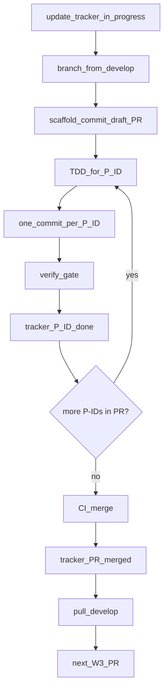

# Wave 3 — Stabilization execution playbook

**Status:** **Closed** 2026-05-20 — all W3-0 through W3-8 PRs merged on `develop`.  
**Base branch:** `develop` only — **`develop → main` is out of scope.**  
**Source plan:** [action-plan-2026-05-14.md](action-plan-2026-05-14.md) (Wave 3 section updated by W3-8).  
**Tracker (SSOT):** [action-plan-progress.md](../action-plan-progress.md) — all P-ID status lives there; **no GitHub Issues** for Wave 3.

---

## What went wrong (do not repeat)

A single branch (`wave3/stabilization`) carried **all** stabilization work with **no per–P-ID commits** and no early PR. That breaks review, bisect, and serial merge.

**Correct model:**

- **One P-ID (or tracker row) → one implementation commit** (TDD red+green may be squashed into that commit).
- **One PR → one or more P-IDs**, each with **its own commit**.
- **Open draft PR** before the first implementation commit; run the verify gate after **every** commit.
- **Update** [action-plan-progress.md](../action-plan-progress.md) when a P-ID moves `pending` → `in_progress` → `done`.

**Do not:** one commit per whole PR, or one mega-branch for all Wave 3.

---

## PR grouping (P-IDs → PRs)

Each row is one PR (one branch, serial merge). **Commits** are tagged by **P-ID** in the subject (e.g. `fix(P-019): …`). Status is tracked in [action-plan-progress.md](../action-plan-progress.md), not in GitHub Issues.

| PR | Title | P-IDs in PR (1 commit each) | Group? | Rationale |
| -- | ----- | --------------------------- | ------ | --------- |
| **W3-0** *(optional)* | Playbook on `develop` | `DOC-PLAYBOOK` | — | Land this file + tracker section; or fold into W3-8 |
| **W3-1** | IPC Zod remainder | **P-008** | No | FE-only |
| **W3-2** | Coordination correctness | **P-019**, **P-032** *(race slice)* | Yes | [Track E](wave2-track-e-followups.md): concurrent approve tests pair with P-019 |
| **W3-3** | Happy-path test floor | **P-032** *(remainder slice)* | No *(or merge into W3-2)* | Claim/broadcast guards + `e2e_propose_sign`; optional split **P-032-BE** / **P-032-E2E** as two tracker rows |
| **W3-4** | Timeout + typed errors | **P-027** (desktop), **P-023** | Yes | Commit order: P-027 then P-023 |
| **W3-5** | Correlation slice | **P-029** | No *(or 3rd commit in W3-4)* | Ops/debuggability |
| **W3-6** | Wallet pubkey binding | **P-039** | No | Signer-safety; never mix with hygiene |
| **W3-7** | Codebase hygiene | **HYG-POC**, **P-036** [, **P-057**] | Yes | Mechanical cleanup; see P-ID table below |
| **W3-8** | Action plan close-out | `DOC-W3` | No | SSOT docs after code PRs |

### Do not group

| Combination | Why |
| ----------- | --- |
| P-008 + anything | IPC vs BE/ops |
| P-039 + HYG-POC / P-036 | Safety vs rename churn |
| P-019 + P-023 | Different layers |
| P-032 (full) + P-008 | Tests vs FE schemas |

### P-ID reference (stabilization scope)

| P-ID | Scope (acceptance summary) |
| ---- | -------------------------- |
| **P-008** | Zod at `tauriCall` for `signing.ts`, `orchestrator-auth.ts`, `asm-state.ts`, `action-builder.ts` + `ipc-schemas.test.ts` |
| **P-019** | Duplicate check in `add_signature` under write lock; concurrent duplicate approve → one sig |
| **P-032** *(race)* | Integration test for concurrent duplicate approve (with P-019) |
| **P-032** *(floor)* | BE: claim when pending, broadcast conflict; extend `e2e_propose_sign` to quorum→approved |
| **P-027** | ~30s timeout on Tauri ASM/Bitcoin RPC in broadcast path |
| **P-023** | `errorCode` on happy-path orchestrator APIs + Tauri/bridge (not full axis inventory) |
| **P-029** | `X-Request-Id` in bridge; `tracing` on approve/patch/claim/broadcast |
| **P-039** | Reject when `wallet.publicKeyHex !== signature.publicKeyHex` |
| **HYG-POC** | Remove POC naming from product code + active docs (`docs/2-discovery/` exempt) — **not** P-057 |
| **P-036** | Centralize `REVEAL_TX_VBYTES`, `COMMIT_DUST_SATS` (stabilization slice) |
| **P-057** | Vestigial Tauri feature / unused config *(optional in W3-7)* |
| **DOC-W3** | Rewrite Wave 3 + Future appendix + satellite doc touch-ups |

**Note:** POC renames are **HYG-POC** in the tracker. **P-057** is vestigial flags per the action plan — do not conflate.

### Recommended serial order

```text
W3-1  P-008
  → W3-2  P-019, P-032-race
  → W3-3  P-032-floor
  → W3-4  P-027, P-023
  → W3-5  P-029          (optional: 3rd commit on W3-4 branch)
  → W3-6  P-039
  → W3-7  HYG-POC, P-036 [, P-057]
  → W3-8  DOC-W3
```

### Aggressive grouping (5 engineering PRs)

| PR | P-IDs (commits) |
| -- | --------------- |
| W3-1 | P-008 |
| W3-2 | P-019, P-032-race, P-032-floor |
| W3-3 | P-027, P-023, P-029 |
| W3-4 | P-039 |
| W3-5 | HYG-POC, P-036 [, P-057] |

---

## Mandatory workflow (every W3 PR)

### 0. Preconditions

```bash
git checkout develop
git pull origin develop
```

Only **one** Wave 3 PR open at a time. No git worktrees.

Mark the PR row **`in_progress`** and listed P-IDs **`in_progress`** in [action-plan-progress.md](../action-plan-progress.md).

### 1. Branch

```bash
git checkout -b wave3/w3-2-coordination
```

Branch name matches PR row (kebab-case).

### 2. Open draft PR before first implementation commit

Scaffold commit only:

```bash
git commit --allow-empty -m "chore(w3-2): scaffold PR — P-019, P-032 race"
git push -u origin HEAD
gh pr create --base develop --draft \
  --title "W3-2: Coordination correctness (P-019, P-032 race)" \
  --body "$(cat <<'EOF'
## P-IDs (one commit each)
- [ ] P-019
- [ ] P-032 (race)

Tracker: docs/assessment/action-plan-progress.md
Playbook: docs/assessment/wave3-stabilization-execution-playbook.md
EOF
)"
```

Paste the PR URL into the **PR** column for that row in `action-plan-progress.md`.

### 3. TDD + one commit per P-ID

For each P-ID in the PR (dependency order):

1. Set P-ID row to **`in_progress`** in `action-plan-progress.md`.
2. TDD: failing test → minimal fix.
3. One commit:

```bash
git commit -m "fix(P-019): atomic dedup in add_signature"
```

4. Run [verify gate](#4-verify-gate--after-every-commit); push.
5. Set P-ID row to **`done`** in `action-plan-progress.md`.

Do **not** combine two P-IDs in one commit.

### 4. Verify gate — after every commit

From repo root:

```bash
cargo fmt --all
cargo fmt --all -- --check
cargo clippy --workspace --all-targets -- -D warnings
cargo test --workspace
cargo audit
cargo deny check

cd desktop-app
npm ci
npm run lint
npm run build
npm run test:ipc-schemas
npm run test:wallet-pubkey-match
cd ..
```

### 5. Merge (human)

After review + green CI: merge to `develop`. Mark PR row **`merged`** and any remaining P-IDs **`done`** in the tracker.

### 6. Next PR

```bash
git checkout develop
git pull origin develop
```

Repeat. Only one open Wave 3 PR at a time.

---

## Per-PR scope and TDD hints

### W3-1 — P-008

Zod + tests for signing, orchestrator-auth, asm-state, action-builder. **1 commit.**

### W3-2 — P-019 + P-032 (race)

P-019: repo dedup under lock. P-032: concurrent duplicate approve integration test. **2 commits** (P-019 first).

### W3-3 — P-032 (floor)

Handler/e2e tests for claim, broadcast conflict, second approve → approved. **1–2 commits** if split BE vs e2e in tracker.

### W3-4 — P-027 + P-023

Desktop RPC timeout, then `errorCode` for happy-path APIs. **2 commits** (P-027 first).

### W3-5 — P-029

Request ID + handler tracing. **1 commit**, or third commit on W3-4 branch.

### W3-6 — P-039

Wallet vs signature pubkey check + unit test. **1 commit.**

### W3-7 — HYG-POC + P-036 [+ P-057]

`rg` inventory for POC strings; renames; constants; optional vestigial flags. **2–3 commits** — order: HYG-POC → P-036 → P-057.

### W3-8 — DOC-W3

Rewrite Wave 3 in action plan, finalize tracker, Future appendix, satellite banners. **1 commit.**

---

## Wave 3 exit (on `develop`)

- All P-IDs in tracker **`done`** (W3-5 optional if folded into W3-4).
- Verify gate green on `develop` tip.
- HYG-POC grep clean.
- Manual 3-spec WDIO + enactment row in `action-plan-progress.md`.
- Tracker banner: **Wave 3 Stabilization — Closed**.

**Deferred:** P-011 full, US-H5, P-053 execution, P-031, P-022/P-064, P-048, Slice 5+, CI WebDriver, `develop → main`.

---

## Quick reference



---

## Related files

| Document | Role |
| -------- | ---- |
| [action-plan-progress.md](../action-plan-progress.md) | **Status** — P-ID and PR rows (SSOT) |
| This playbook | **How** — grouping, TDD, gates, commit rules |
| [action-plan-2026-05-14.md](action-plan-2026-05-14.md) | **What** — scope (W3-8) |
| [wave2-track-d-followups.md](wave2-track-d-followups.md) | P-019, P-023, P-027, P-029 context |
| [wave2-track-e-followups.md](wave2-track-e-followups.md) | P-008, P-032 context |
