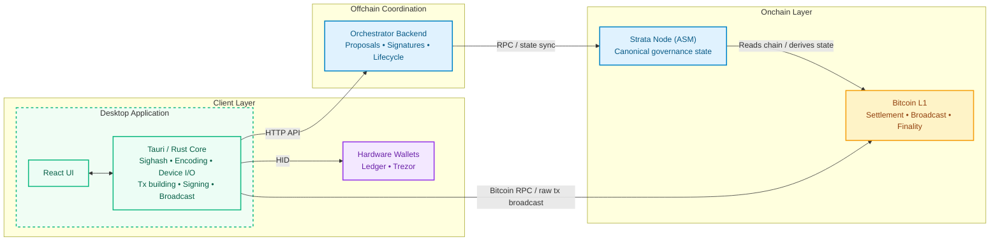
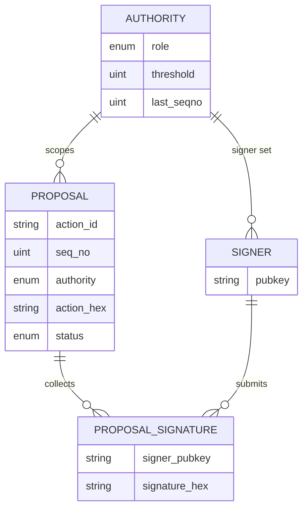

# Phase 1 — Protocol Research & Architecture

> **Status:** Complete
> **Scope:** Internalize SPS-50, SPS-51, SPS-65; identify integration points with the Alpen admin subprotocol crate; validate hardware wallet device matrix; finalize data model and API contract.

This document is the consolidated Phase 1 deliverable for the Alpen Multisig project. It covers the four required outputs defined in the [project proposal](../1-proposal/01-alpen-multisig-proposal.md):

1. Alpen admin crate integration assessment
2. Hardware wallet compatibility matrix
3. Architecture document covering data model, API contract, component boundaries, and tech stack confirmation
4. Testing Environment and general PoCs

Each section documents findings, current implementation status, open gaps, and risks to inform Phase 3 scoping decisions.

## 1. Alpen Admin Crate Integration Assessment

The Alpen/Strata ecosystem publishes its protocol types as internal Rust crates, not on crates.io. The desktop app and backend consume them as git dependencies from `alpenlabs/asm` (rev `a8559d3`, == tag `v0.1-alpha.5`), `alpenlabs/strata-common` (tag `v0.1.0-alpha-rc16`), and `alpenlabs/ssz-gen` (tag `v0.15.0`), following the strategy defined in [ADR-001](../architecture/adrs/001-alpen-crate-dependencies.md). Prior to 2026-04-17 these crates lived on `alpenlabs/alpen` and used Borsh; see [`docs/2-discovery/11-asm-repo-migration.md`](../2-discovery/11-asm-repo-migration.md) for the migration record.

The central constraint of this integration is **SSZ serialization compatibility**. The canonical wire format for `MultisigAction`, `SignedPayload`, and all admin transaction types is defined by these crates and must match, byte-for-byte, what the ASM onchain subprotocol expects. A single discriminant, field-ordering, or sighash-tag difference produces a transaction the ASM will reject. None of the core protocol crates are replaceable, the project must track them upstream, and every upstream change may require a coordinated workspace pin update. The `sighash_payload()` bytes are hand-coded in upstream (SPS-65) and remained byte-identical across the upstream Borsh→SSZ transition, so signatures produced against either version verify on-chain.

This section answers three questions:

1. Which crates are confirmed and in use today?
2. Which crates are needed for the final delivery but not yet integrated in the workspace?
3. Which PRD update types are blocked because the upstream `Role`, `AdminTxType`, or `UpdateAction` variant does not exist yet?

> **Core assumption.** WakeUp Labs does not fork, re-implement, or extend protocol types. Any role, transaction type, action variant, or script template missing from the upstream Alpen crates is a **delivery dependency on Alpen Labs**, not an internal implementation task. This is consistent with ADR-001 and with the "backend MUST NOT redefine governance rules" clause in the backend PRD (§1, [`docs/0-prd/02-multisig-backend.md`](../0-prd/02-multisig-backend.md)).

## 1.1 Crate Inventory (Summary)

The system depends on a set of **non-replaceable Alpen protocol crates** that define
the canonical SSZ encoding, sighash computation, and transaction format required by the ASM.

### Core crates (in use)

- `strata-asm-txs-admin` → action model + sighash computation
- `strata-crypto` → signature validation and threshold logic
- `strata-asm-params` → role definitions (currently limited)
- `strata-l1-txfmt` → SPS-50 transaction parsing
- `ssz` → serialization layer (forces Rust nightly)

These crates are tightly coupled to the protocol and **must match upstream byte-for-byte**.

### Missing integrations (Phase 3)

- `strata-asm-subprotocols-admin` → canonical signer set (backend access control)
- `strata-l1-envelope-fmt` → SPS-51 envelope construction
- `strata-btcio` → commit + reveal transaction builder
- Bitcoin RPC client → transaction signing and broadcast

These components define the **remaining integration surface for Phase 3**.

See [Crate Inventory – Detailed](./crate-inventory.md) for full breakdown.

### 1.2 Implemented Update Types (available today)

The `AdminTxType` enum in `strata-asm-txs-admin` defines **7 variants**. Six map 1:1 to PRD update types; the seventh (`AsmStfVkUpdate`, type 31) has no corresponding PRD update type and is currently treated as unused by the multisig app.

| PRD Update Type                    | Authority       | `UpdateAction` variant           | `AdminTxType`                         | Sighash tag                                       | Execution                                 |
| ---------------------------------- | --------------- | -------------------------------- | ------------------------------------- | ------------------------------------------------- | ----------------------------------------- |
| Strata Administrator Signer update | Strata Admin    | `Multisig(MultisigUpdate)`       | `StrataAdminMultisigUpdate` (10)      | `strata/admin/strata_admin_multisig_update`       | Queued (~2016 blocks)                     |
| Strata verification key update     | Strata Admin    | `VerifyingKey(PredicateUpdate)`  | `OlStfVkUpdate` (30)                  | `strata/admin/ol_stf_vk_update`                   | Queued                                    |
| Operator update                    | Strata Admin    | `OperatorSet(OperatorSetUpdate)` | `OperatorUpdate` (20)                 | `strata/admin/operator_update`                    | Queued                                    |
| Seq Manager Signer update          | Seq Manager     | `Multisig(MultisigUpdate)`       | `StrataSeqManagerMultisigUpdate` (11) | `strata/admin/strata_seq_manager_multisig_update` | Queued                                    |
| Sequencer update                   | Seq Manager     | `Sequencer(SequencerUpdate)`     | `SequencerUpdate` (21)                | `strata/admin/sequencer_update`                   | **Immediate** — skips the queue           |
| Cancel action                      | Admin / Seq Mgr | `MultisigAction::Cancel`         | `Cancel` (0)                          | `strata/admin/cancel`                             | Consumes a seqno; removes a queued update |

### 1.3 Gaps — Blocked on Upstream Alpen Crate Additions

Out of the 13 admin update types defined in the PRD, only 6 are currently supported.  
The remaining **8 update types are blocked** due to missing roles, undefined concepts, or absent implementations in the upstream Alpen crates. :contentReference[oaicite:0]{index=0}

These gaps fall into three categories:

#### 1. Missing roles (hard blockers)

The following update types cannot be implemented because the required roles do not exist in the `Role` enum:

- **Alpen Administrator updates (2 types)**
  - Alpen verification key update
  - Alpen signer set update

- **Security Council updates (3 types)**
  - Security Council signer update
  - Defcon 1 transaction
  - Defcon 3 transaction

→ Neither `Role::AlpenAdministrator` nor `Role::SecurityCouncil` exist upstream.

---

#### 2. Undefined concepts (no protocol specification)

These update types exist only in the PRD and have **no representation in the codebase**:

- Safe Harbor address update
- Soft bridge update
- Hard bridge update

→ There are zero references or types in the Alpen crates, so payload structure and semantics cannot be defined.

---

#### 3. Separate protocol (out of scope of admin subprotocol)

- **`block_payout`**

This is not an admin update. It is a native Bitcoin UTXO spend and requires a completely different implementation path:

- PSBT construction (no SPS-65 sighash)
- Bridge script knowledge (not exposed in any crate)
- Bitcoin RPC integration (fees, broadcast, UTXO selection)
- Independent lifecycle (expired proposals are deleted)

→ This should be treated as a separate flow, not part of the admin subprotocol.

---

### Coverage summary

- **Strata Sequencer Manager** → fully supported (2/2)
- **Strata Administrator** → partially supported (3/7)
- **Alpen Administrator** → not supported (0/2)
- **Security Council** → not supported (0/2)
- **Payout Administrator** → not supported (separate protocol)

---

### Key takeaway

A significant portion of the PRD (8/13 update types + `block_payout`) is currently **blocked on upstream Alpen definitions**.  
These cannot be implemented without new roles, new action types, or additional protocol clarification from Alpen Labs.

### 1.6 Limitations, Risks & POC Status

**Limitations:**

- `Role::AlpenAdministrator` and `Role::SecurityCouncil` do not exist upstream — all Alpen Admin update types, all Security Council update types, and the "Security Council Signer update" payload under Strata Admin are fully blocked until Alpen Labs adds them.
- "Soft/hard bridge update" and "Safe Harbor address update" have no upstream type and no agreed semantics, Strata Admin update types blocked on clarification, not on code.
- `block_payout` is outside the admin subprotocol entirely; the bridge spending script is not exposed in any crate surveyed to date, and the implementation path is not yet scoped.
- Four crates required by the final delivery are not yet integrated in the workspace: `strata-asm-subprotocols-admin`, `strata-l1-envelope-fmt`, `strata-btcio`, and `bitcoind-async-client` (or equivalent RPC client).
- `AsmStfVkUpdate` (type 31) exists upstream but has no PRD mapping; its intended exposure is unclear.

**Risks:**

- All Alpen crates are git dependencies without crates.io releases — upstream breaking changes require manual workspace pin updates with no automated notice. Pin bumps must be gated by the SSZ roundtrip test (`test_encode_matches_direct_strata_ssz`) already established in the desktop client codec. The 2026-04-17 migration documented in [`docs/2-discovery/11-asm-repo-migration.md`](../2-discovery/11-asm-repo-migration.md) is a live example of this risk and how it is handled.
- Mid-phase upstream changes to `MultisigAction`, `SignedPayload`, or `ThresholdConfig` SSZ layout would invalidate off-chain signatures already collected against the previous layout. A signature rotation / re-collection procedure must be defined. Note: the Borsh→SSZ migration was the exception, not the rule — `sighash_payload()` was handcoded and remained byte-identical, so collected signatures survived. Future format changes may not be as lucky.
- The Strata node RPC surface for `AdministrationSubprotoState` is unidentified. If no client crate exists, the backend must implement its own RPC adapter — an unscoped integration.
- The `block_payout` path requires a distinct Bitcoin-native PSBT + RPC implementation with no prototype yet; its complexity is not bounded by the current architecture.
- The whole workspace is forced onto nightly Rust because `strata-asm-params` pulls in `ssz` transitively, and `ssz` depends on `generic_const_exprs`, a nightly feature with no stabilization timeline. We pin a specific nightly date in `rust-toolchain.toml` to avoid surprise breakage, but every pin bump needs a full build and test pass. The backend does not use any Strata crate today, yet it inherits the same toolchain constraint from the workspace. There is no realistic path to stable Rust until Alpen replaces SSZ or the feature stabilizes upstream. See [`docs/2-discovery/15-nightly-dependency-finding.md`](../2-discovery/15-nightly-dependency-finding.md) for the full dependency chain and mitigation options.

## 2. Hardware Wallet Compatibility

Hardware wallet integration is the highest-risk surface in the desktop application. The core problem is that standard hardware wallet APIs expose a `sign_message` endpoint that applies a Bitcoin-specific prefix (BIP-137) before hashing, but the Alpen ASM subprotocol expects **bare ECDSA** over the raw SPS-65 sighash with no prefix. These two formats are cryptographically incompatible for the purpose of ASM signature submission.

The integration is also split across two distinct signing contexts with different security requirements:

- **Session authentication** — a signer proves key ownership to the backend to gain access to their authority's proposals. The backend controls both sides, so BIP-137 is acceptable here.
- **Proposal signing** — a signer produces a signature over an admin action sighash that will be embedded in a Bitcoin transaction and validated onchain by the ASM. This requires raw ECDSA; BIP-137 will be rejected.

### 2.1 Required Capabilities

| Capability                | Protocol requirement                     | Notes                                 |
| ------------------------- | ---------------------------------------- | ------------------------------------- |
| Taproot key derivation    | `m/86'/0'/73'/0/n` (first 20 addresses)  | BIP-86 — Taproot                      |
| secp256k1 ECDSA signing   | SPS-65 raw sighash (no prefix)           | NOT Bitcoin message signing (BIP-137) |
| On-device payload display | Signer must review action before signing | UX safety requirement                 |

### 2.2 Signing Format Gap — BIP-137 vs Raw ECDSA

Both Trezor and Ledger expose a `sign_message` API that applies the BIP-137 prefix before hashing, producing a signature over `SHA256d("Bitcoin Signed Message:\n" + payload)`. The Alpen ASM expects bare ECDSA over the raw SPS-65 sighash — these are **incompatible**.

**Recommendation:** Add BIP-137 support to the crate asm.

> **Sources:** [`docs/2-discovery/06-hardware-wallet-architecture.md`](../2-discovery/06-hardware-wallet-architecture.md), [`docs/2-discovery/07-hardware-wallet-library-analysis.md`](../2-discovery/07-hardware-wallet-library-analysis.md)

### 2.3 Limitations, Risks & POC Status

**Limitations:**

- Only Trezor Model T has been tested, and only on the emulator — no physical device validation yet.
- `sign_message` (BIP-137) cannot be used for incompatibilities with the library.
- Ledger integration has not been done yet.

**Risks:**

- Firmware differences across Trezor models (Model T, Safe 3) may require per-firmware handling or fallback logic.

## 3. Architecture Document

This section is the Phase 1 architecture deliverable. It covers the four required outputs:

1. **component boundaries**
2. **data model**
3. **API contract**
4. **tech stack confirmation**

The system has three tiers: an **onchain layer** (Bitcoin + Strata ASM) that owns canonical governance state, an **offchain coordination layer** (orchestrator backend) that manages the pre-broadcast lifecycle, and a **client layer** (desktop app + hardware wallets) where signers interact and produce signatures.

The key architectural invariant is that the backend is a coordination service, not an authority. It collects signatures and tracks proposal status, but it cannot enforce protocol validity: that is the ASM's job. Backend downtime must not prevent signers from acting: the offline fallback path (manual aggregation plus direct broadcast) is a spec requirement, not a nice-to-have. The concrete module layout and dependency rules below come from [ADR-005](../architecture/adrs/005-layered-architecture.md) and from [`docs/architecture/overview.md`](../architecture/overview.md), which track the real source tree.

### 3.1 System Components



**Component responsibilities:**

| Component                | Responsibilities                                                                                                                                                | Owns                  |
| ------------------------ | --------------------------------------------------------------------------------------------------------------------------------------------------------------- | --------------------- |
| **Bitcoin Network**      | Final settlement. Validates and confirms admin transactions.                                                                                                    | Finality              |
| **Strata Node (ASM)**    | Executes the admin subprotocol STF. Canonical source for signer sets, enacted actions, and `last_seqno` per authority.                                          | Protocol validity     |
| **Orchestrator Backend** | Proposal creation, signature collection, lifecycle tracking, authority-scoped access control. Derives signer sets from ASM state via RPC.                       | Offchain coordination |
| **Tauri / Rust Core**    | Sighash computation (`compute_sighash()`), device communication (HID), API client, session key management. Security boundary between UI and signing operations. | Signing integrity     |
| **React UI**             | Signer-facing flows: wallet connect → address select → multisig select → auth → dashboard. Displays quorum progress, action details, lifecycle status.          | User interaction      |
| **Hardware Wallets**     | Key storage and ECDSA signing. On-device display of action details before signing. Never exposed to raw private keys in software.                               | Key custody           |

### 3.2 Data Model

The orchestrator backend does not own protocol state. It coordinates around it. The canonical source of truth is always the onchain ASM (signer sets, enacted actions, sequence numbers). The backend's data model reflects only what is needed to run the offchain lifecycle: collecting signatures, tracking proposal status, and enforcing authority-scoped access. The shapes below match the current code in [`orchestrator-be/src/domain/proposal.rs`](../../orchestrator-be/src/domain/proposal.rs) and [`desktop-app/src-tauri/src/domain/`](../../desktop-app/src-tauri/src/domain/), which both follow the layering defined in [ADR-005](../architecture/adrs/005-layered-architecture.md).

**Governance state** (read from the onchain ASM via the Strata node, cached locally):

```
Authority
├── role: Authority            (StrataAdmin | StrataSequencerManager |
│                               AlpenAdmin | SecurityCouncil | PayoutAdmin)
├── signer_set: Vec<CompressedPublicKey>
├── threshold: NonZero<u8>
└── last_seqno: u64            last sequence number confirmed onchain
```

> Only `StrataAdmin` and `StrataSequencerManager` exist in the upstream `Role` enum today (see §1.4). The other three variants are the backend-side representation the system will adopt once Alpen ships them.

**Coordination state** (owned by the backend, in `orchestrator-be/src/domain/proposal.rs`):

```
Proposal
├── action_id: ActionId        sha256(seq_no_be ‖ action_hex_bytes),
│                              deterministic and idempotent
├── seq_no: u64
├── authority: Authority
├── status: ProposalStatus
├── action_hex: String         Borsh-serialized MultisigAction, hex-encoded,
│                              opaque to the backend
└── signatures: Vec<ProposalSignature>

ProposalSignature
├── signer_pubkey: String      signer canonical pubkey, hex-encoded
└── signature_hex: String      raw secp256k1 ECDSA over the SPS-65 sighash

QuorumStatus                   derived view, not persisted
├── collected: u32             unique signer count
├── required: u32              authority threshold
└── is_reached: bool

ProposalStatus = Pending | Approved | Enacted | Canceled | Expired
```

**Deliberate choices worth noting:**

- `action_hex` stays opaque to the backend. Hygiene today is limited to hex decoding. The backend never re-interprets semantics. That is what keeps the service inside the "coordination only" boundary from ADR-005 and the backend PRD.
- `ActionId` is content-addressed: `sha256(seq_no_be_bytes ‖ action_hex_bytes)`. The same `(MultisigAction, SeqNo)` pair always produces the same id, which gives duplicate rejection for free and makes the API idempotent by construction.
- The desktop app maintains a parallel `domain/` module with its own `Action`, `Authority`, and `Proposal` types. Strata crate types only cross into the desktop app at `infrastructure/action_codec.rs`, the single place where Borsh encoding happens. Everything above that boundary works in project-owned domain types, which is exactly the direction ADR-005 prescribes.
- Session state is intentionally absent from the current schema. Ephemeral-key authentication is part of the target architecture (see §3.4) but no `Session` type exists in the code yet. Adding it is tracked under §3.8 as the next concrete backend step.

**Richer lifecycle on the design board.** The implementation uses the five `ProposalStatus` variants above because that is what the POC needed. The target lifecycle, documented in [`docs/architecture/overview.md`](../architecture/overview.md), splits the pending phase into `Pending → QuorumMet → Approved`, adds `ExecutedImmediate` for `SequencerUpdate` (which skips the queue, see §1.2), and distinguishes `CanceledOff` (removed before broadcast) from `CanceledOn` (removed via an onchain `Cancel` transaction). These states will land alongside the flows that require them.

**Entity relationships (current schema):**



### 3.4 API Contract

The backend exposes a versioned HTTP surface under `/api/v1`, wired in [`orchestrator-be/src/main.rs`](../../orchestrator-be/src/main.rs) and [`orchestrator-be/src/handlers/mod.rs`](../../orchestrator-be/src/handlers/mod.rs). Handlers are thin wrappers around `application::proposals`, which is the only layer allowed to mutate domain state. This is the ADR-005 rule applied in practice.

**Implemented today:**

| Method | Path                                   | Body / Query                                                      | Description                                          |
| ------ | -------------------------------------- | ----------------------------------------------------------------- | ---------------------------------------------------- |
| GET    | `/api/v1/health`                       | —                                                                 | Liveness probe                                       |
| GET    | `/api/v1/proposals`                    | `?status=pending\|approved\|enacted\|canceled\|expired`           | List proposals, optionally filtered by status        |
| POST   | `/api/v1/proposals`                    | `{ authority, seq_no, action_hex, signer_pubkey, signature_hex }` | Create a proposal with the creator's first signature |
| GET    | `/api/v1/proposals/:action_id`         | —                                                                 | Fetch a proposal by its deterministic action id      |
| POST   | `/api/v1/proposals/:action_id/approve` | `{ signer_pubkey, signature_hex }`                                | Append an approval signature                         |

Error responses are mapped from `AppError` in [`orchestrator-be/src/error.rs`](../../orchestrator-be/src/error.rs): `400 Bad Request` for invalid hex or malformed Borsh, `404 Not Found` for unknown `action_id`, `409 Conflict` for duplicate `(seq_no, action_hex)` or duplicate signer on the same proposal, `500 Internal Server Error` for repository-level failures. All of these are covered by the integration tests in `handlers::tests`.

**Authentication: as designed vs. as implemented.** The target model, required by the backend PRD and already assumed by the desktop client's `fetch_proposals`, uses an ephemeral-key session. A signer authenticates with their canonical key, receives a short-lived session bound to a single authority, and signs subsequent requests with the session key. None of that is in the backend code today. There is no `POST /sessions` route, no bearer-token middleware, and no session extractor. The desktop client already calls `bearer_auth(token)` against endpoints that silently ignore the header. Closing this gap is the single most visible drift between the two apps and is tracked under §3.8.

**Access-control invariants to enforce once session middleware lands** (from [`.claude/rules/backend-api-conventions.md`](../../.claude/rules/backend-api-conventions.md)):

- The session's authority scope must match the proposal's authority.
- The caller's canonical pubkey must exist in the onchain signer set for that authority at the time of the request, as derived from live ASM state.
- Non-signers must not be able to infer proposal existence from status codes, response shape, or timing differences.

### 3.5 Sighash Computation (SPS-65)

```
sighash = SHA256(
    SHA256(tag)           ← 32 bytes, tag = "strata/admin/<type_name>"
    ‖ seqno_be            ← 8 bytes, big-endian u64
    ‖ sighash_payload     ← variable, Borsh-encoded action-specific data
)
```

Each signer signs this 32-byte hash with raw secp256k1 ECDSA (not BIP-137).

### 3.6 Tech Stack

| Layer         | Stack                                     |
| ------------- | ----------------------------------------- |
| Backend       | Rust, Axum, in-memory (Postgres planned)  |
| Desktop shell | Tauri 2                                   |
| Frontend      | React 18, TypeScript, TailwindCSS, Vite   |
| Signing       | `strata-asm-txs-admin`, `strata-crypto`   |
| HW wallet     | `trezor-client 0.1.5` (HID), Ledger (TBD) |
| Bitcoin       | `bitcoin` crate (workspace)               |

### 3.7 Limitations, Risks & POC Status

**Limitations:**

- The Strata node RPC interface for querying `AdministrationSubprotoState` has not been identified — ASM state sync is architecturally required for access control but the implementation path is unknown.
- The `block_payout` flow (Payout Admin) requires a separate Bitcoin RPC client; it is not represented in the current architecture.

**Risks:**

- ASM state sync latency creates a window where stale signer sets could allow or deny access incorrectly — invalidation strategy needs to be defined.
- Backend downtime must not block signers from manually aggregating signatures and broadcasting directly to Bitcoin (spec requirement). This offline path has not been validated end-to-end.
- Sequence number gaps are protocol-valid but can cause coordination confusion without explicit metadata support in the UI.

## 4. Blockers/Questions summary

The following questions must be clarified with Alpen Labs to unblock Phase 3 implementation. :contentReference[oaicite:0]{index=0}

### Environment & Setup

- Is there a public testnet environment we can use, or is a full local setup required?
- If local setup is required, is there a reference guide to run the full stack (Strata node + Bitcoin + ASM)?
- How are roles (e.g. StrataAdmin, SequencerManager) expected to be assigned and managed in test environments?

---

### Protocol Gaps (Roles & Update Types)

- Will `Role::AlpenAdministrator` and `Role::SecurityCouncil` be added upstream? What is the expected timeline?
- How should “Security Council signer update” be modeled if the role does not yet exist?
- Are Defcon 1 and Defcon 3 standard admin updates or part of a separate mechanism?

---

### Undefined Concepts

- What do “Soft” and “Hard” bridge updates represent at the protocol level?
- What is the “Safe Harbor address” (Bitcoin address, script, or protocol parameter)?

---

### Transaction Construction & Bitcoin Integration

- Which crate or spec defines the bridge script required for `block_payout`?
- Is there an existing helper for building commit + reveal transactions, or should we rely directly on `strata-btcio`?

---

### State Access & RPC

- Which Strata node RPC endpoint exposes `AdministrationSubprotoState`?
- Is there an official client crate, or should the backend implement a custom RPC adapter?

---

### Hardware Wallet Integration

- Is raw ECDSA over the SPS-65 sighash the expected signing format for all devices?

---

### Scope & Roadmap

- Any of this findings may affect the PRD and should be updated?

## 5. Appendix — Protocol References

| Spec   | Description                                                                    |
| ------ | ------------------------------------------------------------------------------ |
| SPS-50 | Bitcoin transaction format — `OP_RETURN` header structure and magic bytes      |
| SPS-51 | Witness envelope format — chunked payload inside `OP_FALSE OP_IF ... OP_ENDIF` |
| SPS-65 | Admin sighash computation — tagged SHA256 over seqno + action payload          |

**Discovery docs:**

- [Conceptual overview](../2-discovery/01-conceptual-overview.md)
- [Alpen crate coverage vs PRD](../2-discovery/08-alpen-crate-prd-coverage.md)
- [Functional analysis](../2-discovery/09-functional-analysis.md)
- [Hardware wallet architecture](../2-discovery/06-hardware-wallet-architecture.md)
- [Hardware wallet library analysis](../2-discovery/07-hardware-wallet-library-analysis.md)
