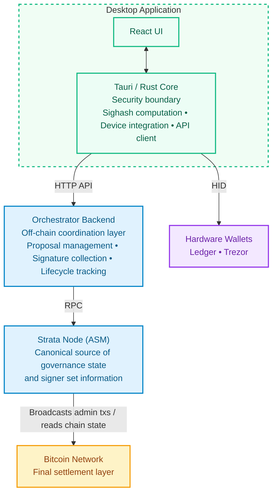
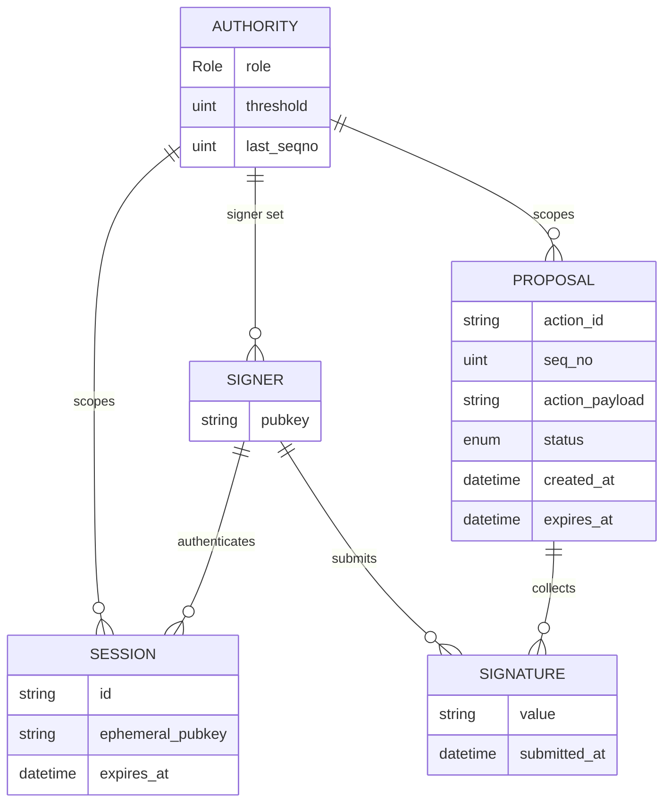

# Phase 1 — Protocol Research & Architecture

> **Status:** In progress
> **Goal:** Internalize SPS-50, SPS-51, SPS-65; identify integration points with the Alpen admin subprotocol crate; validate hardware wallet device matrix; finalize data model and API contract; recommend HWI bundling approach.

---

## 1. Alpen Admin Crate Integration Assessment

The Alpen/Strata ecosystem publishes its protocol types as internal Rust crates, not on crates.io. This creates a hard dependency: the desktop app and backend must consume these crates directly from the `alpenlabs/alpen` and `alpenlabs/strata-common` repositories, pinned by git commit in the workspace `Cargo.toml`.

The central constraint of this integration is **Borsh serialization compatibility**. The canonical wire format for `MultisigAction`, `SignedPayload`, and all admin transaction types is defined by these crates and must match exactly what the ASM onchain subprotocol expects. Any re-implementation or reinterpretation would produce protocol-invalid transactions. This means none of the core protocol crates are replaceable — the project must track them upstream.

The integration assessment is structured around three questions:
1. Which crates are already confirmed and in use?
2. Which crates are needed but not yet validated?
3. Which update types are blocked because the upstream role or transaction type doesn't exist yet?

### 1.1 Crate Inventory

| Crate                       | Key types / functions                                                                                        | Used by                  | Replaceable?                                 |
| --------------------------- | ------------------------------------------------------------------------------------------------------------ | ------------------------ | -------------------------------------------- |
| `strata-asm-txs-admin`      | `MultisigAction`, `UpdateAction`, `CancelAction`, `compute_sighash()`, `parser::parse_tx()`, `SignedPayload` | desktop-app, e2e-tests   | No — canonical Borsh layout and sighash tags |
| `strata-crypto`             | `CompressedPublicKey`, `ThresholdConfig`, `verify_threshold_signatures()`, `SignatureSet`                    | desktop-app, e2e-tests   | No — types embedded in Borsh serialization   |
| `strata-asm-params`         | `Role` enum                                                                                                  | desktop-app, e2e-tests   | No — Borsh discriminant must match ASM       |
| `strata-primitives`         | `Buf32` (sighash return type)                                                                                | e2e-tests (transitively) | No — return type of `compute_sighash()`      |
| `strata-asm-common`         | `TxInputRef`                                                                                                 | e2e-tests                | No — required by `parser::parse_tx()`        |
| `strata-l1-txfmt`           | `ParseConfig`, `TagData` (SPS-50 parsing)                                                                    | e2e-tests                | No — protocol header format                  |
| `strata-asm-txs-test-utils` | `TEST_MAGIC_BYTES`, tx construction helpers                                                                  | e2e-tests                | No — builds exact witness envelope structure |

**Crates to add:**

| Crate                           | Source                    | Needed for                                                                                                                              |
| ------------------------------- | ------------------------- | --------------------------------------------------------------------------------------------------------------------------------------- |
| `strata-asm-subprotocols-admin` | `alpenlabs/alpen`         | Reading canonical signer sets from ASM state (`AdministrationSubprotoState`, `MultisigAuthority`) — required for backend access control |
| `strata-l1-envelope-fmt`        | `alpenlabs/strata-common` | SPS-51 envelope construction for production Bitcoin transactions                                                                        |

> **Source:** [`docs/2-discovery/08-alpen-crate-prd-coverage.md`](../2-discovery/08-alpen-crate-prd-coverage.md)

### 1.2 Implemented Update Types (available today)

| PRD Update Type                    | Authority       | `UpdateAction` variant           | `AdminTxType`                         | Sighash tag                                       |
| ---------------------------------- | --------------- | -------------------------------- | ------------------------------------- | ------------------------------------------------- |
| Strata Administrator Signer update | Strata Admin    | `Multisig(MultisigUpdate)`       | `StrataAdminMultisigUpdate` (10)      | `strata/admin/strata_admin_multisig_update`       |
| Strata verification key update     | Strata Admin    | `VerifyingKey(PredicateUpdate)`  | `OlStfVkUpdate` (30)                  | `strata/admin/ol_stf_vk_update`                   |
| Operator update                    | Strata Admin    | `OperatorSet(OperatorSetUpdate)` | `OperatorUpdate` (20)                 | `strata/admin/operator_update`                    |
| Seq Manager Signer update          | Seq Manager     | `Multisig(MultisigUpdate)`       | `StrataSeqManagerMultisigUpdate` (11) | `strata/admin/strata_seq_manager_multisig_update` |
| Sequencer update                   | Seq Manager     | `Sequencer(SequencerUpdate)`     | `SequencerUpdate` (21)                | `strata/admin/sequencer_update`                   |
| Cancel action                      | Admin / Seq Mgr | `MultisigAction::Cancel`         | `Cancel` (0)                          | `strata/admin/cancel`                             |

### 1.3 Gaps — Blocked on Upstream Alpen Crate Additions

| PRD Update Type                   | Authority        | Status      | Blocker                                                                 |
| --------------------------------- | ---------------- | ----------- | ----------------------------------------------------------------------- |
| Alpen verification key update     | Alpen Admin      | **Blocked** | `Role::AlpenAdministrator` does not exist — zero references in codebase |
| Alpen Administrator Signer update | Alpen Admin      | **Blocked** | Same — role not defined                                                 |
| Safe Harbor address update        | Strata Admin     | **Blocked** | Zero references to "safe harbor" in codebase                            |
| Security Council Signer update    | Strata Admin     | **Blocked** | `Role::SecurityCouncil` does not exist                                  |
| "Soft" bridge update              | Strata Admin     | **Blocked** | Term only in PRD, not in codebase — semantics unclear                   |
| "Hard" bridge update              | Strata Admin     | **Blocked** | Same                                                                    |
| Defcon 1 transaction              | Security Council | **Blocked** | Zero references to "defcon"                                             |
| Defcon 3 transaction              | Security Council | **Blocked** | Same                                                                    |

### 1.4 Payout Administrator — Separate Protocol

`block_payout` is **not part of the admin subprotocol**. It is a Bitcoin-native UTXO spend from the bridge multisig script (not SPS-50/SPS-65). Requires direct PSBT construction, bridge script spending conditions, and a Bitcoin RPC client.

### 1.5 Open Questions for Alpen Labs

- What do "Soft" vs "Hard" bridge updates mean? They appear only in the PRD.
- When will `Role::AlpenAdministrator`, `Role::SecurityCouncil`, and corresponding `AdminTxType` variants be added?
- Are Defcon 1/3 standard admin transactions or a separate mechanism?
- Where are the `block_payout` bridge script spending conditions defined?
- What RPC endpoint provides `AdministrationSubprotoState`? Is there a client crate?

### 1.6 Limitations, Risks & POC Status

**Limitations:**
- `Role::AlpenAdministrator` and `Role::SecurityCouncil` don't exist upstream — all Alpen Admin and Security Council update types are fully blocked until Alpen Labs adds them.
- `block_payout` is outside the admin subprotocol entirely — requires a separate PSBT + Bitcoin RPC implementation path not yet scoped.
- `strata-asm-subprotocols-admin` (required to read canonical signer sets for access control) has not been compiled or integrated in the workspace yet.

**Risks:**
- All Alpen crates are git dependencies without crates.io releases — upstream breaking changes require manual workspace pin updates with no automated notice.
- "Soft/hard bridge updates" and Defcon transactions remain semantically undefined. If Alpen Labs defines them mid-implementation, they could require significant scope additions.
- The ASM RPC endpoint for `AdministrationSubprotoState` is unidentified — could block backend access control implementation if no client crate exists.

**POC Status:**
- Sighash computation validated end-to-end in `e2e-tests` with `strata-asm-txs-admin` and `strata-crypto`.
- `strata-asm-subprotocols-admin` and `strata-l1-envelope-fmt` not yet compiled or exercised in the workspace.

---

## 2. Hardware Wallet Compatibility Matrix

Hardware wallet integration is the highest-risk surface in the desktop application. The core problem is that standard hardware wallet APIs expose a `sign_message` endpoint that applies a Bitcoin-specific prefix (BIP-137) before hashing, but the Alpen ASM subprotocol expects **bare ECDSA** over the raw SPS-65 sighash with no prefix. These two formats are cryptographically incompatible for the purpose of ASM signature submission.

The integration is also split across two distinct signing contexts with different security requirements:

- **Session authentication** — a signer proves key ownership to the backend to gain access to their authority's proposals. The backend controls both sides, so BIP-137 is acceptable here.
- **Proposal signing** — a signer produces a signature over an admin action sighash that will be embedded in a Bitcoin transaction and validated onchain by the ASM. This requires raw ECDSA; BIP-137 will be rejected.

The PSBT path (Option B in section 4) solves the proposal signing problem by constructing a minimal Bitcoin transaction and using the device's `sign_tx` API, which returns raw ECDSA. This adds significant complexity but is the only protocol-correct path.

### 2.1 Required Capabilities

| Capability                | Protocol requirement                      | Notes                                  |
| ------------------------- | ----------------------------------------- | -------------------------------------- |
| Taproot key derivation    | `m/86'/0'/73'/0/n` (first 20 addresses)   | BIP-86 — Taproot                       |
| secp256k1 ECDSA signing   | SPS-65 raw sighash (no prefix)            | NOT Bitcoin message signing (BIP-137)  |
| On-device payload display | Signer must review action before signing  | UX safety requirement                  |
| PSBT support              | Needed for raw ECDSA output via `sign_tx` | Workaround for BIP-137 format mismatch |

### 2.2 Signing Format Gap — BIP-137 vs Raw ECDSA

Both Trezor and Ledger expose a `sign_message` API that applies the BIP-137 prefix before hashing, producing a signature over `SHA256d("Bitcoin Signed Message:\n" + payload)`. The Alpen ASM expects bare ECDSA over the raw SPS-65 sighash — these are **incompatible**.

Resolution options:

| Option                             | How                                 | Protocol compatibility                             | Complexity |
| ---------------------------------- | ----------------------------------- | -------------------------------------------------- | ---------- |
| **A — BIP-137 verify server-side** | Backend verifies with prefix        | Works for auth nonce only — not for ASM submission | Low        |
| **B — PSBT / `sign_tx` path**      | Construct Bitcoin tx, use `sign_tx` | Raw ECDSA — protocol-correct                       | High       |
| **C — `sign_identity`**            | Experimental Trezor API             | Unstable across firmware versions                  | Medium     |

**Recommendation:** Option B (PSBT path) for proposal signing. Option A for auth nonce (backend controls both sides).

> **Source:** [`docs/2-discovery/10-poc5-trezor-findings.md`](../2-discovery/10-poc5-trezor-findings.md)

### 2.3 Device Matrix

| Device         | Taproot (BIP-86) | ECDSA sign                 | On-device display | PSBT support        | Status                                            |
| -------------- | ---------------- | -------------------------- | ----------------- | ------------------- | ------------------------------------------------- |
| Trezor Model T | —                | BIP-137 via `sign_message` | Yes               | Yes (via `sign_tx`) | POC validated (emulator) — BIP-137 gap identified |
| Trezor Safe 3  | —                | —                          | —                 | —                   | Not yet tested                                    |
| Ledger Nano S+ | —                | —                          | —                 | —                   | Not yet tested                                    |
| Ledger Nano X  | —                | —                          | —                 | —                   | Not yet tested                                    |

> _Fill in per-device validation results as testing progresses._

### 2.4 Known Issues (Trezor POC-5)

- `SPENDADDRESS` used instead of `SPENDWITNESS` for BIP-84 path — produces wrong address type (P2PKH instead of P2WPKH). Must fix before production.
- Blocking HID calls inside `async` Tauri commands — must wrap with `tokio::task::spawn_blocking`.
- No connection pooling in `trezor-client 0.1.5` — each `connect()` and `sign_message()` opens a new HID session (~200–500ms overhead).

### 2.5 Limitations, Risks & POC Status

**Limitations:**
- Only Trezor Model T has been tested, and only on the emulator — no physical device validation yet.
- `sign_message` (BIP-137) cannot be used for ASM signature submission; the PSBT path is required, which is significantly more complex.
- On-device display of the full action payload in the PSBT path has not been validated.
- Ledger integration has not been started.

**Risks:**
- PSBT path requires constructing a valid Bitcoin transaction solely to extract a raw ECDSA signature — complexity is high and must be validated against each device's `sign_tx` behavior.
- Firmware differences across Trezor models (Model T, Safe 3) may require per-firmware handling or fallback logic.
- Ledger Rust transport crate (`ledger-transport-hidapi`) maturity is unknown — if insufficient, it becomes the blocking dependency for the Option B recommendation.
- Failure to use `tokio::task::spawn_blocking` for HID calls causes Tauri runtime deadlocks — must be enforced as a code convention.

**POC Status:**
- POC-5 validated on Trezor Model T emulator: HID connection, `sign_message` flow, address derivation, BIP-137 incompatibility confirmed.
- Next: physical device test + PSBT signing path for raw ECDSA extraction.
- Next: Ledger emulator equivalent of POC-5.

---

## 3. Architecture Document

The system has three tiers: an **onchain layer** (Bitcoin + Strata ASM) that owns canonical governance state, an **offchain coordination layer** (orchestrator backend) that manages the pre-broadcast lifecycle, and a **client layer** (desktop app + hardware wallets) where signers interact and produce signatures.

The key architectural invariant is that the backend is a coordination service, not an authority. It collects signatures and tracks proposal status, but it cannot enforce protocol validity — that is the ASM's job. The backend's access control decisions depend on the onchain signer set, which means it must stay synchronized with the Strata node. Backend downtime must not prevent signers from acting: the offline fallback path (manual aggregation + direct broadcast) is a spec requirement, not a nice-to-have.

### 3.1 System Components



**Component responsibilities:**

| Component | Responsibilities | Owns |
| --- | --- | --- |
| **Bitcoin Network** | Final settlement. Validates and confirms admin transactions. | Finality |
| **Strata Node (ASM)** | Executes the admin subprotocol STF. Canonical source for signer sets, enacted actions, and `last_seqno` per authority. | Protocol validity |
| **Orchestrator Backend** | Proposal creation, signature collection, lifecycle tracking, authority-scoped access control. Derives signer sets from ASM state via RPC. | Offchain coordination |
| **Tauri / Rust Core** | Sighash computation (`compute_sighash()`), device communication (HID), API client, session key management. Security boundary between UI and signing operations. | Signing integrity |
| **React UI** | Signer-facing flows: wallet connect → address select → multisig select → auth → dashboard. Displays quorum progress, action details, lifecycle status. | User interaction |
| **Hardware Wallets** | Key storage and ECDSA signing. On-device display of action details before signing. Never exposed to raw private keys in software. | Key custody |

### 3.2 Authorities and Update Types

| #   | Authority                | Update types available | Update types blocked                                  |
| --- | ------------------------ | ---------------------- | ----------------------------------------------------- |
| 1   | Alpen Administrator      | 0                      | 2 (all blocked)                                       |
| 2   | Strata Administrator     | 3 of 7                 | 4 (soft/hard bridge, safe harbor, sec council signer) |
| 3   | Strata Sequencer Manager | 2 of 2                 | 0                                                     |
| 4   | Security Council         | 0                      | 2 (defcon not defined)                                |
| 5   | Payout Administrator     | 0 (separate protocol)  | —                                                     |

### 3.3 Data Model

> **Note:** This is a high-level conceptual structure derived from the POC phase and protocol research. It is not a final schema — field names, persistence layout, and relationships will be refined during implementation.

The orchestrator backend does not own the protocol state — it coordinates around it. The canonical source of truth is always the onchain ASM state (signer sets, enacted actions, sequence numbers). The backend's data model reflects only what is needed to manage the offchain lifecycle: collecting signatures, tracking proposal status, and enforcing authority-scoped access.

**Governance state** (read from onchain ASM via Strata node — cached locally):

```
Authority
├── role: Role                        (AlpenAdmin | StrataAdmin | SequencerManager | SecurityCouncil | PayoutAdmin)
├── signer_set: Vec<CompressedPublicKey>
├── threshold: NonZero<u8>
└── last_seqno: u64                   last sequence number confirmed onchain

MultisigAction
├── Update(UpdateAction)
│   ├── Multisig(MultisigUpdate)      role + add_keys + remove_keys + new_threshold
│   ├── OperatorSet(OperatorSetUpdate)
│   ├── Sequencer(SequencerUpdate)
│   └── VerifyingKey(PredicateUpdate)
└── Cancel(CancelAction)              target_id: u32 + seqno
```

**Coordination state** (owned by the backend orchestrator):

```
Session
├── id
├── signer_pubkey                     canonical key that authenticated
├── ephemeral_pubkey                  attested ephemeral key for subsequent requests
├── authority: Role                   single authority scope per session
└── expires_at

Proposal
├── action_id: ActionId               hash(MultisigAction, SeqNo) — deterministic, idempotent
├── authority: Role
├── seqno: u64
├── action: MultisigAction            Borsh-serialized, opaque to the backend
├── signatures: Vec<Signature>
├── status: ProposalStatus
├── created_at
└── expires_at                        created_at + 7 days

ProposalStatus = Pending | Approved | Enacted | Canceled | Expired
```

**Entity relationships:**



### 3.4 API Contract

All endpoints that touch multisig state require authentication. The session token is an ephemeral keypair attested by the signer's canonical key — all subsequent requests are signed with the ephemeral private key and scoped to a single authority.

| Endpoint | Auth | Description |
| --- | --- | --- |
| `POST /sessions` | None | Create session: signer signs a nonce + authority binding with their canonical key |
| `GET /proposals` | Required | List proposals scoped to the caller's authority |
| `POST /proposals` | Required | Create a new proposal; submits creator's signature inline |
| `GET /proposals/{id}` | Required | Get proposal details, current signatures, and quorum progress |
| `POST /proposals/{id}/signatures` | Required | Submit an approval or cancellation signature |
| `DELETE /proposals/{id}` | Required | Cancel a proposal (only before broadcast) |

**Access control invariants enforced at every authenticated endpoint:**
- The session's authority scope must match the proposal's authority.
- The caller's canonical pubkey must exist in the onchain signer set for that authority at the time of the request.
- A non-signer receives the same response as a signer for non-existent resources — proposal existence must not be inferable by non-signers.

### 3.5 Sighash Computation (SPS-65)

```
sighash = SHA256(
    SHA256(tag)           ← 32 bytes, tag = "strata/admin/<type_name>"
    ‖ seqno_be            ← 8 bytes, big-endian u64
    ‖ sighash_payload     ← variable, Borsh-encoded action-specific data
)
```

Each signer signs this 32-byte hash with raw secp256k1 ECDSA (not BIP-137).

### 3.6 Bitcoin Transaction Structure (SPS-50 + SPS-51)

Every admin update produces a Bitcoin reveal transaction:

- **Output 0** — `OP_RETURN` with SPS-50 header: magic + subprotocol_id + tx_type + aux
- **Input 0 witness** — SPS-51 envelope: `<sig> <spend_script>` where spend_script embeds the Borsh-serialized `SignedPayload { seqno, action, signatures }` chunked into 520-byte pushes

### 3.7 Tech Stack

| Layer         | Stack                                     |
| ------------- | ----------------------------------------- |
| Backend       | Rust, Axum, Postgres                      |
| Desktop shell | Tauri 2                                   |
| Frontend      | React 18, TypeScript, TailwindCSS, Vite   |
| Signing       | `strata-asm-txs-admin`, `strata-crypto`   |
| HW wallet     | `trezor-client 0.1.5` (HID), Ledger (TBD) |
| Bitcoin       | `bitcoin` crate (workspace)               |

### 3.8 Limitations, Risks & POC Status

**Limitations:**
- The Strata node RPC interface for querying `AdministrationSubprotoState` has not been identified — ASM state sync is architecturally required for access control but the implementation path is unknown.
- Postgres integration is planned but not started — the only persistence implementation is an in-memory repository.
- Session authentication is designed but not implemented — all endpoints are currently unprotected.
- The `block_payout` flow (Payout Admin) requires a separate Bitcoin RPC client; it is not represented in the current architecture.

**Risks:**
- ASM state sync latency creates a window where stale signer sets could allow or deny access incorrectly — invalidation strategy needs to be defined.
- Backend downtime must not block signers from manually aggregating signatures and broadcasting directly to Bitcoin (spec requirement). This offline path has not been validated end-to-end.
- Sequence number gaps are protocol-valid but can cause coordination confusion without explicit metadata support in the UI.

**POC Status:**
- Domain types, `ActionId` computation, and `ProposalStatus` lifecycle validated in unit tests.
- Layered architecture implemented per ADR-005 (handlers → application → domain → infrastructure).
- Postgres migrations, repository trait implementation, and session middleware are the next concrete steps.

---

## 4. HWI Bundling vs. Device-Narrowing Recommendation

The desktop app needs to communicate with hardware wallets to sign admin action sighashes. Two integration strategies are available: bundle [Bitcoin HWI](https://github.com/bitcoin-core/HWI) (a Python-based unified hardware wallet interface) as a subprocess, or integrate device-specific Rust crates directly.

This decision affects distribution size, device support breadth, maintenance surface, and implementation complexity. It is not a pure technical choice — it also depends on the realistic signer population for Alpen Labs and the maturity of available Rust crates for each device.

The shared constraint that both options must resolve is the **BIP-137 signing format gap** (section 2.2). Both HWI and the Rust crates use the PSBT path (`sign_tx`) to produce raw ECDSA — the implementation complexity is roughly equivalent. The meaningful differences are around distribution, device breadth, and language stack.

**Decision criteria:**

| Criterion | Option A — HWI | Option B — Rust crates |
| --- | --- | --- |
| Device breadth | Broad (Trezor, Ledger, Coldcard, others) | Narrow (Trezor + Ledger only) |
| Binary size | +40–80 MB (Python runtime) | Minimal overhead |
| Distribution complexity | High (cross-platform Python bundling) | Low (native binary) |
| Maintenance | HWI version pinning, no per-device code | Separate crate per device |
| Protocol compatibility (PSBT) | Yes | Yes (same PSBT path) |
| Coldcard support | Yes | No (additional work required) |
| Rust stack alignment | No (subprocess) | Yes (native workspace) |

### 4.1 Options

**Option A — HWI Bundling**
Bundle Bitcoin HWI (Hardware Wallet Interface) as a subprocess within the Tauri desktop app. HWI provides a unified Python-based interface to Trezor, Ledger, Coldcard, and others via PSBT.

| Pro                                           | Con                                               |
| --------------------------------------------- | ------------------------------------------------- |
| Broad device support from day one             | Python runtime must be bundled (~40–80 MB)        |
| PSBT path — raw ECDSA compatible with SPS-65  | Distribution complexity (cross-platform bundling) |
| Coldcard and other advanced devices supported | Additional attack surface (subprocess execution)  |
| No per-device HID code to maintain            | HWI version pinning and update lifecycle          |

**Option B — Pure-Rust per-device libraries (device-narrowing)**
Integrate device-specific Rust crates (`trezor-client`, `ledger-transport-hidapi`) directly in the Tauri backend. Only support Trezor and Ledger initially.

| Pro                                        | Con                                                       |
| ------------------------------------------ | --------------------------------------------------------- |
| No Python dependency — smaller binary      | Must maintain separate crate per device                   |
| Native Rust — fits existing workspace      | `trezor-client` API requires PSBT path work (BIP-137 gap) |
| Tighter control over HID session lifecycle | Coldcard and others not supported without additional work |
| Simpler distribution                       | Ledger crate maturity TBD                                 |

### 4.2 Recommendation

> _To be completed after Ledger crate evaluation._

**Preliminary lean:** Option B (pure-Rust, device-narrowing) for the initial delivery scope — Trezor and Ledger cover the realistic signer population for Alpen Labs. The signing format gap (BIP-137 → PSBT) must be resolved regardless of option chosen, and it is the same PSBT path either way.

HWI bundling should be revisited if Coldcard support is required or if Ledger's Rust crate proves insufficiently mature.

**Pending:** Ledger Rust transport evaluation (emulator test equivalent to POC-5).

### 4.3 Limitations, Risks & POC Status

**Limitations:**
- The recommendation cannot be finalized without completing the Ledger Rust crate evaluation — maturity is the deciding factor between Option A and Option B.
- HWI (Option A) has not been prototyped — Python subprocess execution from Tauri is untested.
- Coldcard and other devices are explicitly out of scope for initial delivery; HWI would be required to add them later.

**Risks:**
- Both options share the same root technical risk: the PSBT signing path must be implemented to produce protocol-correct raw ECDSA. This is non-trivial regardless of the HWI choice.
- If Ledger's Rust crate proves immature, the project may need to pivot to Option A late, introducing Python bundling and distribution complexity.
- Cross-platform HID behavior (macOS, Windows, Linux) has not been validated for either option.

**POC Status:**
- Option B partially validated: `trezor-client 0.1.5` on macOS emulator, HID connection established, `sign_message` exercised.
- Ledger POC (emulator equivalent of POC-5) is the next required step before finalizing this recommendation.
- HWI subprocess integration (Option A) has not been prototyped.

---

## 5. Appendix — Protocol References

| Spec   | Description                                                                    |
| ------ | ------------------------------------------------------------------------------ |
| SPS-50 | Bitcoin transaction format — `OP_RETURN` header structure and magic bytes      |
| SPS-51 | Witness envelope format — chunked payload inside `OP_FALSE OP_IF ... OP_ENDIF` |
| SPS-65 | Admin sighash computation — tagged SHA256 over seqno + action payload          |

**Discovery docs:**

- [Conceptual overview](../2-discovery/01-conceptual-overview.md)
- [Alpen crate coverage vs PRD](../2-discovery/08-alpen-crate-prd-coverage.md)
- [Functional analysis](../2-discovery/09-functional-analysis.md)
- [POC-5 — Trezor findings](../2-discovery/10-poc5-trezor-findings.md)
