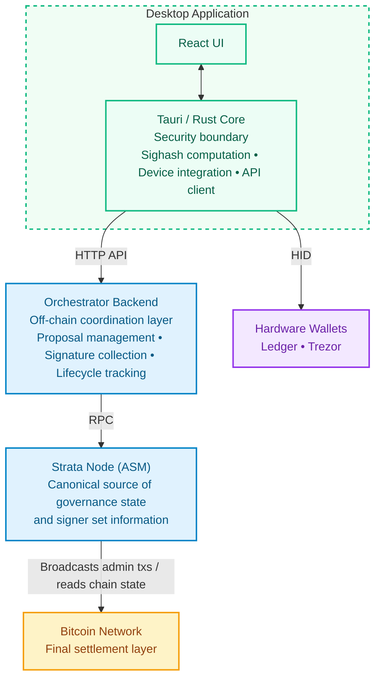
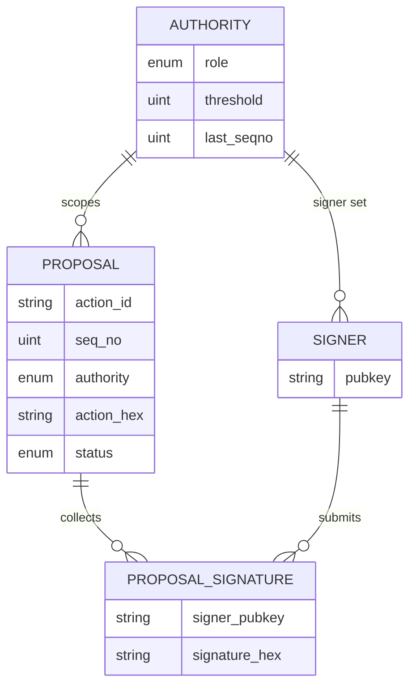

# Phase 1 — Protocol Research & Architecture

> **Status:** Complete
> **Scope:** Internalize SPS-50, SPS-51, SPS-65; identify integration points with the Alpen admin subprotocol crate; validate hardware wallet device matrix; finalize data model and API contract; recommend HWI bundling approach.

This document is the consolidated Phase 1 deliverable for the Alpen Multisig project. It covers the four required outputs defined in the [project proposal](../1-proposal/01-alpen-multisig-proposal.md): (1) Alpen admin crate integration assessment, (2) hardware wallet compatibility matrix, (3) architecture document covering data model, API contract, component boundaries, and tech stack confirmation, and (4) HWI bundling recommendation. Each section documents findings, current implementation status, open gaps, and risks to inform Phase 3 scoping decisions.

## 1. Alpen Admin Crate Integration Assessment

The Alpen/Strata ecosystem publishes its protocol types as internal Rust crates, not on crates.io. The desktop app and backend consume them as git dependencies from `alpenlabs/asm` (rev `a8559d3`, == tag `v0.1-alpha.5`), `alpenlabs/strata-common` (tag `v0.1.0-alpha-rc16`), and `alpenlabs/ssz-gen` (tag `v0.15.0`), following the strategy defined in [ADR-001](../architecture/adrs/001-alpen-crate-dependencies.md). Prior to 2026-04-17 these crates lived on `alpenlabs/alpen` and used Borsh; see [`docs/2-discovery/11-asm-repo-migration.md`](../2-discovery/11-asm-repo-migration.md) for the migration record.

The central constraint of this integration is **SSZ serialization compatibility**. The canonical wire format for `MultisigAction`, `SignedPayload`, and all admin transaction types is defined by these crates and must match, byte-for-byte, what the ASM onchain subprotocol expects. A single discriminant, field-ordering, or sighash-tag difference produces a transaction the ASM will reject. None of the core protocol crates are replaceable — the project must track them upstream, and every upstream change may require a coordinated workspace pin update. The `sighash_payload()` bytes are hand-coded in upstream (SPS-65) and remained byte-identical across the upstream Borsh→SSZ transition, so signatures produced against either version verify on-chain.

This section answers three questions:
1. Which crates are confirmed and in use today?
2. Which crates are needed for the final delivery but not yet integrated in the workspace?
3. Which PRD update types are blocked because the upstream `Role`, `AdminTxType`, or `UpdateAction` variant does not exist yet?

> **Core assumption.** WakeUp Labs does not fork, re-implement, or extend protocol types. Any role, transaction type, action variant, or script template missing from the upstream Alpen crates is a **delivery dependency on Alpen Labs**, not an internal implementation task. This is consistent with ADR-001 and with the "backend MUST NOT redefine governance rules" clause in the backend PRD (§1, [`docs/0-prd/02-multisig-backend.md`](../0-prd/02-multisig-backend.md)).

### 1.1 Crate Inventory

**Confirmed and in use** (pinned in workspace `Cargo.toml`, `alpenlabs/asm` rev `a8559d3` / `alpenlabs/strata-common` tag `v0.1.0-alpha-rc16`):

| Crate                       | Source                      | Key types / functions                                                                                                            | Used by                  | Replaceable?                                 |
| --------------------------- | --------------------------- | -------------------------------------------------------------------------------------------------------------------------------- | ------------------------ | -------------------------------------------- |
| `strata-asm-txs-admin`      | `alpenlabs/asm`             | `MultisigAction`, `UpdateAction`, `CancelAction`, `Sighash::compute_sighash()`, `parser::parse_tx()`, `SignedPayload`            | desktop-app, e2e-tests   | No — canonical SSZ layout and sighash tags   |
| `strata-asm-params`         | `alpenlabs/asm`             | `Role` enum — **2 variants today**: `StrataAdministrator`, `StrataSequencerManager`                                              | desktop-app, e2e-tests   | No — SSZ discriminant must match ASM         |
| `strata-asm-common`         | `alpenlabs/asm`             | `TxInputRef`                                                                                                                     | e2e-tests                | No — required by `parser::parse_tx()`        |
| `strata-asm-txs-test-utils` | `alpenlabs/asm`             | `TEST_MAGIC_BYTES`, reveal-tx construction helpers                                                                               | e2e-tests                | No — builds exact witness envelope structure |
| `strata-crypto`             | `alpenlabs/strata-common`   | `CompressedPublicKey`, `ThresholdConfig`, `ThresholdConfigUpdate`, `verify_threshold_signatures()`, `SignatureSet`, `IndexedSignature` | desktop-app, e2e-tests   | No — types embedded in SSZ serialization     |
| `strata-l1-txfmt`           | `alpenlabs/strata-common`   | `ParseConfig`, `TagData` (SPS-50 parsing)                                                                                        | e2e-tests                | No — protocol header format                  |
| `strata-identifiers`        | `alpenlabs/strata-common`   | `Buf32` (sighash return type)                                                                                                    | transitive               | No — return type of `compute_sighash()`      |
| `ssz`                       | `alpenlabs/ssz-gen` v0.15.0 | `Encode`, `Decode` traits used by our codec                                                                                      | desktop-app              | No — must match the upstream derive output   |

**Required for the final delivery, not yet integrated in the workspace:**

| Crate                           | Source                    | Needed for                                                                                                              | PRD driver                                                                 |
| ------------------------------- | ------------------------- | ----------------------------------------------------------------------------------------------------------------------- | -------------------------------------------------------------------------- |
| `strata-asm-subprotocols-admin` | `alpenlabs/alpen`         | Reading canonical signer sets via `AdministrationSubprotoState` / `MultisigAuthority` (backend access control)          | Backend PRD §3 — "backend must run the ASM STF to get the canonical set of signers for each authority" |
| `strata-l1-envelope-fmt`        | `alpenlabs/strata-common` | SPS-51 reveal-script envelope construction (`EnvelopeScriptBuilder`, auto-chunks at 520 bytes)                          | UI PRD req 13.2 — create and broadcast approval transactions               |
| `strata-btcio` (`writer::builder`) | `alpenlabs/alpen`      | Commit + reveal transaction construction (`EnvelopeConfig`, `create_envelope_transactions`) at broadcast time            | UI PRD req 13.2.1 — "Send" button, sat/vB fee-rate control                 |
| `bitcoind-async-client` (or equivalent) | external / `alpen` | Bitcoin RPC client for wallet signing of the commit tx and raw-tx broadcast                                             | UI PRD req 13.2 — broadcast via the application's Bitcoin RPC              |

None of these four are compiled into the workspace today; they are the integration surface remaining for Phase 3.

> **Sources:** [`docs/2-discovery/03-poc1-findings.md`](../2-discovery/03-poc1-findings.md) §5–§6, [`docs/2-discovery/08-alpen-crate-prd-coverage.md`](../2-discovery/08-alpen-crate-prd-coverage.md), [`docs/2-discovery/10-asm-bitcoin-state-model.md`](../2-discovery/10-asm-bitcoin-state-model.md).

### 1.2 Implemented Update Types (available today)

The `AdminTxType` enum in `strata-asm-txs-admin` defines **7 variants**. Six map 1:1 to PRD update types; the seventh (`AsmStfVkUpdate`, type 31) has no corresponding PRD update type and is currently treated as unused by the multisig app.

| PRD Update Type                    | Authority       | `UpdateAction` variant           | `AdminTxType`                         | Sighash tag                                       | Execution                |
| ---------------------------------- | --------------- | -------------------------------- | ------------------------------------- | ------------------------------------------------- | ------------------------ |
| Strata Administrator Signer update | Strata Admin    | `Multisig(MultisigUpdate)`       | `StrataAdminMultisigUpdate` (10)      | `strata/admin/strata_admin_multisig_update`       | Queued (~2016 blocks)    |
| Strata verification key update     | Strata Admin    | `VerifyingKey(PredicateUpdate)`  | `OlStfVkUpdate` (30)                  | `strata/admin/ol_stf_vk_update`                   | Queued                   |
| Operator update                    | Strata Admin    | `OperatorSet(OperatorSetUpdate)` | `OperatorUpdate` (20)                 | `strata/admin/operator_update`                    | Queued                   |
| Seq Manager Signer update          | Seq Manager     | `Multisig(MultisigUpdate)`       | `StrataSeqManagerMultisigUpdate` (11) | `strata/admin/strata_seq_manager_multisig_update` | Queued                   |
| Sequencer update                   | Seq Manager     | `Sequencer(SequencerUpdate)`     | `SequencerUpdate` (21)                | `strata/admin/sequencer_update`                   | **Immediate** — skips the queue |
| Cancel action                      | Admin / Seq Mgr | `MultisigAction::Cancel`         | `Cancel` (0)                          | `strata/admin/cancel`                             | Consumes a seqno; removes a queued update |
| _(unmapped)_                       | —               | `VerifyingKey(PredicateUpdate)`  | `AsmStfVkUpdate` (31)                 | `strata/admin/asm_stf_vk_update`                  | Queued; not referenced by the PRD |

> **Note on `VerifyingKey` dispatch.** `OlStfVkUpdate` (30) and `AsmStfVkUpdate` (31) are two rows that share a single Rust variant: `UpdateAction::VerifyingKey(PredicateUpdate)`. The choice between the two `AdminTxType` values (and therefore sighash tags) is driven by an inner `ProofType` discriminator inside `PredicateUpdate` — there is no separate `UpdateAction::AsmStfVk` variant in the crate.

> **Note on `Cancel` authorization.** A `CancelAction` targets a queued action by id and, at handling time, the required authority is derived from the **targeted** queued action's role (see `crates/asm/subprotocols/admin/src/handler.rs`), not from a role inside the cancel payload. The desktop app must therefore sign a cancel with the same authority that authorized the original update.

The `SequencerUpdate` exception is significant for the lifecycle model: it has no `Approved → Enacted` window and cannot be canceled. The backend proposal state machine and the UI "Past/Approved" views must treat it as a special case.

### 1.3 Gaps — Blocked on Upstream Alpen Crate Additions

The PRD enumerates 13 distinct admin-subprotocol update types (req 15) plus `block_payout` (req 16+). Six are implemented today (§1.2). **Eight are blocked** because the required `Role`, `AdminTxType`, or action semantics do not exist upstream. The "zero references" claims below were independently corroborated by a full-codebase sweep in [`docs/2-discovery/08-alpen-crate-prd-coverage.md`](../2-discovery/08-alpen-crate-prd-coverage.md) §2.

| PRD Update Type                   | PRD req | Authority                                         | Blocker                                                                                                                                                                                                       |
| --------------------------------- | ------- | ------------------------------------------------- | ------------------------------------------------------------------------------------------------------------------------------------------------------------------------------------------------------------- |
| Alpen verification key update     | 15.1.1  | Alpen Administrator                               | `Role::AlpenAdministrator` does not exist — zero references in the Alpen codebase                                                                                                                             |
| Alpen Administrator Signer update | 15.1.2  | Alpen Administrator                               | Same — role not defined                                                                                                                                                                                        |
| Safe Harbor address update        | 15.2.1  | Strata Administrator                              | Zero references to "safe harbor" in the Alpen codebase — concept undefined upstream                                                                                                                            |
| Security Council Signer update    | 15.2.4  | Strata Administrator *(target: Security Council)* | `Role::SecurityCouncil` does not exist. Strata Admin is the authorizing authority, but the `MultisigUpdate { role, .. }` payload cannot reference a role enum variant that does not exist upstream.           |
| "Soft" bridge update              | 15.2.6  | Strata Administrator                              | Term only in PRD; semantically undefined in the crates                                                                                                                                                        |
| "Hard" bridge update              | 15.2.7  | Strata Administrator                              | Same                                                                                                                                                                                                           |
| Defcon 1 transaction              | 15.4.1  | Security Council                                  | No `Role::SecurityCouncil`; zero references to "defcon" — mechanism not specified                                                                                                                              |
| Defcon 3 transaction              | 15.4.2  | Security Council                                  | Same                                                                                                                                                                                                           |

**Role coverage summary** (against the `Role` enum in `strata-asm-params`):

| PRD Role                 | Exists upstream?       | PRD update types | Implemented |
| ------------------------ | ---------------------- | ---------------- | ----------- |
| Alpen Administrator      | **No**                 | 2                | 0 (0%)      |
| Strata Administrator     | Yes                    | 7                | 3 (43%)     |
| Strata Sequencer Manager | Yes                    | 2                | 2 (100%)    |
| Security Council         | **No**                 | 2                | 0 (0%)      |
| Payout Administrator     | **No** (separate protocol) | 1 (`block_payout`) | 0 — different path |

### 1.4 Payout Administrator — Separate Protocol

`block_payout` (PRD req 16–20) is **not part of the admin subprotocol**. It is a native Bitcoin UTXO spend from the bridge multisig script, not an SPS-50/SPS-65 tagged admin transaction. It requires a fundamentally different implementation path:

- Direct PSBT construction using the `bitcoin` crate — no sighash tag, no SPS-51 envelope, no OP_RETURN header.
- Knowledge of the bridge script spending conditions — **not located in any crate surveyed so far**; the `bridge-v1` subprotocol at `crates/asm/subprotocols/bridge-v1/` (deposit, operator, assignment, withdrawal handlers) does not expose `block_payout` spending logic.
- A Bitcoin RPC client for broadcast, fee-rate control at 0.1 sat/vB granularity (PRD req 17.3.1.1), and UTXO selection within the ~400 KB standardness limit (PRD req 20.1).
- A distinct lifecycle: expired `block_payout` proposals are **deleted** rather than kept as history (PRD req 17.4.1) — diverges from the admin update lifecycle.

### 1.5 Open Questions for Alpen Labs

These questions must be resolved before the blocked update types can be scoped into the implementation phase.

| # | Question                                                                                                                           | Why it blocks us                                                                                                          |
| - | ---------------------------------------------------------------------------------------------------------------------------------- | ------------------------------------------------------------------------------------------------------------------------- |
| 1 | What do "Soft" vs "Hard" bridge updates mean (PRD req 15.2.6–7)?                                                                   | Zero codebase references; we cannot design the action payload, the `UpdateAction` variant, or the sighash tag.           |
| 2 | What does "Safe Harbor address" represent (PRD req 15.2.1) — a Bitcoin address, a script, or a protocol parameter?                 | No upstream type; cannot design the `UpdateAction` variant.                                                              |
| 3 | Will `Role::AlpenAdministrator` and `Role::SecurityCouncil` be added upstream? When?                                               | Both roles cover 4 of 13 PRD update types plus all Defcon transactions — half of the blocked scope.                      |
| 4 | Are Defcon 1/3 standard `UpdateAction` variants, or a separate mechanism (e.g., a dedicated subprotocol)?                          | Determines whether they reuse the existing sighash/envelope pipeline or require a new one.                                |
| 5 | Where are the `block_payout` bridge-script spending conditions defined? Which crate, if any, exposes the script template?         | Required to construct any spending PSBT; no known crate surfaces it today.                                               |
| 6 | What Strata node RPC endpoint exposes `AdministrationSubprotoState`? Is there a client crate, or must the backend implement its own? | Backend PRD §3 mandates running the ASM STF to derive canonical signer sets; without RPC access there is no access control. |
| 7 | Is `AsmStfVkUpdate` (type 31) a PRD-relevant update type we should surface, or an internal-only variant?                           | Currently unmapped; if the PRD intends it to be exposed, the UI and backend need a new code path.                        |
| 8 | Timeline for upstream additions — is there a release roadmap the multisig app should track?                                       | Affects Phase 3 scoping and risk: blocked types cannot be delivered while they remain missing upstream.                  |

### 1.6 Assumptions

1. **Alpen Labs is the sole source of protocol-layer additions.** WakeUp Labs will not author new `Role` variants, `AdminTxType` values, `UpdateAction` variants, or sighash tags. Any missing PRD update type is tracked as a delivery dependency on Alpen Labs, not as internal implementation work (per ADR-001).
2. **Upstream Borsh layout is stable between pin updates** within a given Phase 3 milestone. A mid-phase breaking change to the Borsh form of `MultisigAction`, `SignedPayload`, or `ThresholdConfig` would invalidate any signatures already collected off-chain against the previous layout, and would require a signature re-collection procedure.
3. **Sighash computation is always delegated to `strata-asm-txs-admin`** via the `Sighash` trait (`compute_sighash(seqno) -> Buf32`). The desktop app never re-implements tag construction; it always calls the crate. This is the single point that guarantees signature compatibility with the ASM.
4. **Signer-as-broadcaster is the canonical broadcast path.** The actor who reaches quorum (or any later signer) builds the commit+reveal pair locally from the collected `SignedPayload`. The backend never broadcasts — it only coordinates (backend PRD §2.3).

### 1.7 Limitations, Risks & POC Status

**Limitations:**
- `Role::AlpenAdministrator` and `Role::SecurityCouncil` do not exist upstream — all Alpen Admin update types, all Security Council update types, and the "Security Council Signer update" payload under Strata Admin are fully blocked until Alpen Labs adds them.
- "Soft/hard bridge update" and "Safe Harbor address update" have no upstream type and no agreed semantics — Strata Admin update types blocked on clarification, not on code.
- `block_payout` is outside the admin subprotocol entirely; the bridge spending script is not exposed in any crate surveyed to date, and the implementation path is not yet scoped.
- Four crates required by the final delivery are not yet integrated in the workspace: `strata-asm-subprotocols-admin`, `strata-l1-envelope-fmt`, `strata-btcio`, and `bitcoind-async-client` (or equivalent RPC client).
- `AsmStfVkUpdate` (type 31) exists upstream but has no PRD mapping; its intended exposure is unclear.

**Risks:**
- All Alpen crates are git dependencies without crates.io releases — upstream breaking changes require manual workspace pin updates with no automated notice. Pin bumps must be gated by the SSZ roundtrip test (`test_encode_matches_direct_strata_ssz`) already established in the desktop client codec. The 2026-04-17 migration documented in [`docs/2-discovery/11-asm-repo-migration.md`](../2-discovery/11-asm-repo-migration.md) is a live example of this risk and how it is handled.
- Mid-phase upstream changes to `MultisigAction`, `SignedPayload`, or `ThresholdConfig` SSZ layout would invalidate off-chain signatures already collected against the previous layout. A signature rotation / re-collection procedure must be defined. Note: the Borsh→SSZ migration was the exception, not the rule — `sighash_payload()` was handcoded and remained byte-identical, so collected signatures survived. Future format changes may not be as lucky.
- If Alpen Labs defines the missing roles and update types late in the project, Phase 3 scope may need to extend substantially or defer those types to a follow-up milestone.
- The Strata node RPC surface for `AdministrationSubprotoState` is unidentified. If no client crate exists, the backend must implement its own RPC adapter — an unscoped integration.
- The `block_payout` path requires a distinct Bitcoin-native PSBT + RPC implementation with no prototype yet; its complexity is not bounded by the current architecture.
- The whole workspace is forced onto nightly Rust because `strata-asm-params` pulls in `ssz` transitively, and `ssz` depends on `generic_const_exprs`, a nightly feature with no stabilization timeline. We pin a specific nightly date in `rust-toolchain.toml` to avoid surprise breakage, but every pin bump needs a full build and test pass. The backend does not use any Strata crate today, yet it inherits the same toolchain constraint from the workspace. There is no realistic path to stable Rust until Alpen replaces SSZ or the feature stabilizes upstream. See [`docs/2-discovery/07-nightly-dependency-finding.md`](../2-discovery/07-nightly-dependency-finding.md) for the full dependency chain and mitigation options.

**POC status:**
- End-to-end sighash computation validated in `e2e-tests` against `strata-asm-txs-admin` and `strata-crypto` at `alpenlabs/asm` rev `a8559d3` / `alpenlabs/strata-common` tag `v0.1.0-alpha-rc16` (re-validated 2026-04-17). `Role` enum, `AdminTxType` discriminants, and `sighash_payload` bytes are identical to the pre-SSZ version; the migration does not close any PRD coverage gap.
- Desktop client domain ↔ protocol SSZ roundtrip is isolated in a single `infrastructure/action_codec.rs` module, with a byte-level compatibility test (POC-4, `test_encode_matches_direct_strata_ssz`) that fails fast on upstream layout drift.
- Backend proposal CRUD with deterministic `ActionId` and duplicate rejection is implemented in [`orchestator-be/src/application/proposals.rs`](../../orchestator-be/src/application/proposals.rs), mirroring the backend PRD's minimal API sketch (`create_update_action`, `approve_action`, `get_update_action`, `list_proposals`).
- `strata-asm-subprotocols-admin`, `strata-l1-envelope-fmt`, `strata-btcio`, and `bitcoind-async-client` are not yet compiled or exercised in the workspace.


## 2. Hardware Wallet Compatibility Matrix

Hardware wallet integration is the highest-risk surface in the desktop application. The core problem is that standard hardware wallet APIs expose a `sign_message` endpoint that applies a Bitcoin-specific prefix (BIP-137) before hashing, but the Alpen ASM subprotocol expects **bare ECDSA** over the raw SPS-65 sighash with no prefix. These two formats are cryptographically incompatible for the purpose of ASM signature submission.

The integration is also split across two distinct signing contexts with different security requirements:

- **Session authentication** — a signer proves key ownership to the backend to gain access to their authority's proposals. The backend controls both sides, so BIP-137 is acceptable here.
- **Proposal signing** — a signer produces a signature over an admin action sighash that will be embedded in a Bitcoin transaction and validated onchain by the ASM. This requires raw ECDSA; BIP-137 will be rejected.

The PSBT path (Option B in section 4) solves the proposal signing problem by constructing a minimal Bitcoin transaction and using the device's `sign_tx` API, which returns raw ECDSA. This adds significant complexity but is the only protocol-correct path.

### 2.1 Required Capabilities

| Capability                | Protocol requirement                      | Notes                                  |
| ------------------------- | ----------------------------------------- | -------------------------------------- |
| Taproot key derivation    | `m/86'/0'/73'/0/n` (first 20 addresses)   | BIP-86 — Taproot                       |
| secp256k1 ECDSA signing   | SPS-65 raw sighash (no prefix)            | NOT Bitcoin message signing (BIP-137)  |
| On-device payload display | Signer must review action before signing  | UX safety requirement                  |
| PSBT support              | Needed for raw ECDSA output via `sign_tx` | Workaround for BIP-137 format mismatch |

### 2.2 Signing Format Gap — BIP-137 vs Raw ECDSA

Both Trezor and Ledger expose a `sign_message` API that applies the BIP-137 prefix before hashing, producing a signature over `SHA256d("Bitcoin Signed Message:\n" + payload)`. The Alpen ASM expects bare ECDSA over the raw SPS-65 sighash — these are **incompatible**.

Resolution options:

| Option                             | How                                 | Protocol compatibility                             | Complexity |
| ---------------------------------- | ----------------------------------- | -------------------------------------------------- | ---------- |
| **A — BIP-137 verify server-side** | Backend verifies with prefix        | Works for auth nonce only — not for ASM submission | Low        |
| **B — PSBT / `sign_tx` path**      | Construct Bitcoin tx, use `sign_tx` | Raw ECDSA — protocol-correct                       | High       |
| **C — `sign_identity`**            | Experimental Trezor API             | Unstable across firmware versions                  | Medium     |

**Recommendation:** Option B (PSBT path) for proposal signing. Option A for auth nonce (backend controls both sides).

> **Sources:** [`docs/2-discovery/06-hardware-wallet-architecture.md`](../2-discovery/06-hardware-wallet-architecture.md), [`docs/2-discovery/07-hardware-wallet-library-analysis.md`](../2-discovery/07-hardware-wallet-library-analysis.md)

### 2.3 Device Matrix

| Device         | Taproot (BIP-86) | ECDSA sign                 | On-device display | PSBT support        | Status                                            |
| -------------- | ---------------- | -------------------------- | ----------------- | ------------------- | ------------------------------------------------- |
| Trezor Model T | —                | BIP-137 via `sign_message` | Yes               | Yes (via `sign_tx`) | POC validated (emulator) — BIP-137 gap identified |
| Trezor Safe 3  | —                | —                          | —                 | —                   | Not yet tested                                    |
| Ledger Nano S+ | —                | —                          | —                 | —                   | Not yet tested                                    |
| Ledger Nano X  | —                | —                          | —                 | —                   | Not yet tested                                    |

> _Fill in per-device validation results as testing progresses._

### 2.4 Known Issues (Trezor POC-5)

- `SPENDADDRESS` used instead of `SPENDWITNESS` for BIP-84 path — produces wrong address type (P2PKH instead of P2WPKH). Must fix before production.
- Blocking HID calls inside `async` Tauri commands — must wrap with `tokio::task::spawn_blocking`.
- No connection pooling in `trezor-client 0.1.5` — each `connect()` and `sign_message()` opens a new HID session (~200–500ms overhead).

### 2.5 Limitations, Risks & POC Status

**Limitations:**
- Only Trezor Model T has been tested, and only on the emulator — no physical device validation yet.
- `sign_message` (BIP-137) cannot be used for ASM signature submission; the PSBT path is required, which is significantly more complex.
- On-device display of the full action payload in the PSBT path has not been validated.
- Ledger integration has not been started.

**Risks:**
- PSBT path requires constructing a valid Bitcoin transaction solely to extract a raw ECDSA signature — complexity is high and must be validated against each device's `sign_tx` behavior.
- Firmware differences across Trezor models (Model T, Safe 3) may require per-firmware handling or fallback logic.
- Ledger Rust transport crate (`ledger-transport-hidapi`) maturity is unknown — if insufficient, it becomes the blocking dependency for the Option B recommendation.
- Failure to use `tokio::task::spawn_blocking` for HID calls causes Tauri runtime deadlocks — must be enforced as a code convention.

**POC Status:**
- POC-5 validated on Trezor Model T emulator: HID connection, `sign_message` flow, address derivation, BIP-137 incompatibility confirmed.
- Next: physical device test + PSBT signing path for raw ECDSA extraction.
- Next: Ledger emulator equivalent of POC-5.


## 3. Architecture Document

This section is the Phase 1 architecture deliverable. It covers the four required outputs: **component boundaries** (§3.1), **data model** (§3.3), **API contract** (§3.4), and **tech stack confirmation** (§3.7). §3.2 maps the five governance authorities to their available and blocked update types. §3.5 and §3.6 document the protocol integration surfaces (SPS-65 sighash and SPS-50/51 transaction structure). §3.8 collects limitations, risks, and current POC status.

The system has three tiers: an **onchain layer** (Bitcoin + Strata ASM) that owns canonical governance state, an **offchain coordination layer** (orchestrator backend) that manages the pre-broadcast lifecycle, and a **client layer** (desktop app + hardware wallets) where signers interact and produce signatures.

The key architectural invariant is that the backend is a coordination service, not an authority. It collects signatures and tracks proposal status, but it cannot enforce protocol validity: that is the ASM's job. The backend's access control decisions depend on the onchain signer set, which means it must stay synchronized with the Strata node. Backend downtime must not prevent signers from acting: the offline fallback path (manual aggregation plus direct broadcast) is a spec requirement, not a nice-to-have. The concrete module layout and dependency rules below come from [ADR-005](../architecture/adrs/005-layered-architecture.md) and from [`docs/architecture/overview.md`](../architecture/overview.md), which track the real source tree.

### 3.1 System Components



**Component responsibilities:**

| Component | Responsibilities | Owns |
| --- | --- | --- |
| **Bitcoin Network** | Final settlement. Validates and confirms admin transactions. | Finality |
| **Strata Node (ASM)** | Executes the admin subprotocol STF. Canonical source for signer sets, enacted actions, and `last_seqno` per authority. | Protocol validity |
| **Orchestrator Backend** | Proposal creation, signature collection, lifecycle tracking, authority-scoped access control. Derives signer sets from ASM state via RPC. | Offchain coordination |
| **Tauri / Rust Core** | Sighash computation (`compute_sighash()`), device communication (HID), API client, session key management. Security boundary between UI and signing operations. | Signing integrity |
| **React UI** | Signer-facing flows: wallet connect → address select → multisig select → auth → dashboard. Displays quorum progress, action details, lifecycle status. | User interaction |
| **Hardware Wallets** | Key storage and ECDSA signing. On-device display of action details before signing. Never exposed to raw private keys in software. | Key custody |

### 3.2 Authorities and Update Types

| #   | Authority                | Update types available | Update types blocked                                  |
| --- | ------------------------ | ---------------------- | ----------------------------------------------------- |
| 1   | Alpen Administrator      | 0                      | 2 (all blocked)                                       |
| 2   | Strata Administrator     | 3 of 7                 | 4 (soft/hard bridge, safe harbor, sec council signer) |
| 3   | Strata Sequencer Manager | 2 of 2                 | 0                                                     |
| 4   | Security Council         | 0                      | 2 (defcon not defined)                                |
| 5   | Payout Administrator     | 0 (separate protocol)  | —                                                     |

### 3.3 Data Model

The orchestrator backend does not own protocol state. It coordinates around it. The canonical source of truth is always the onchain ASM (signer sets, enacted actions, sequence numbers). The backend's data model reflects only what is needed to run the offchain lifecycle: collecting signatures, tracking proposal status, and enforcing authority-scoped access. The shapes below match the current code in [`orchestator-be/src/domain/proposal.rs`](../../orchestator-be/src/domain/proposal.rs) and [`desktop-app/src-tauri/src/domain/`](../../desktop-app/src-tauri/src/domain/), which both follow the layering defined in [ADR-005](../architecture/adrs/005-layered-architecture.md).

**Governance state** (read from the onchain ASM via the Strata node, cached locally):

```
Authority
├── role: Authority            (StrataAdmin | StrataSequencerManager |
│                               AlpenAdmin | SecurityCouncil | PayoutAdmin)
├── signer_set: Vec<CompressedPublicKey>
├── threshold: NonZero<u8>
└── last_seqno: u64            last sequence number confirmed onchain
```

> Only `StrataAdmin` and `StrataSequencerManager` exist in the upstream `Role` enum today (see §1.4). The other three variants are the backend-side representation the system will adopt once Alpen ships them.

**Coordination state** (owned by the backend, in `orchestator-be/src/domain/proposal.rs`):

```
Proposal
├── action_id: ActionId        sha256(seq_no_be ‖ action_hex_bytes),
│                              deterministic and idempotent
├── seq_no: u64
├── authority: Authority
├── status: ProposalStatus
├── action_hex: String         Borsh-serialized MultisigAction, hex-encoded,
│                              opaque to the backend
└── signatures: Vec<ProposalSignature>

ProposalSignature
├── signer_pubkey: String      signer canonical pubkey, hex-encoded
└── signature_hex: String      raw secp256k1 ECDSA over the SPS-65 sighash

QuorumStatus                   derived view, not persisted
├── collected: u32             unique signer count
├── required: u32              authority threshold
└── is_reached: bool

ProposalStatus = Pending | Approved | Enacted | Canceled | Expired
```

**Deliberate choices worth noting:**

- `action_hex` stays opaque to the backend. The backend only parses Borsh when it must check structural hygiene (malformed hex, discriminant sanity). It never re-interprets semantics. That is what keeps the service inside the "coordination only" boundary from ADR-005 and the backend PRD.
- `ActionId` is content-addressed: `sha256(seq_no_be_bytes ‖ action_hex_bytes)`. The same `(MultisigAction, SeqNo)` pair always produces the same id, which gives duplicate rejection for free and makes the API idempotent by construction.
- The desktop app maintains a parallel `domain/` module with its own `Action`, `Authority`, and `Proposal` types. Strata crate types only cross into the desktop app at `infrastructure/action_codec.rs`, the single place where Borsh encoding happens. Everything above that boundary works in project-owned domain types, which is exactly the direction ADR-005 prescribes.
- Session state is intentionally absent from the current schema. Ephemeral-key authentication is part of the target architecture (see §3.4) but no `Session` type exists in the code yet. Adding it is tracked under §3.8 as the next concrete backend step.

**Richer lifecycle on the design board.** The implementation uses the five `ProposalStatus` variants above because that is what the POC needed. The target lifecycle, documented in [`docs/architecture/overview.md`](../architecture/overview.md), splits the pending phase into `Pending → QuorumMet → Approved`, adds `ExecutedImmediate` for `SequencerUpdate` (which skips the queue, see §1.2), and distinguishes `CanceledOff` (removed before broadcast) from `CanceledOn` (removed via an onchain `Cancel` transaction). These states will land alongside the flows that require them.

**Entity relationships (current schema):**



### 3.4 API Contract

The backend exposes a versioned HTTP surface under `/api/v1`, wired in [`orchestator-be/src/main.rs`](../../orchestator-be/src/main.rs) and [`orchestator-be/src/handlers/mod.rs`](../../orchestator-be/src/handlers/mod.rs). Handlers are thin wrappers around `application::proposals`, which is the only layer allowed to mutate domain state. This is the ADR-005 rule applied in practice.

**Implemented today:**

| Method | Path                                    | Body / Query                                                        | Description                                          |
| ------ | --------------------------------------- | ------------------------------------------------------------------- | ---------------------------------------------------- |
| GET    | `/api/v1/health`                        | —                                                                   | Liveness probe                                       |
| GET    | `/api/v1/proposals`                     | `?status=pending\|approved\|enacted\|canceled\|expired`             | List proposals, optionally filtered by status        |
| POST   | `/api/v1/proposals`                     | `{ authority, seq_no, action_hex, signer_pubkey, signature_hex }`   | Create a proposal with the creator's first signature |
| GET    | `/api/v1/proposals/:action_id`          | —                                                                   | Fetch a proposal by its deterministic action id      |
| POST   | `/api/v1/proposals/:action_id/approve`  | `{ signer_pubkey, signature_hex }`                                  | Append an approval signature                         |

Error responses are mapped from `AppError` in [`orchestator-be/src/error.rs`](../../orchestator-be/src/error.rs): `400 Bad Request` for invalid hex or malformed Borsh, `404 Not Found` for unknown `action_id`, `409 Conflict` for duplicate `(seq_no, action_hex)` or duplicate signer on the same proposal, `500 Internal Server Error` for repository-level failures. All of these are covered by the integration tests in `handlers::tests`.

**Authentication: as designed vs. as implemented.** The target model, required by the backend PRD and already assumed by the desktop client's `fetch_proposals`, uses an ephemeral-key session. A signer authenticates with their canonical key, receives a short-lived session bound to a single authority, and signs subsequent requests with the session key. None of that is in the backend code today. There is no `POST /sessions` route, no bearer-token middleware, and no session extractor. The desktop client already calls `bearer_auth(token)` against endpoints that silently ignore the header. Closing this gap is the single most visible drift between the two apps and is tracked under §3.8.

**Access-control invariants to enforce once session middleware lands** (from [`.claude/rules/backend-api-conventions.md`](../../.claude/rules/backend-api-conventions.md)):
- The session's authority scope must match the proposal's authority.
- The caller's canonical pubkey must exist in the onchain signer set for that authority at the time of the request, as derived from live ASM state.
- Non-signers must not be able to infer proposal existence from status codes, response shape, or timing differences.

### 3.5 Sighash Computation (SPS-65)

```
sighash = SHA256(
    SHA256(tag)           ← 32 bytes, tag = "strata/admin/<type_name>"
    ‖ seqno_be            ← 8 bytes, big-endian u64
    ‖ sighash_payload     ← variable, Borsh-encoded action-specific data
)
```

Each signer signs this 32-byte hash with raw secp256k1 ECDSA (not BIP-137).

### 3.6 Bitcoin Transaction Structure (SPS-50 + SPS-51)

Every admin update produces a Bitcoin reveal transaction:

- **Output 0** — `OP_RETURN` with SPS-50 header: magic + subprotocol_id + tx_type + aux
- **Input 0 witness** — SPS-51 envelope: `<sig> <spend_script>` where spend_script embeds the Borsh-serialized `SignedPayload { seqno, action, signatures }` chunked into 520-byte pushes

### 3.7 Tech Stack

| Layer         | Stack                                     |
| ------------- | ----------------------------------------- |
| Backend       | Rust, Axum, in-memory (Postgres planned)  |
| Desktop shell | Tauri 2                                   |
| Frontend      | React 18, TypeScript, TailwindCSS, Vite   |
| Signing       | `strata-asm-txs-admin`, `strata-crypto`   |
| HW wallet     | `trezor-client 0.1.5` (HID), Ledger (TBD) |
| Bitcoin       | `bitcoin` crate (workspace)               |

### 3.8 Limitations, Risks & POC Status

**Limitations:**
- The Strata node RPC interface for querying `AdministrationSubprotoState` has not been identified — ASM state sync is architecturally required for access control but the implementation path is unknown.
- Postgres integration is planned but not started — the only persistence implementation is an in-memory repository.
- Session authentication is designed but not implemented — all endpoints are currently unprotected.
- The `block_payout` flow (Payout Admin) requires a separate Bitcoin RPC client; it is not represented in the current architecture.

**Risks:**
- ASM state sync latency creates a window where stale signer sets could allow or deny access incorrectly — invalidation strategy needs to be defined.
- Backend downtime must not block signers from manually aggregating signatures and broadcasting directly to Bitcoin (spec requirement). This offline path has not been validated end-to-end.
- Sequence number gaps are protocol-valid but can cause coordination confusion without explicit metadata support in the UI.

**POC Status:**
- Domain types, `ActionId` computation, and `ProposalStatus` lifecycle validated in unit tests.
- Layered architecture implemented per ADR-005 (handlers → application → domain → infrastructure).
- Postgres migrations, repository trait implementation, and session middleware are the next concrete steps.


## 4. HWI Bundling vs. Device-Narrowing Recommendation

The desktop app needs to communicate with hardware wallets to sign admin action sighashes. Two integration strategies are available: bundle [Bitcoin HWI](https://github.com/bitcoin-core/HWI) (a Python-based unified hardware wallet interface) as a subprocess, or integrate device-specific Rust crates directly.

This decision affects distribution size, device support breadth, maintenance surface, and implementation complexity. It is not a pure technical choice — it also depends on the realistic signer population for Alpen Labs and the maturity of available Rust crates for each device.

The shared constraint that both options must resolve is the **BIP-137 signing format gap** (section 2.2). Both HWI and the Rust crates use the PSBT path (`sign_tx`) to produce raw ECDSA — the implementation complexity is roughly equivalent. The meaningful differences are around distribution, device breadth, and language stack.

**Decision criteria:**

| Criterion | Option A — HWI | Option B — Rust crates |
| --- | --- | --- |
| Device breadth | Broad (Trezor, Ledger, Coldcard, others) | Narrow (Trezor + Ledger only) |
| Binary size | +40–80 MB (Python runtime) | Minimal overhead |
| Distribution complexity | High (cross-platform Python bundling) | Low (native binary) |
| Maintenance | HWI version pinning, no per-device code | Separate crate per device |
| Protocol compatibility (PSBT) | Yes | Yes (same PSBT path) |
| Coldcard support | Yes | No (additional work required) |
| Rust stack alignment | No (subprocess) | Yes (native workspace) |

### 4.1 Options

**Option A — HWI Bundling**
Bundle Bitcoin HWI (Hardware Wallet Interface) as a subprocess within the Tauri desktop app. HWI provides a unified Python-based interface to Trezor, Ledger, Coldcard, and others via PSBT.

| Pro                                           | Con                                               |
| --------------------------------------------- | ------------------------------------------------- |
| Broad device support from day one             | Python runtime must be bundled (~40–80 MB)        |
| PSBT path — raw ECDSA compatible with SPS-65  | Distribution complexity (cross-platform bundling) |
| Coldcard and other advanced devices supported | Additional attack surface (subprocess execution)  |
| No per-device HID code to maintain            | HWI version pinning and update lifecycle          |

**Option B — Pure-Rust per-device libraries (device-narrowing)**
Integrate device-specific Rust crates (`trezor-client`, `ledger-transport-hidapi`) directly in the Tauri backend. Only support Trezor and Ledger initially.

| Pro                                        | Con                                                       |
| ------------------------------------------ | --------------------------------------------------------- |
| No Python dependency — smaller binary      | Must maintain separate crate per device                   |
| Native Rust — fits existing workspace      | `trezor-client` API requires PSBT path work (BIP-137 gap) |
| Tighter control over HID session lifecycle | Coldcard and others not supported without additional work |
| Simpler distribution                       | Ledger crate maturity TBD                                 |

### 4.2 Recommendation

> _To be completed after Ledger crate evaluation._

**Preliminary lean:** Option B (pure-Rust, device-narrowing) for the initial delivery scope — Trezor and Ledger cover the realistic signer population for Alpen Labs. The signing format gap (BIP-137 → PSBT) must be resolved regardless of option chosen, and it is the same PSBT path either way.

HWI bundling should be revisited if Coldcard support is required or if Ledger's Rust crate proves insufficiently mature.

**Pending:** Ledger Rust transport evaluation (emulator test equivalent to POC-5).

### 4.3 Limitations, Risks & POC Status

**Limitations:**
- The recommendation cannot be finalized without completing the Ledger Rust crate evaluation — maturity is the deciding factor between Option A and Option B.
- HWI (Option A) has not been prototyped — Python subprocess execution from Tauri is untested.
- Coldcard and other devices are explicitly out of scope for initial delivery; HWI would be required to add them later.

**Risks:**
- Both options share the same root technical risk: the PSBT signing path must be implemented to produce protocol-correct raw ECDSA. This is non-trivial regardless of the HWI choice.
- If Ledger's Rust crate proves immature, the project may need to pivot to Option A late, introducing Python bundling and distribution complexity.
- Cross-platform HID behavior (macOS, Windows, Linux) has not been validated for either option.

**POC Status:**
- Option B partially validated: `trezor-client 0.1.5` on macOS emulator, HID connection established, `sign_message` exercised.
- Ledger POC (emulator equivalent of POC-5) is the next required step before finalizing this recommendation.
- HWI subprocess integration (Option A) has not been prototyped.


## 5. Appendix — Protocol References

| Spec   | Description                                                                    |
| ------ | ------------------------------------------------------------------------------ |
| SPS-50 | Bitcoin transaction format — `OP_RETURN` header structure and magic bytes      |
| SPS-51 | Witness envelope format — chunked payload inside `OP_FALSE OP_IF ... OP_ENDIF` |
| SPS-65 | Admin sighash computation — tagged SHA256 over seqno + action payload          |

**Discovery docs:**

- [Conceptual overview](../2-discovery/01-conceptual-overview.md)
- [Alpen crate coverage vs PRD](../2-discovery/08-alpen-crate-prd-coverage.md)
- [Functional analysis](../2-discovery/09-functional-analysis.md)
- [Hardware wallet architecture](../2-discovery/06-hardware-wallet-architecture.md)
- [Hardware wallet library analysis](../2-discovery/07-hardware-wallet-library-analysis.md)
