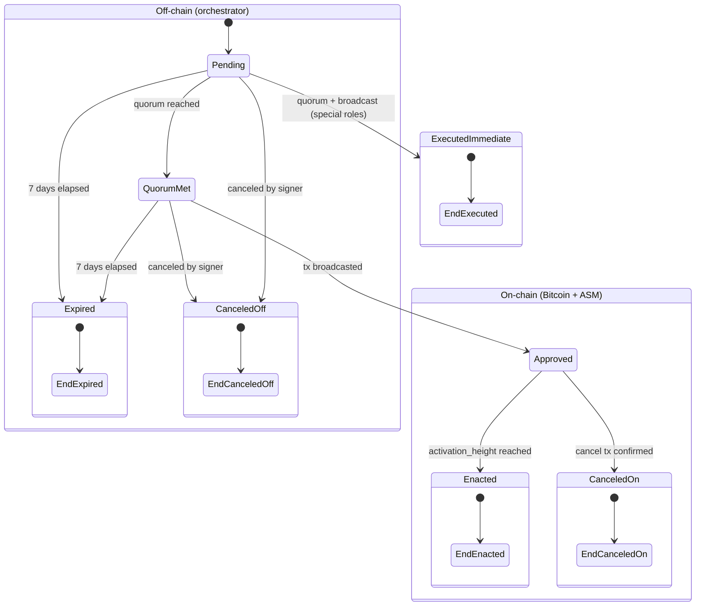

# Architecture Overview

## System Context

The Alpen Multisig application is a cross-platform desktop tool that enables authorized signers to manage on-chain governance of the Strata bridge and Alpen rollup. The system coordinates signature collection off-chain, constructs Bitcoin transactions embedding governance payloads (SPS-50/51/65), and broadcasts them for the ASM (Administration State Machine) to process deterministically.

```
┌──────────────────────────────────────────────────────────────────────┐
│                         Desktop App (Tauri)                          │
│                                                                      │
│  ┌───────────────────────┐  Tauri IPC  ┌──────────────────────────┐  │
│  │  React Frontend (UI)  │────────────>│  Tauri Rust Shell        │  │
│  │  - Proposal mgmt      │  invoke()   │  - Signing library       │  │
│  │  - Signature collect.  │             │  - Backend proxy         │  │
│  │  - Wallet connect     │             │  - HW wallet adapters     │  │
│  └───────────────────────┘             └─────────┬────────────────┘  │
│                                                   │                   │
│   Key material stays in Rust/device boundary;      │ HTTP              │
│   React receives only non-secret response fields    │                   │
└───────────────────────────────────────────────────┼──────────────────┘
                                                     │
                                                     ▼
                                      ┌──────────────────────────┐
                                      │   Orchestrator Backend   │
                                      │   - Proposal CRUD        │
                                      │   - Signature aggregation│
                                      │   - Lifecycle tracking   │
                                      └──────────────────────────┘
                                                     │
                                                     │ (signers broadcast
                                                     │  independently)
                                                     ▼
┌──────────────────────────────────────────────────────────────────────┐
│                           Bitcoin (L1)                                │
│   OP_RETURN (SPS-50) + Witness Envelope (SPS-51)                     │
│   ┌────────────────────────────────────────────────────────────────┐ │
│   │ Strata Node → ASM (Administration State Machine)               │ │
│   │   - Parses admin txs from Bitcoin blocks                       │ │
│   │   - Verifies threshold signatures (SPS-65)                     │ │
│   │   - Manages queued updates + confirmation depth                │ │
│   │   - Enacts governance changes deterministically                │ │
│   └────────────────────────────────────────────────────────────────┘ │
└──────────────────────────────────────────────────────────────────────┘
```

## Governance Model — Five Authorities

Each authority is an independent multisig with its own signer set, threshold, and sequence number. They are fully isolated — no cross-authority data leakage.

| Authority | Role | Key Actions |
|-----------|------|-------------|
| **Alpen Admin** | Rollup governance | Verification keys, admin signer set updates |
| **Strata Admin** | Bridge governance | Safe harbor, verification keys, signer sets, security council, operators, bridge params |
| **Sequencer Manager** | Sequencer ops | Sequencer key rotation |
| **Security Council** | Emergency response | Defcon 1/3 emergency actions |
| **Payout Admin** | Payout operations | `block_payout` transaction construction and broadcast |

## Component Architecture

### 1. Orchestrator Backend

**Role:** Off-chain coordination service only. It does NOT enforce protocol validity rules — that is the ASM's job.

**Allowed:** Hygiene checks (malformed input, duplicate signatures, structural consistency).
**Forbidden:** Re-implementing signature threshold verification, sequence number validation, or any canonical SPS-65 logic.

**API Surface (`/api/v1`):**

| Method | Path | Purpose |
|--------|------|---------|
| `GET` | `/health` | Liveness check |
| `GET` | `/ready` | Readiness (ASM + Bitcoin RPC reachability) |
| `GET` | `/proposals` | List proposals (authority-scoped, optional status filter) |
| `POST` | `/proposals` | Create proposal (`seq_no` + `action_payload`) |
| `GET` | `/proposals/:action_id` | Get proposal details + quorum status |
| `POST` | `/proposals/:action_id/approve` | Submit approval signature |
| `POST` | `/proposals/:action_id/broadcast/claim` | Claim broadcast coordination slot |
| `PATCH` | `/proposals/:action_id/broadcast` | Report broadcast progress / txids |

**API Security:**

- Bearer session from `/auth/challenge` + `/auth/verify` (authority-scoped)
- Proposal mutations include signer signatures per PRD

**Data Identity:**

- `ActionId = hash(MultisigAction, SeqNo)` — deterministic, idempotent
- `SeqNo` is `u64`, allows gaps (not strictly sequential)
- Duplicate `(MultisigAction, SeqNo)` pairs are rejected

**Proposal Lifecycle:**



**State Reference:**

| State | Layer | Description | Visible to |
|---|---|---|---|
| **Pending** | Off-chain | Proposal created, signatures being collected. Expires after 7 days from creation if quorum is not reached. | Signers of that authority only |
| **Quorum Met** | Off-chain | Threshold of signatures collected. "Send" button available. Still within the 7-day window — if no one broadcasts before it elapses, transitions to Expired. | Signers of that authority only |
| **Approved** | On-chain | Bitcoin tx confirmed in a block. Update is queued in the ASM waiting for its activation height. Can still be canceled during this window. | Signers of that authority only |
| **Enacted** | On-chain | `activation_height` reached. ASM applied the governance change. Irreversible. | Signers — Past view |
| **Executed (immediate)** | On-chain | Applies only to Sequencer Manager and Security Council updates. No confirmation queue — change takes effect in the same block the tx is mined. | Signers — Past view |
| **Expired** | Off-chain | 7-day window elapsed before the tx was broadcast. | Signers — Past view |
| **Canceled (off-chain)** | Off-chain | Manually canceled by a signer before the Bitcoin tx was ever broadcast. No on-chain record. | Signers — Past view |
| **Canceled (on-chain)** | On-chain | A `Cancel` tx (signed by the same authority) was broadcast and confirmed during the ~2016 block wait window after Approved. Not available for Sequencer Manager or Security Council. | Signers — Past view |

### 2. Desktop Application

**Tauri Shell:** Rust process managing IPC commands, signing operations, and system-level operations. Key material stays in the Rust/device boundary; the React frontend receives only non-secret response fields.

**React Frontend:** UI layer for all signer interactions.

**Required Navigation Flow:**

```
Wallet Connect → Address Select → Authority Select → Dashboard
```

**Key Frontend Constraints:**
- Never expose private keys in UI state, logs, or storage
- Authority labeling required on every action form
- Quorum progress (`collected / required`) always visible for pending actions
- Support copy/paste signature workflows for manual fallback
- Deterministic payload summary before hardware wallet signing prompt
- Explicit fee inputs for broadcast (0.1 sat/vB increments, max 10,000 sat/vB)

### 3. Hardware Wallet Integration

The application integrates with hardware wallets for secure key management and signing:

- Taproot-style account discovery flow (`m/86'/0'/73'/0/n`)
- Device address listing and on-device address verification
- SPS-65 signing via hardware wallet
- Support for Trezor and Ledger devices

## Protocol Integration Points

### SPS-50 — Transaction Header (OP_RETURN)

```
OP_RETURN <magic(4)> <subprotocol_id(1)> <tx_type(1)> <aux(≤74 bytes)>
```

- `subprotocol_id = 0` for administration
- `tx_type` identifies the action (e.g., `10` = StrataAdminMultisigUpdate)

### SPS-51 — Witness Envelope

```
OP_FALSE OP_IF <520-byte chunks of SSZ-serialized SignedPayload> OP_ENDIF
```

- Max payload ~395KB
- Contains: `{ seqno, action, signatures }`

### SPS-65 — Administration Subprotocol

**Sighash computation (domain-separated, replay-protected):**

```
sighash = SHA256( SHA256(tag) || seqno_be_bytes(8) || sighash_payload )
tag = "strata/admin/<type_name>"
```

**ASM verification flow:**
1. `payload.seqno > authority.last_seqno` (replay protection)
2. `payload.seqno ≤ authority.last_seqno + max_seqno_gap` (gap limit, default 10)
3. Verify ECDSA threshold signatures against current signer set
4. Queue update with `activation_height = current_height + confirmation_depth` (~2016 blocks)

## Offline Survivability

The backend is a convenience layer, not a requirement. If the backend is unavailable:

1. Signers can construct proposals manually
2. Collect signatures via out-of-band channels (copy/paste)
3. Build the Bitcoin transaction locally
4. Broadcast directly to the Bitcoin network

The ASM processes Bitcoin blocks regardless of how the transaction was constructed.

## Technology Stack

| Layer | Stack |
|-------|-------|
| Backend | Rust, Axum, PostgreSQL |
| Desktop Shell | Tauri 2, Rust |
| Frontend | React 18, TypeScript, Vite, TailwindCSS |
| Signing | ECDSA (secp256k1), SSZ-encoded `MultisigAction`, SPS-65 tagged sighash |
| Hardware Wallet | Trezor, Ledger (HID interface) |
| Protocol | SPS-50/51/65, SSZ serialization |
