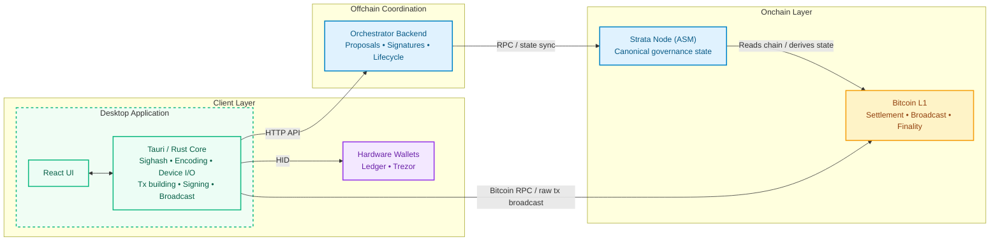

# Protocol Research and Integration Assessment

This document provides a comprehensive technical assessment of the Strata Multisig system, covering protocol integration, hardware wallet compatibility, and system architecture.

## 1. Alpen Protocol Integration Assessment

The Alpen/Strata ecosystem publishes its protocol types as Rust crates that define the canonical SSZ encoding, sighash computation, and transaction format required by the onchain State Machine (ASM).

The central constraint of this integration is **SSZ serialization compatibility**. The canonical wire format for `MultisigAction`, `SignedPayload`, and all admin transaction types must match, byte-for-byte, what the ASM onchain subprotocol expects. A single discriminant, field-ordering, or sighash-tag difference produces a transaction the ASM will reject.

### 1.1 Core Protocol Crates

The system depends on a set of non-replaceable Alpen protocol crates:

- `strata-asm-txs-admin` — action model and sighash computation
- `strata-crypto` — signature validation and threshold logic
- `strata-asm-params` — role definitions
- `strata-l1-txfmt` — SPS-50 transaction parsing
- `ssz` — serialization layer

These crates are tightly coupled to the protocol and must match upstream byte-for-byte.

### 1.2 Implemented Update Types

The `AdminTxType` enum defines the supported update types:

| Update Type | Authority | Execution |
|-------------|-----------|-----------|
| Strata Administrator Signer update | Strata Admin | Queued (~2016 blocks) |
| Strata verification key update | Strata Admin | Queued |
| Operator update | Strata Admin | Queued |
| Sequencer Manager Signer update | Sequencer Manager | Queued |
| Sequencer update | Sequencer Manager | Immediate |
| Cancel action | Admin / Sequencer Manager | Consumes a seqno; removes a queued update |

### 1.3 Update Types Requiring Upstream Additions

The following update types require additional role definitions or protocol specifications from Alpen Labs:

**Missing role definitions:**
- Security Council updates (signer update, Defcon 1 transaction, Defcon 3 transaction)

**Partially supported:**
- Alpen Administrator VK update (`EeStfVk`) — Action encoding and signing supported; enactment detection on ASM not yet implemented. Signer updates (`AlpenAdminMultisigUpdate`) are fully supported.

**Undefined protocol concepts:**
- Safe Harbor address update
- Soft bridge update
- Hard bridge update

**Separate protocol:**
- `block_payout` — This is a native Bitcoin UTXO spend requiring PSBT construction, bridge script knowledge, and Bitcoin RPC integration. It operates independently from the admin subprotocol.

### 1.4 Coverage Summary

| Authority | Supported Update Types |
|-----------|------------------------|
| Strata Sequencer Manager | 2/2 |
| Strata Administrator | 3/3 (signer, VK, operator) |
| Alpen Administrator | 1/2 (signer supported; VK update pending enactment detection) |
| Security Council | Requires upstream role definition |
| Payout Administrator | Separate protocol implementation |

## 2. Hardware Wallet Compatibility

Hardware wallet integration supports the required signing operations for the multisig system.

### 2.1 Required Capabilities

| Capability | Protocol Requirement |
|------------|---------------------|
| Taproot key derivation | `m/86'/0'/73'/0/n` (first 20 addresses) — BIP-86 |
| secp256k1 ECDSA signing | SPS-65 raw sighash (no prefix) |
| On-device payload display | Signer must review action before signing |

### 2.2 Signing Format

The system uses raw ECDSA over the SPS-65 sighash with no prefix. This differs from standard Bitcoin message signing (BIP-137), which applies a prefix before hashing.

### 2.3 Supported Devices

The system supports all hardware wallets that provide:
- Taproot input support
- Raw ECDSA message signing capability
- On-device display for payload verification
- HID interface for desktop communication

## 3. System Architecture

The system has three tiers: an **onchain layer** (Bitcoin + Strata ASM) that owns canonical governance state, an **offchain coordination layer** (orchestrator backend) that manages the pre-broadcast lifecycle, and a **client layer** (desktop app + hardware wallets) where signers interact and produce signatures.

The key architectural invariant is that the backend is a coordination service, not an authority. It collects signatures and tracks proposal status, but it cannot enforce protocol validity — that is the ASM's job. Backend downtime must not prevent signers from acting: the offline fallback path (manual aggregation plus direct broadcast) is a specification requirement.

### 3.1 System Components



**Component Responsibilities:**

| Component | Responsibilities | Owns |
|-----------|-----------------|------|
| **Bitcoin Network** | Final settlement. Validates and confirms admin transactions. | Finality |
| **Strata Node (ASM)** | Executes the admin subprotocol STF. Canonical source for signer sets, enacted actions, and sequence numbers. | Protocol validity |
| **Orchestrator Backend** | Proposal creation, signature collection, lifecycle tracking, authority-scoped access control. Derives signer sets from ASM state. | Offchain coordination |
| **Tauri / Rust Core** | Sighash computation, device communication (HID), API client, session key management. Security boundary between UI and signing operations. | Signing integrity |
| **React UI** | Signer-facing flows: wallet connect → address select → multisig select → auth → dashboard. Displays quorum progress, action details, lifecycle status. | User interaction |
| **Hardware Wallets** | Key storage and ECDSA signing. On-device display of action details before signing. Never exposed to raw private keys in software. | Key custody |

### 3.2 Data Model

The orchestrator backend does not own protocol state. It coordinates around it. The canonical source of truth is always the onchain ASM (signer sets, enacted actions, sequence numbers).

**Governance State** (read from the onchain ASM, cached locally):

```
Authority
├── role: Authority            (StrataAdmin | StrataSequencerManager |
│                               AlpenAdmin | SecurityCouncil | PayoutAdmin)
├── signer_set: Vec<CompressedPublicKey>
├── threshold: NonZero<u8>
└── last_seqno: u64            last sequence number confirmed onchain
```

**Coordination State** (owned by the backend):

```
Proposal
├── action_id: ActionId        sha256(seq_no_be ‖ action_hex_bytes),
│                              deterministic and idempotent
├── seq_no: u64
├── authority: Authority
├── status: ProposalStatus
├── action_hex: String         Serialized MultisigAction, hex-encoded,
│                              opaque to the backend
└── signatures: Vec<ProposalSignature>

ProposalSignature
├── signer_pubkey: String      signer canonical pubkey, hex-encoded
└── signature_hex: String      raw secp256k1 ECDSA over the SPS-65 sighash

ProposalStatus = Pending | Approved | Enacted | Canceled | Expired
```

**Design Principles:**

- `action_hex` stays opaque to the backend. The backend never re-interprets semantics, keeping the service inside the "coordination only" boundary.
- `ActionId` is content-addressed: `sha256(seq_no_be_bytes ‖ action_hex_bytes)`. The same `(MultisigAction, SeqNo)` pair always produces the same id, providing duplicate rejection and API idempotency.
- Session state uses ephemeral-key authentication. A signer authenticates with their canonical key, receives a short-lived session bound to a single authority, and signs subsequent requests with the session key.

### 3.3 API Contract

The backend exposes a versioned HTTP API under `/api/v1`:

| Method | Path | Description |
|--------|------|-------------|
| GET | `/api/v1/health` | Liveness probe |
| GET | `/api/v1/proposals` | List proposals, optionally filtered by status |
| POST | `/api/v1/proposals` | Create a proposal with the creator's first signature |
| GET | `/api/v1/proposals/:action_id` | Fetch a proposal by its deterministic action id |
| POST | `/api/v1/proposals/:action_id/approve` | Append an approval signature |

**Authentication:** Uses an ephemeral-key session model. A signer authenticates with their canonical key, receives a short-lived session bound to a single authority, and signs subsequent requests with the session key.

**Access Control:** The session's authority scope must match the proposal's authority. The caller's canonical pubkey must exist in the onchain signer set for that authority. Non-signers cannot infer proposal existence from status codes, response shape, or timing differences.

### 3.4 Sighash Computation (SPS-65)

```
sighash = SHA256(
    SHA256(tag)           ← 32 bytes, tag = "strata/admin/<type_name>"
    ‖ seqno_be            ← 8 bytes, big-endian u64
    ‖ sighash_payload     ← variable, encoded action-specific data
)
```

Each signer signs this 32-byte hash with raw secp256k1 ECDSA.

### 3.5 Technology Stack

| Layer | Stack |
|-------|-------|
| Backend | Rust, Axum, PostgreSQL |
| Desktop shell | Tauri 2 |
| Frontend | React 18, TypeScript, TailwindCSS, Vite |
| Signing | `strata-asm-txs-admin`, `strata-crypto` |
| Hardware wallet | Trezor, Ledger (HID interface) |
| Bitcoin | `bitcoin` crate |

## 4. Protocol References

| Spec | Description |
|------|-------------|
| SPS-50 | Bitcoin transaction format — `OP_RETURN` header structure and magic bytes |
| SPS-51 | Witness envelope format — chunked payload inside `OP_FALSE OP_IF ... OP_ENDIF` |
| SPS-65 | Admin sighash computation — tagged SHA256 over seqno + action payload |
