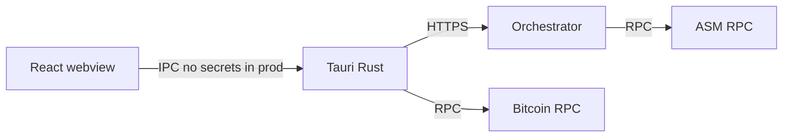

# Threat model (P-051) — summary

**SSOT (security — assets & risks):** Pair with [`specs/signer-safety-model.md`](../specs/signer-safety-model.md) for signer UX principles. This doc covers threats and mitigations; signer-safety covers what the signer must verify. Read both; do not duplicate.

## Assets

- Signer private keys (HW wallet, mnemonic dev path, operator key for broadcast)
- Session bearer tokens (authority-scoped)
- Proposal `action_hex` and collected signatures

## Trust boundaries

## Top risks (Wave 2 mitigations)

| Risk | Mitigation |
|------|------------|
| Malicious backend returns wrong proposal | P-005 hash verify (Track F) |
| Well-known test mnemonic in production | R1.1 per-signer capability: the software mnemonic signer is rejected on mainnet (`allowed_on` = regtest/testnet only), only a hardware signer is allowed on mainnet; the mnemonic-signing IPC is off in release builds (`ALLOW_DEV_MNEMONIC_SIGNING` / `dev_secrets.rs`, P-040). Reveal key is a per-broadcast ephemeral key (R1.0) |
| Mnemonic / raw key exfil via XSS | P-003 + P-040: dev signing IPC off in release (Decision #2; Track A) |
| Supply-chain compromise | P-011 audit/deny/lockfile |
| Cross-authority data leak | P-002 session + proposal scope |
| Coordinator/UI desync on broadcast | P-066 desktop execute + PATCH metadata |
| UTXO double-selection: two commits (or a commit and a send) spend the same coin, so one bundle is replaced and its reveal — whose envelope key is already evicted — can never land (#516) | In-memory reservation of every built tx's inputs before the wallet lock is released; a failed broadcast is settled from the broadcaster's typed answer, and what stays open (ambiguous, undelivered, reveal missing) by the desktop settle loop: found → recorded, absent at every source for 3 checks over 10 min → released and `failed`, commit live + reveal missing → reveal resubmitted. `claim_broadcast` also returns 409 while another approved proposal of that authority is in flight. A proposal that is no longer approved does not count. A `commit_broadcasted` row with no txids older than 10 minutes can be re-claimed and does not block the authority; a row that already has a txid cannot. The desktop offers send again on that empty claim. Documented limits: reservations and absence counters are in memory (an app restart forgets them); BDK 1.2 cannot evict a tx, so a recorded tx dropped without a conflict keeps its inputs looking spent until the session is rebuilt; a commit chained on unconfirmed change dies with its parent. See `specs/proposal-broadcast-commit-reveal.md` |

## Accepted risks

- **Removed signer keeps offchain access until session expiry (#582).** A session bearer token is valid for up to 24 hours from sign-in, and membership is checked only at `/auth/verify`. A signer removed from the multisig during that window (or anyone holding a leaked token) can keep reading proposals and calling every write endpoint. The orchestrator is coordination only and does not verify governance signatures: it checks that `signer_pubkey` matches the session and stores `signature_hex` as given, so such a caller can open proposals, take a `seq_no`, or add an approval that makes a proposal look ready to broadcast. Mitigation: the ASM rejects signatures from non-members at enactment, so none of this can take effect onchain; the exposure is misleading coordination state, not unauthorized governance. Follow-up: re-check membership on write endpoints.

## Out of scope (Wave 3+)

- Signed releases all platforms (P-011 full)
- Shared types codegen (P-043)
- Event-sourced audit log (P-031)
