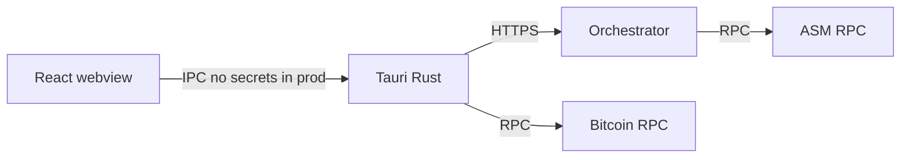

# Threat model (P-051) — summary

## Assets

- Signer private keys (HW wallet, mnemonic dev path, operator key for broadcast)
- Session bearer tokens (authority-scoped)
- Proposal `action_hex` and collected signatures

## Trust boundaries

## Top risks (Wave 2 mitigations)

| Risk | Mitigation |
|------|------------|
| Malicious backend returns wrong proposal | P-005 hash verify (Track F) |
| Well-known test mnemonic in production | R1.1 per-signer capability: the software mnemonic signer is rejected on mainnet (`allowed_on` = regtest/testnet only), only a hardware signer is allowed on mainnet; the mnemonic-signing IPC is off in release builds (`ALLOW_DEV_MNEMONIC_SIGNING` / `dev_secrets.rs`, P-040). Reveal key is a per-broadcast ephemeral key (R1.0) |
| Mnemonic / raw key exfil via XSS | P-003 + P-040: dev signing IPC off in release (Decision #2; Track A) |
| Supply-chain compromise | P-011 audit/deny/lockfile |
| Cross-authority data leak | P-002 session + proposal scope |
| Coordinator/UI desync on broadcast | P-066 desktop execute + PATCH metadata |

## Out of scope (Wave 3+)

- Signed releases all platforms (P-011 full)
- Shared types codegen (P-043)
- Event-sourced audit log (P-031)
