# Admin Wallet (Mini Wallet) — Implementation Plan

Phase 1 delivers **US-H7** — see [`admin-wallet-regtest-commit-funding.md`](./admin-wallet-regtest-commit-funding.md).

## 1. Purpose and scope

The **Admin Wallet** is the signer's BIP-86 Taproot (`m/86'/0'/73'/n/n`) BTC custody layer used for mining-fee inputs, change, and (per PRD §4) Send/Receive. It is distinct from the **Admin ID** (`m/84'/0'/73'/0/0`, P2WPKH), which authenticates to the orchestrator and signs SPS-65 messages and must never sign Bitcoin transactions.

**In scope for this program**

- Authorities: **Strata Administrator** and **Alpen Administrator** only.
- Stack: `bdk_wallet` + **Bitcoin Core–compatible JSON-RPC** (`BITCOIN_RPC_URL`) — referred to below as **chain RPC** (protocol/transport), not “users must run Bitcoin Core.”
- Governance commit/reveal: funding moves to Admin Wallet + BDK; protocol in [`proposal-broadcast-commit-reveal.md`](./proposal-broadcast-commit-reveal.md) unchanged.
- Later: PRD §4 wallet UI (Alta handoff), Send validations, fee-bump, receive rotation, Admin ID display, shared Send UX, direct Trezor/Ledger (no HWI).

**Explicit exclusions (not planned in any phase below)**

- Payout Administrator (`block_payout`, P2TR Admin ID for payout, US-I*, PRD §6).
- HWI (`hwi` CLI, POC-miniwallet HWI integration).
- BDK Electrum (`bdk_electrum`) and standalone Electrum servers.
- Esplora or other indexers in this program.

**External references (visual / POC only — not workspace deps)**

- Alta UI: `miniwallet/Alpen-v0.1-Alta-handoff/Alpen v0.1 - Alta/` — WalletPanel, S9/S11 broadcast UX.
- POC: `miniwallet/poc-miniwallet/frontend` — reference only.

## 2. Traceability

| Phase | Name | Stories / specs |
|---|---|---|
| 1 ✅ | Regtest commit funding | US-H7, [`admin-wallet-regtest-commit-funding.md`](./admin-wallet-regtest-commit-funding.md) |
| 2 ✅ | Wallet core read path | PRD §4.1–4.2 (balance, UTXOs, addresses), [`admin-wallet-core-read-path.md`](./admin-wallet-core-read-path.md) |
| 3 ✅ | Wallet UI shell | PRD §4, Alta WalletPanel |
| 3.5 ✅ | Retire operator hot key | PRD §3.2 — folded reveal internal key into Admin Wallet seed at `m/86'/0'/73'/2/0` (superseded by R1.0: ephemeral reveal key) |
| 3.6 ✅ | Admin Wallet–only commit funding | Remove `BitcoindSendToAddress` variant and `COMMIT_FUNDING` toggle; Admin Wallet (BDK) is the sole commit funder from this phase onward |
| 3.7 ✅ | Session-bound Admin Wallet (mnemonic) | PRD §3.2 — wallet/commit/broadcast key from login session; `ADMIN_WALLET_REGTEST_MNEMONIC` removed (3.7c), [`admin-wallet-session-bound-mnemonic.md`](./admin-wallet-session-bound-mnemonic.md) |
| 3.8 ✅ | Watch-only Admin Wallet (HW login) | PRD §3.2 — HW login path gets a read-only BDK wallet from xpub; balance/addresses visible, signing deferred to R1.1 (broadcast) / Phase 7 (Send) |
| R1.0 ✅ | Ephemeral reveal key | SPS-50 — per-broadcast envelope key, reveal change → Admin Wallet; supersedes `m/86'/0'/73'/2/0`; merged PR #195 |
| R1.0.1 ✅ | Sign commit + reveal before broadcast | SPS-50 — pre-sign both, broadcast commit→reveal (`submitpackage` if available, else sequential); closes the R1.0 crash window via atomicity; merged PR #198, [`admin-wallet-presign-commit-reveal.md`](./admin-wallet-presign-commit-reveal.md) |
| R1.1 ✅ | Session-driven broadcast signing (adds HW path) | PRD §3.2, §5.3.3, [`admin-wallet-session-driven-broadcast-signing.md`](./admin-wallet-session-driven-broadcast-signing.md) — unified `PsbtSigner` driven port; mnemonic login = software signer (simulated HW), HW login = on-device PSBT signer; reveal by ephemeral key; `ALLOW_DEV_MNEMONIC_SIGNING` replaced by per-signer network capability |
| R1.2 ✅ | Clean wallet UI | PRD §4, Alta WalletPanel, [`admin-wallet-clean-wallet-ui.md`](./admin-wallet-clean-wallet-ui.md) |
| R1.3 | Receive rotation | PRD §4.3.4 |
| R1.4 | Remove connect-time derivation picking | PRD §3.2 — canonical paths only |
| 4 | Send BTC happy path | PRD §4.3.5 (regtest, dev mnemonic) |
| 5 | Transactions + fee-bump | PRD §4.3.3 (RBF-first) |
| 6 | Admin ID UI (receive rotation → R1.3) | PRD §4.1–4.2 |
| 7 | HW adapters — Send-on-HW (broadcast signing → R1.1) | PRD §3.2 (Trezor/Ledger PSBT, no HWI) |
| 8 | Shared Send + governance broadcast UX | US-H4, Alta S9/S11, PRD §5.3.2 |
| 9 | Hardening + remote testnet/mainnet RPC | PRD §2 (no local node assumption) |

## 3. Architecture

### Components

```text
React (desktop-app/src)
  └─ IPC invoke (no secrets)
       └─ Tauri admin_wallet module
            ├─ bdk_wallet (descriptors, sync, build, sign)
            ├─ bdk_bitcoind_rpc → chain RPC (BITCOIN_RPC_URL)
            └─ WalletService (commit funding, Send, fee inputs)
```

- **Secrets and signing** stay in Rust (Tauri). React shows addresses, balances, and confirmation UX only.
- **WalletService** is the single Rust service for commit funding, Send, and governance fee inputs. (Phase 1's pluggable `CommitFunding` abstraction was removed in Phase 3.6; the Admin Wallet/BDK is now the sole funder.)
- **Reveal** internal key is currently derived from the Admin Wallet at `m/86'/0'/73'/2/0` (Phase 3.5); R1.0 replaces it with a per-broadcast **ephemeral** key (the reveal is a taproot script-path spend a HW cannot sign). The **commit funding** tx then becomes the session-driven, HW-signable part in R1.1.

### Chain RPC end state

| Environment | Chain RPC | Local `bitcoind` |
|---|---|---|
| Dev / CI (today → Phase 1) | `http://127.0.0.1:18443` via `scripts/bitcoind-asm-runner.sh` | Yes, scripts/CI only |
| Production end state (Phase 9) | Remote testnet/mainnet RPC (trusted preset or custom URL per PRD §2) | No product assumption |

**What goes away:** Local full node as a product requirement; server-side `sendtoaddress` on `BITCOIN_WALLET_NAME` for product flows.

**What stays:** A Bitcoin Core–compatible RPC **client** in the app for sync, fee estimates, and broadcast.

### Phase dependency diagram

```mermaid
flowchart LR
  P1[Phase 1 Commit funding] --> P2[Phase 2 Read path]
  P2 --> P3[Phase 3 UI shell]
  P3 --> P35[Phase 3.5 Retire operator hot key]
  P35 --> P36[Phase 3.6 Admin Wallet-only commit funding]
  P36 --> P37[Phase 3.7 Session-bound wallet mnemonic]
  P37 --> P38[Phase 3.8 Watch-only wallet HW]
  P38 --> R1[Release 1: R1.0 Ephemeral reveal key → R1.0.1 Pre-sign commit+reveal → R1.1 HW commit-funding signing → R1.2 Clean UI → R1.3 Receive rotation → R1.4 Drop derivation picking]
  R1 --> P4[Phase 4 Send happy path]
  P4 --> P5[Phase 5 Tx list + RBF]
  P5 --> P6[Phase 6 Admin ID UI]
  P6 --> P7[Phase 7 HW adapters: Send-on-HW]
  P7 --> P8[Phase 8 Gov + Send UX]
  P8 --> P9[Phase 9 Remote RPC hardening]
```



## 4. Phased plan

The plan has three parts: the completed **Foundation** (Phases 1–3.8), the next shippable increment **Release 1**, and the **Remaining phases (4–9)**.

### Foundation (Phases 1–3.8) — done

Commit funding, wallet read path, UI shell, operator-key retirement, Admin-Wallet-only funding, session-bound mnemonic wallet, and watch-only HW wallet are all complete.

#### Phase 1 — Regtest commit funding (BDK + chain RPC)

**Goal:** US-H7 — fund governance commit from Admin Wallet on regtest; CI keeps legacy funding.

**In scope**

- Workspace crates: `bdk_wallet`, `bdk_bitcoind_rpc`.
- Descriptors: `tr(m/86'/0'/73'/0/*)` and `tr(m/86'/0'/73'/1/*)` on regtest.
- `CommitFunding` trait: `BitcoindSendToAddress` (default) | `BdkAdminWalletMnemonic`.
- Replace commit `sendtoaddress` only inside `broadcast_commit_then_reveal`; reveal unchanged.
- Env: `COMMIT_FUNDING`, `ADMIN_WALLET_REGTEST_MNEMONIC`, `ALLOW_DEV_MNEMONIC_SIGNING`, regtest guards.
- Minimal broadcast UI: mode, Admin Wallet address, balance.
- Tests: unit derivation; CI default legacy; manual regtest with flag.

**Out of scope**

- Full wallet tabs, Send form, HW commit sign, mainnet/testnet, Electrum/Esplora, Payout.

**Done when**

- With `COMMIT_FUNDING=admin_wallet` on regtest, an approved proposal commit is paid from `m/86'/0'/73'/0/0` and change goes to `…/1/*`; reveal and orchestrator PATCH match US-H6 behavior.
- CI/E2E pass with default legacy funding unchanged.

**Primary code areas**

- `desktop-app/src-tauri/Cargo.toml` — BDK deps
- `desktop-app/src-tauri/src/infrastructure/admin_wallet/`
- `desktop-app/src-tauri/src/application/proposals.rs` — funding hook
- `desktop-app/src/screens/` (broadcast screen) — funding mode + balance
- `docs/specs/admin-wallet-regtest-commit-funding.md`

---

#### Phase 2 — Wallet core read path

**Spec:** [`admin-wallet-core-read-path.md`](./admin-wallet-core-read-path.md) — full technical design, IPC contracts, test plan.

**Goal:** BDK sync, balance, UTXOs, address list for Admin Wallet without Send UI.

**In scope:** `WalletService` read APIs over IPC; chain RPC sync; external/internal index display.

**Out of scope:** Send, fee-bump, HW signing, governance UX merge.

**Done when:** Signer sees correct balance and funded addresses on regtest via chain RPC.

**Primary code areas:** `admin_wallet` module, IPC commands, thin React hooks.

---

#### Phase 3 — Wallet UI shell

**Goal:** Port Alta WalletPanel layout (tabs: Balance, Addresses, Transactions, Receive, Send placeholder).

**In scope:** React structure, routing, empty/loading states; visual parity with `miniwallet/Alpen-v0.1-Alta-handoff/`.

**Out of scope:** Production Send, HW flows, remote mainnet.

**Done when:** Wallet section navigable with read-only data from Phase 2.

**Primary code areas:** `desktop-app/src/screens/wallet/`, shared components.

---

#### Phase 3.5 — Retire operator hot key (interim Admin Wallet derivation) ✅

**Goal:** Eliminate `OPERATOR_SECRET_KEY_HEX` as a separate hot key in environment. Derive the SPS-50 commit/reveal internal key from the Admin Wallet seed at a dedicated path so that — per PRD §3.2 — no signing material lives outside the Admin Wallet's secret zone. HW-mediated signing is deferred to Release 1 (R1.1); this phase keeps the dev mnemonic as the secret source, but consolidates it into a single key custody surface.

**Rationale:** The PRD never specifies a separate operator key. All signing flows are HW-wallet mediated (§3.2.2.5, §4.3.5.5.1, §5.3.3.2.2). `OPERATOR_SECRET_KEY_HEX` is dev scaffolding from POC days; carrying it as a parallel hot key through Phase 7 unnecessarily widens the secret-management surface. Retiring it before Phase 4 means the Send pipeline (Phase 4) and the reveal pipeline share one signer infrastructure, which Release 1 (R1.1) then swaps to HW in a single coherent change.

**In scope**

- Derivation path: `m/86'/0'/73'/2/0` — dedicated chain `2` for SPS-50 commit/reveal internal key (distinct from external `0/*` and change `1/*`).
- `infrastructure/broadcast_env.rs`: drop `OPERATOR_SECRET_KEY_HEX` parsing; load the operator keypair via BDK from the Admin Wallet descriptor at the new path. Same `ALLOW_DEV_MNEMONIC_SIGNING` guard as Phase 1.
- Remove `OPERATOR_SECRET_KEY_HEX`, `ALLOW_DEV_OPERATOR_KEY`, and the well-known test-key rejection logic — superseded by the mnemonic guard.
- Update `application/proposals.rs`: `broadcast_commit_then_reveal` continues to receive an `&UntweakedKeypair`; only its source changes.
- Update `proposal-broadcast-commit-reveal.md` spec to reflect Admin Wallet-derived commit internal key.
- Update `desktop-app/e2e-webdriver/README.md`, CI workflows, and regtest scripts to drop `OPERATOR_SECRET_KEY_HEX` from setup recipes.
- Tests: `broadcast_env.rs` regressions; integration test that verifies the commit address is reproducible from the dev mnemonic; orchestrator claim/PATCH unchanged.

**Out of scope**

- HW PSBT signing for reveal (Release 1, R1.1).
- Removing `ADMIN_WALLET_REGTEST_MNEMONIC` (Phase 9).
- Changing SPS-50/51 envelope shape — only the internal key source changes; protocol semantics preserved.

**Done when**

- `OPERATOR_SECRET_KEY_HEX` and `ALLOW_DEV_OPERATOR_KEY` no longer exist in code, env, `.env.example`, runbooks, CI, or E2E setup.
- On regtest with `ALLOW_DEV_MNEMONIC_SIGNING=1`, commit and reveal still succeed; orchestrator txids and `PATCH` behavior unchanged.
- The commit address for a given proposal is deterministic from `ADMIN_WALLET_REGTEST_MNEMONIC` + payload.
- Regression suite (Phase 1 + Phase 2) green; no operator-key references remain in workspace `grep`.

**Primary code areas**

- `desktop-app/src-tauri/src/infrastructure/broadcast_env.rs` — replace env parsing with BDK derivation
- `desktop-app/src-tauri/src/infrastructure/broadcast_tx.rs` — no API change; consumes the same `UntweakedKeypair`
- `desktop-app/src-tauri/src/application/proposals.rs` — wiring only
- `docs/specs/proposal-broadcast-commit-reveal.md` — protocol-doc update
- `desktop-app/e2e-webdriver/README.md`, `scripts/`, CI workflows — env recipe cleanup

**Risks / notes**

- **Breaking change on regtest:** commit addresses change (different internal key). Acceptable because regtest state is ephemeral; document in changelog and reset E2E fixtures.
- **No on-chain consequence in production:** no mainnet/testnet state exists yet; this is a one-time clean swap.
- **Superseded by R1.0:** R1.0 replaces this seed-derived key at `m/86'/0'/73'/2/0` with a per-broadcast ephemeral key (the SPS-50 reveal is a script-path spend a HW cannot sign). Phase 3.5 still stands as the step that retired the standalone operator hot key.

---

#### Phase 3.6 — Admin Wallet–only commit funding ✅

**Status:** Complete — merged to `develop` as PR #187 (08dd1d4).
**Spec:** [`admin-wallet-commit-funding-only.md`](./admin-wallet-commit-funding-only.md).

**Goal:** Remove the `BitcoindSendToAddress` variant and the `COMMIT_FUNDING` environment variable toggle. From this phase onward, the commit transaction is always funded by the Admin Wallet (BDK), with no fallback to node-wallet `sendtoaddress`. This eliminates the dual-path bifurcation introduced in Phase 1 and ensures all development and testing work against the real Admin Wallet funding path.

**Rationale:** Phase 1 introduced `CommitFunding` as a pluggable trait to allow a gradual migration — CI/E2E could keep the legacy `sendtoaddress` path while the Admin Wallet path was validated. With Phase 3.5 complete (internal key consolidated) and Phase 3.7 (session-bound wallet) next in line, continuing to maintain two funding paths means all subsequent development — including Phase 4 Send and Phase 7 HW signing — would be built and tested against the wrong (legacy) path. Removing the bifurcation now ensures the Admin Wallet is the single source of truth for commit funding from this point forward.

**In scope**

- Remove `BitcoindSendToAddress` struct and its `CommitFunding` implementation from `application/commit_funding.rs`.
- Remove the `select_commit_funding` factory function and the `COMMIT_FUNDING` env var dispatch logic.
- `broadcast_commit_then_reveal` always uses `BdkAdminWalletMnemonic` (or its evolved `WalletService` form); no env-var switching.
- Remove `COMMIT_FUNDING` and `BITCOIN_WALLET_NAME` from `.env.example`, runbooks, CI workflows, scripts, and staging config.
- Update tests: remove tests that exercise `BitcoindSendToAddress` or the `bitcoind` mode; keep and strengthen BDK Admin Wallet funding tests.
- CI pipeline migrated to use `admin_wallet` mode exclusively — `ADMIN_WALLET_REGTEST_MNEMONIC` + funded Admin Wallet address as the only funding path.
- E2E regtest playbook updated: fund the Admin Wallet external address before running broadcast specs.

**Out of scope**

- Removing `ADMIN_WALLET_REGTEST_MNEMONIC` itself (Phase 9; or superseded by Phase 3.7 session binding for normal flows).
- Session-binding the wallet to login (Phase 3.7).
- Hardware wallet signing for commit (Release 1, R1.1).
- `CommitFunding` trait itself may be retained as an abstraction if R1.1 HW signing needs it — evaluate at implementation time. If the trait has no other implementors, remove it entirely.

**Done when**

- `BitcoindSendToAddress`, `select_commit_funding`, and `COMMIT_FUNDING` no longer exist anywhere in the codebase (code, env files, docs, CI, scripts).
- `BITCOIN_WALLET_NAME` removed from all broadcast-related configuration (may be retained if still needed for other RPC calls — evaluate at implementation time).
- On regtest with `ALLOW_DEV_MNEMONIC_SIGNING=1` and a funded Admin Wallet, commit and reveal succeed; orchestrator `PATCH` behavior unchanged.
- CI green with the Admin Wallet as the sole commit funder.
- `cargo test --workspace` and frontend CI pass.

**Primary code areas**

- `desktop-app/src-tauri/src/application/commit_funding.rs` — remove `BitcoindSendToAddress`, `select_commit_funding`, and `COMMIT_FUNDING` dispatch
- `desktop-app/src-tauri/src/commands/proposals.rs` — wire directly to BDK funding path; remove `select_commit_funding` call
- `desktop-app/.env.example`, CI workflows, `scripts/`, `staging/docker-compose.yml`, `render.yaml` — remove `COMMIT_FUNDING` and `BITCOIN_WALLET_NAME` from broadcast recipes
- `docs/specs/admin-wallet-regtest-commit-funding.md` — update to reflect single funding path

**Risks / notes**

- **CI regtest funding:** CI must have an Admin Wallet address pre-funded before running broadcast specs. Add a setup step to fund `m/86'/0'/73'/0/0` from the coinbase wallet before broadcast tests.
- **`BITCOIN_WALLET_NAME` scope:** verify whether any non-broadcast code path still uses `BITCOIN_WALLET_NAME` before removing it. If so, retain it scoped to that path only.
- **Release 1 (R1.1) future:** HW signing for commit will replace the BDK mnemonic signer at the `WalletService` level, not at the `CommitFunding` level. No further changes to the commit-funding wiring are expected after this phase.

---

#### Phase 3.7 — Session-bound Admin Wallet (mnemonic login) ✅

**Status:** Complete (3.7a session slot + 3.7b session-bound commit/reveal key + 3.7c `ADMIN_WALLET_REGTEST_MNEMONIC` removed). See [evolution](../evolution/2026-05-28-admin-wallet-session-bound-mnemonic.md) and [roadmap Phase 06](../feature/admin-wallet-session-bound-mnemonic/deliver/roadmap.json).
**Spec:** [`admin-wallet-session-bound-mnemonic.md`](./admin-wallet-session-bound-mnemonic.md).

**Goal:** Bind the `WalletService` lifecycle **and** the SPS-50 commit/reveal internal key to the user's login session so that when the user logs in with "Palabras" (dev mnemonic), the Admin Wallet, commit funding, and reveal signing material all derive from *that same mnemonic* — not from a separate `ADMIN_WALLET_REGTEST_MNEMONIC` env var. Closes the PRD §3.2 gap where Admin Wallet, Admin ID, and broadcast key were sourced independently.

**Rationale:** The PRD specifies a single hardware wallet as the source of both Admin ID (`m/84'/0'/73'/0/0`) and Admin Wallet (`m/86'/0'/73'/n/n`). Today `ADMIN_WALLET_REGTEST_MNEMONIC` is an independent env var with no runtime enforcement that it matches the login session. Any mismatch silently shows the wrong wallet. Phase 3.7 makes the Admin Wallet a first-class property of the session.

**In scope**

- `WalletService` becomes session-scoped: initialized at login time from the session mnemonic, cleared at logout. Tauri managed state changes from `Arc<WalletService>` (fixed at startup) to `Arc<RwLock<Option<WalletService>>>` (replaced per session).
- Mnemonic login (`auth_complete` IPC path): after successful orchestrator auth, derive and register the `WalletService` from the same mnemonic used to derive the Admin ID. Mnemonic never leaves Rust.
- Logout (`auth_logout` IPC path): drop the `WalletService` from managed state; panel returns to `Disabled` state.
- **3.7b:** Session-bound commit/reveal key at `m/86'/0'/73'/2/0` — cached in `WalletSession` at init; `load_broadcast_env` resolves keypair via session (not env) when logged in; `proposals_prepare_broadcast` takes `WalletSession` state.
- **`ADMIN_WALLET_REGTEST_MNEMONIC` removed (3.7c):** no prod/test reads; mnemonic only via `wallet_session_init`.
- `ALLOW_DEV_MNEMONIC_SIGNING` guard remains but is now implied by the mnemonic login type; still required as an explicit opt-in for regtest.
- HW login path: `WalletService` is not initialized (stays `None` / `Disabled`) until Phase 3.8 handles it.
- Tests: session init/teardown unit tests; regression that balance and addresses returned by IPC match the session mnemonic's derived wallet, not the env var wallet.

**Out of scope**

- HW login (Phase 3.8).
- Send/signing from the session wallet (Phase 4+).
- Removing `ADMIN_WALLET_REGTEST_MNEMONIC` entirely (kept for CI; full removal in Phase 9).

**Done when**

- Logging in with mnemonic A and separately configuring `ADMIN_WALLET_REGTEST_MNEMONIC=B` shows wallet A in the panel, not wallet B.
- **3.7b:** Same A vs B scenario: `proposals_prepare_broadcast` / reveal signing use keypair derived from A, not B.
- Logging out clears the wallet panel to `Disabled` state and drops the session commit/reveal keypair.
- CI integration tests using `ADMIN_WALLET_REGTEST_MNEMONIC` as headless fallback continue to pass unmodified.
- `cargo test --workspace` and full frontend CI green.

**Primary code areas**

- `desktop-app/src-tauri/src/main.rs` — managed state type change
- `desktop-app/src-tauri/src/commands/authentication.rs` — `auth_complete` initializes `WalletService`; `auth_logout` drops it
- `desktop-app/src-tauri/src/application/wallet_service.rs` — session lifecycle API
- `desktop-app/src-tauri/src/commands/admin_wallet.rs` — all commands guard against `None` session (return `Disabled`)

**Risks / notes**

- **Concurrent IPC calls during login**: brief window between `auth_complete` and first wallet IPC. Commands must handle `None` state gracefully (return `Disabled`, not panic).
- **Phase 3.8 handoff**: HW login calls the same session-init slot but passes an xpub instead of a mnemonic (watch-only). The `WalletService` API surface established here is the extension point Phase 3.8 fills; HW signing then lands in Release 1 (R1.1).

---

#### Phase 3.8 — Watch-only Admin Wallet (HW login) ✅

**Status:** Complete — merged to `develop` as PR #190 (5f9fffd).

**Goal:** When the user logs in with a hardware wallet (Trezor/Ledger), derive a **watch-only** BDK wallet from the device xpub at `m/86'/0'/73'` and register it as the session's `WalletService`. Balance and addresses become visible; all signing operations (Send, commit funding, reveal) remain disabled with a clear "Connect hardware wallet to sign" message. Signing lands later: the reveal key becomes ephemeral in R1.0, the commit funding tx is HW-signed in R1.1, and Send-on-HW in Phase 7.

**Rationale:** After Phase 3.7, HW users see the `Disabled` state in the wallet panel — a regression from the PRD intent. A watch-only wallet is trivially derivable from the xpub that the existing Trezor/Ledger IPC already surfaces, and gives HW users the same read-only visibility mnemonic users have, without requiring any Phase 7 signing infrastructure.

**In scope**

- Extend `auth_complete` (HW path): after successful orchestrator auth with a HW-derived Admin ID, also call the Trezor/Ledger IPC to retrieve the account xpub at `m/86'/0'/73'` and construct a watch-only `bdk_wallet::Wallet` (descriptor from xpub, no private key material).
- `WalletService` initialized from watch-only descriptor; `can_sign()` → `false`. All existing read IPC (balance, UTXOs, addresses, sync) works identically.
- Send and commit-funding IPC commands return a new `WalletError::ReadOnly` variant when `can_sign()` is false; UI surfaces "Hardware wallet required to sign".
- Logout clears the watch-only wallet from managed state (same as Phase 3.7).
- Tests: unit test that a watch-only `WalletService` returns `ReadOnly` on sign attempts; read-path IPC returns data normally.

**Out of scope**

- PSBT construction and HW signing (commit funding in Release 1 R1.1; reveal key ephemeral in R1.0; Send in Phase 7).
- Trezor/Ledger xpub export IPC if it does not already exist — if missing, scope it minimally here; do not build full PSBT flow.

**Done when**

- HW login shows correct balance and funded addresses in the wallet panel.
- Send button and broadcast commit are disabled with "Hardware wallet required to sign" (not hidden — visible but inoperable).
- Mnemonic login path unchanged; watch-only path has zero impact on Phase 3.7 behavior.
- `cargo test --workspace` and full frontend CI green.

**Primary code areas**

- `desktop-app/src-tauri/src/commands/authentication.rs` — HW `auth_complete` branch
- `desktop-app/src-tauri/src/application/wallet_service.rs` — `can_sign()` predicate; `WalletError::ReadOnly`
- `desktop-app/src-tauri/src/infrastructure/hw_wallet/` — xpub extraction (Trezor/Ledger)
- `desktop-app/src/domain/admin-wallet/` — UI: disable Send / show "requires HW" when `canSign: false`

**Risks / notes**

- **xpub IPC availability**: Trezor adapter in `hw_wallet/trezor.rs` may not yet expose account-level xpub export. Needs investigation at implementation time; if missing it is a small addition scoped to this phase.
- **Signing handoff**: Release 1 (R1.1) and Phase 7 replace the watch-only descriptor with a PSBT signer at the same managed state slot. No further changes to `auth_complete` or `WalletService` API are expected.

---

### Release 1 — in progress (next: R1.3)

Release 1 is built on the Foundation. Six steps, in order. Each step lists only its goal and "done when"; full design lives in the per-phase sections and specs. **Next shippable increment:** R1.3 (Receive rotation).

#### R1.0 — Ephemeral reveal key (decouple the envelope key from the seed) ✅

**Status:** Complete — merged to `develop` as PR #195 (2026-05-30).

**Goal:** Replace the commit/reveal internal key — currently derived from the session seed at `m/86'/0'/73'/2/0` (Phase 3.5/3.7b) — with a **per-broadcast ephemeral key** generated in the app. The envelope/carrier key is not custody-significant (governance authority lives in the SPS-65 `SignatureSet` inside the payload), so it does not need to come from the wallet seed. This makes reveal signing **login-agnostic** and shrinks R1.1 to "HW signs the commit funding". The reveal **change must be redirected to an Admin Wallet address** so no funds are stranded on the throwaway key.

**Done when:** On regtest, commit+reveal succeed using a fresh ephemeral key per broadcast (no `m/86'/0'/73'/2/0` derivation); the reveal change lands on an Admin Wallet address (not the ephemeral key); mnemonic-login broadcast behavior is otherwise unchanged; `cargo test --workspace` and frontend CI green.

**Why / notes:** Revisits the Phase 3.5 decision (which folded the operator key into the wallet seed). That rationale treated the envelope carrier key as custody-significant; it is not — and a HW cannot sign the SPS-50 reveal (taproot **script-path** over a custom envelope leaf) anyway, so an in-app key is unavoidable for the reveal. Known limitation until R1.0.1: the ephemeral key lives across the commit→reveal window; loss on crash is bounded to the commit dust + fee. See [`proposal-broadcast-commit-reveal.md`](./proposal-broadcast-commit-reveal.md) for the updated protocol description.

#### R1.0.1 — Build and sign commit + reveal before broadcasting ✅

**Spec:** [`admin-wallet-presign-commit-reveal.md`](./admin-wallet-presign-commit-reveal.md) — full technical design, decisions, and test plan.

**Status:** Done — merged PR #198 (2026-05-30). 8 TDD steps; `submit_package` + sequential fallback, in-memory `PendingReveals` + `proposals_resubmit_reveal`, single regtest mine, `commit_confirmed` PATCH dropped. Evolution: [`docs/evolution/2026-05-30-admin-wallet-presign-commit-reveal.md`](../evolution/2026-05-30-admin-wallet-presign-commit-reveal.md).

**Goal:** Reorder the broadcast flow so the commit and the reveal are both built and signed **before either is broadcast**, then broadcast commit→reveal (atomically via `submitpackage` when the node supports it, otherwise sequentially). Drop the ephemeral key immediately after both are signed. This removes the crash-loss window R1.0 introduces: once the reveal is signed the ephemeral key is no longer needed.

**Done when:** On regtest, an approved proposal broadcasts with the reveal already signed before the commit hits the network; `submitpackage` atomicity means a crash before the broadcast leaves nothing on-chain (clean retry), and a transient broadcast failure within the session is recoverable via the `proposals_resubmit_reveal` IPC command (re-sends the in-memory signed reveal, no ephemeral key needed); commit→reveal still confirm; `cargo test --workspace` and frontend CI green.

**Why / notes:** Today `broadcast_commit_then_reveal` broadcasts the commit first (Step 1) and only builds/signs the reveal afterward (Step 3, via `get_raw_transaction`). R1.0.1 splits commit funding into build-and-sign (returning the full signed `Transaction`) from broadcast, so the reveal is built locally without the round-trip. `submitpackage` is best-effort (Core 24+); sequential commit→reveal is the fallback. **Persistence scope (decided):** the signed reveal is **not** durably persisted — the window is closed by `submitpackage` atomicity, and a session-scoped in-memory store backs the resubmit IPC; a hard process crash on the sequential-fallback path (pre-24 node) is an accepted, documented limitation (durable orchestrator-stored persistence is a possible future hardening). RBF of the commit (Phase 5) would still need the key re-derived — out of scope here.

#### R1.1 — Session-driven broadcast signing (adds HW path)

**Status:** Done — merged to `develop`. Unified `PsbtSigner` port (mnemonic + Ledger on-device); `ALLOW_DEV_MNEMONIC_SIGNING` fully removed as a signing/broadcast gate and replaced by the per-signer `allowed_on(network)` capability (it survives only as the dev-only mnemonic-login IPC exposure gate in `dev_secrets.rs`, P-040). Evolution: [`admin-wallet-session-driven-broadcast-signing-evolution.md`](../evolution/admin-wallet-session-driven-broadcast-signing-evolution.md).

**Spec:** [`admin-wallet-session-driven-broadcast-signing.md`](./admin-wallet-session-driven-broadcast-signing.md) — full technical design, decisions (D1–D7), and test plan.

**Goal:** Unify broadcast signing behind a single `PsbtSigner` **driven port** on `WalletService`. The commit PSBT is always built by BDK from the wallet descriptor (fully annotated with taproot/BIP32 derivation) and handed to the selected signer; only the signer differs — `MnemonicPsbtSigner` (software, a **simulated hardware wallet** for the "Palabras"/mnemonic login) or `HwPsbtSigner` (real Trezor/Ledger **on-device, PSBT key-path** for the HW login). The mnemonic path therefore exercises the *exact same unified flow* as the HW path, end-to-end on regtest with no device. The reveal stays signed by the ephemeral envelope key in both cases and is never routed to the signer. This unblocks HW logins (today watch-only → `ReadOnly`) from broadcasting. Downstream `CommitFunding` and `broadcast_commit_then_reveal` are unchanged.

`ALLOW_DEV_MNEMONIC_SIGNING` is **removed** and replaced by a typed, per-signer network capability (`signer.allowed_on(network)`): `MnemonicPsbtSigner` is allowed on **regtest/testnet only** (a software hot key must never sign mainnet, per PRD §3.2); `HwPsbtSigner` is allowed on **any** network. `WalletService.can_sign: bool` becomes an optional signer capability.

Sliced in two steps (both ship under R1.1): (a) `PsbtSigner` port + `MnemonicPsbtSigner` + flow unification + flag removal — the walking skeleton, verifiable on regtest with the mnemonic login and zero device; then (b) `HwPsbtSigner` real on-device taproot key-path PSBT signing. (a) de-risks (b).

**Done when:**
- A unified `PsbtSigner` port exists with `MnemonicPsbtSigner` and `HwPsbtSigner` implementors; `WalletService` builds the PSBT via BDK for both paths, signs through the port, finalizes and extracts the tx.
- On regtest, the mnemonic login broadcasts an approved proposal end-to-end with **no device** (slice a); the HW login broadcasts with real on-device taproot key-path signing (slice b); the reveal is signed by the ephemeral key in both.
- `ALLOW_DEV_MNEMONIC_SIGNING` is removed from code, CI, e2e, and `.env`; the mnemonic signer is rejected on mainnet with `SignerNotAllowedOnNetwork` and accepted on regtest/testnet; the HW signer is allowed on any network.
- Device-absent / user-refusal returns a typed error **before** any broadcast (nothing hits the network).
- Existing `CommitFunding` and `broadcast_commit_then_reveal` tests stay green; no out-of-session custody key is consulted.

#### R1.2 — Clean wallet UI ✅

**Status:** Complete — branch `feature/admin-wallet-clean-wallet-ui` (commit `138412d`, 2026-06-02). Spec: [`admin-wallet-clean-wallet-ui.md`](./admin-wallet-clean-wallet-ui.md). Evolution: [`docs/evolution/2026-06-02-admin-wallet-clean-wallet-ui.md`](../evolution/2026-06-02-admin-wallet-clean-wallet-ui.md).

**Goal:** Bring the wallet panel to production quality — remove dev-only affordances and placeholders, consistent loading/empty/error states.

**Done when:** The wallet panel shows balance, addresses, and receive cleanly with no dev-only controls, at visual parity with the Alta WalletPanel.

#### R1.3 — Receive rotation

**Goal:** The Receive tab issues a fresh address and rotates to the next unused index after the current one is credited (PRD §4.3.4).

**Done when:** After incoming funds confirm, the displayed receive address rotates to the next unused index on regtest.

#### R1.4 — Remove connect-time derivation picking

**Goal:** Drop the connect-flow step where the user manually picks a derivation path/account; derive Admin ID and Admin Wallet automatically at their canonical paths.

**Done when:** Connecting a HW wallet derives Admin ID (`m/84'/0'/73'/0/0`) and Admin Wallet (`m/86'/0'/73'/n/n`) with no manual path-selection UI.

**Later (optional, not in Release 1):** Admin ID display/copy (Phase 6), Send-on-HW + verify-on-device (Phase 7), QR for receive, fee-bump (Phase 5) — pull forward only if a Release 1 step needs them.

---

### Remaining phases (4–9)

Phases 4–9 continue after Release 1. **Phase 6 (receive) and Phase 7 (HW) overlap with Release 1** — their entries below list only what remains after Release 1 ships.

#### Phase 4 — Send BTC happy path (regtest, dev mnemonic)

**Goal:** PRD §4.3.5 Send with validations (address network, amount, fee default from chain RPC, change to `…/1/*`).

**In scope:** Build/sign/broadcast via BDK; dev mnemonic on regtest; Confirm gate.

**Out of scope:** Hardware confirm, mainnet, governance-specific Send chrome.

**Done when:** Regtest send succeeds with change to first unused internal index.

**Primary code areas:** `WalletService` send path, Send screen, validation helpers.

---

#### Phase 5 — Transactions + fee-bump (RBF-first)

**Goal:** Unconfirmed tx list and fee bump per PRD §4.3.3.

**In scope:** RBF bump via BDK + chain RPC; error surfaces for non-RBF txs.

**Out of scope:** CPFP policy, payout txs.

**Done when:** User can bump an unconfirmed Admin Wallet send on regtest.

**Primary code areas:** tx list IPC, bump command, UI actions.

---

#### Phase 6 — Admin ID UI (receive rotation shipped in Release 1)

> Receive-address rotation is delivered in **Release 1 (R1.3)**. This phase covers only the remainder.

**Goal:** PRD §4.1–4.2 Admin ID display/copy + QR.

**In scope:** Admin ID `m/84'/0'/73'/0/0` shown and copyable in UI; QR for receive/Admin ID.

**Out of scope:** Receive rotation (Release 1, R1.3); HW verify-on-device (Phase 7).

**Done when:** Admin ID visible and copyable per PRD.

**Primary code areas:** settings/header Admin ID, wallet Receive tab (display only).

---

#### Phase 7 — Hardware wallet direct adapters (Send-on-HW; broadcast signing shipped in Release 1)

> HW signing for the governance **broadcast** is delivered in Release 1 (commit-funding HW signing in R1.1; reveal by an ephemeral key in R1.0). This phase covers only the remainder: HW signing of the Admin Wallet **Send** path and verify-on-device.

**Goal:** Trezor/Ledger PSBT sign for the Admin Wallet Send path (Phase 4) per PRD §3.2; reuse existing device adapters; verify-address-on-device.

**In scope:** PSBT preview + signing on device for Send; receive-address verify-on-device; reuse of the adapters established in Release 1.

**Out of scope:** HWI CLI, POC Electrum path; governance broadcast signing (Release 1, R1.0/R1.1).

**Done when:** Regtest/testnet Admin Wallet send is HW-signed without a mnemonic; dev-mnemonic guard becomes unreachable on release builds (full removal in Phase 9).

**Primary code areas:** `infrastructure/hw_wallet/`, PSBT pipeline in `admin_wallet` (send path).

---

#### Phase 8 — Shared Send + governance broadcast UX

**Goal:** US-H4 fee control; Alta S9/S11-style shared Send + governance broadcast screens.

**In scope:** Unified fee entry (0.1 sat/vB steps); pending-quorum “Send” flow per PRD §5.3.2.3; commit funding uses Admin Wallet by default.

**Out of scope:** Payout swimlane.

**Done when:** Governance broadcast and wallet Send share components and validation patterns.

**Primary code areas:** broadcast screen refactor, shared `send/` components.

---

#### Phase 9 — Hardening + remote testnet/mainnet RPC

**Goal:** No local node assumption; trusted/custom RPC URLs; production capability flags.

**In scope:** Network presets, TLS/auth for remote RPC, remove dev mnemonics from release builds, deprecate `BITCOIN_WALLET_NAME` for product flows.

**Out of scope:** Electrum/Esplora implementation.

**Done when:** Testnet/mainnet operate against remote chain RPC only; documentation and runbooks updated.

**Primary code areas:** `broadcast_env.rs`, config UI, release CI matrix without bundled bitcoind for app users.

## 5. Baseline (pre-Foundation starting point)

This table captures the state **before** the Foundation work. Several rows have since changed — the "Now (after Foundation)" column records the current state.

| Area | Pre-Foundation starting point | Now (after Foundation) |
|---|---|---|
| Governance broadcast | Desktop `broadcast_commit_then_reveal` — commit via `sendtoaddress`, reveal via operator key + `send_raw_transaction` | Commit funded by Admin Wallet (BDK); reveal key derived from Admin Wallet at `m/86'/0'/73'/2/0` |
| Chain access | `HttpBitcoinRpcClient` in `infrastructure/bitcoin_rpc.rs` | Unchanged |
| Operator / reveal | `OPERATOR_SECRET_KEY_HEX`, `ALLOW_DEV_OPERATOR_KEY` on regtest — dev scaffolding | Retired in Phase 3.5; reveal key derived from Admin Wallet (`m/86'/0'/73'/2/0`) |
| Admin ID HW | BIP-84 Trezor paths in `hw_wallet/trezor.rs`; frontend `m/84'/0'/73'/0/0` | Unchanged |
| Broadcast UI | `/proposals/:actionId/broadcast`, orchestrator claim + PATCH | Unchanged |
| BDK | Not in workspace | In workspace (`bdk_wallet`, `bdk_bitcoind_rpc`) since Phase 1 |
| Product RPC assumption | Local regtest `bitcoind` in scripts; `BITCOIN_WALLET_NAME` for legacy commit funding | Local `bitcoind` still the dev/CI chain RPC; `BITCOIN_WALLET_NAME`/`COMMIT_FUNDING` removed (Phase 3.6) |

Spec: [`proposal-broadcast-commit-reveal.md`](./proposal-broadcast-commit-reveal.md).

## 6. Configuration

| Variable | Role | Direction |
|---|---|---|
| `BITCOIN_RPC_URL` | Chain RPC base URL | Keep; document as chain RPC, not “Core-only” |
| `BITCOIN_RPC_USER` / `BITCOIN_RPC_PASS` | RPC auth | Keep |
| `BITCOIN_NETWORK` | `regtest` / `testnet` / `mainnet` | Keep |
| `BITCOIN_WALLET_NAME` | Legacy bitcoind wallet for `sendtoaddress` | **Removed in Phase 3.6** (broadcast path); verify non-broadcast usages before full removal |
| `COMMIT_FUNDING` | `bitcoind` (default) \| `admin_wallet` | **Removed in Phase 3.6** — Admin Wallet is the sole commit funder from Phase 3.6 onward |
| `ADMIN_WALLET_REGTEST_MNEMONIC` | **Removed in Phase 3.7c.** Admin Wallet mnemonic and commit/reveal key come from the login session (`wallet_session_init`) only. `.env` keeps RPC/asm vars. |
| `ALLOW_DEV_MNEMONIC_SIGNING` | **Retired as a signing/broadcast gate in R1.1** — broadcast capability is now decided per-signer by `allowed_on(network)` (`MnemonicPsbtSigner`: regtest/testnet only; `HwPsbtSigner`: any). The env name survives **only** as the dev-only exposure gate for the mnemonic/raw-key signing IPC in release builds (`dev_secrets.rs`, P-040; debug builds enable it automatically). No longer required in `.env` for broadcast. See [`admin-wallet-session-driven-broadcast-signing.md`](./admin-wallet-session-driven-broadcast-signing.md). | Partially retired |
| `OPERATOR_SECRET_KEY_HEX` | **Removed in Phase 3.5.** Dev hot key for SPS-50 commit/reveal internal key; superseded by Admin Wallet derivation at `m/86'/0'/73'/2/0` | Retired |
| `ALLOW_DEV_OPERATOR_KEY` | **Removed in Phase 3.5.** Was a guard against the well-known POC test operator key; no longer applicable once operator key derives from the Admin Wallet | Retired |

Local `bitcoind` remains in `scripts/bitcoind-asm-runner.sh` and CI as the chain RPC source until Phase 9; end users target remote RPC. The node's **wallet** (`BITCOIN_WALLET_NAME`) is no longer used for commit funding from Phase 3.6 onward.

## 7. Risks and future backends

**Remote RPC limits:** Public or shared Bitcoin Core RPC endpoints may rate-limit, lag on descriptor rescans, or lack wallet-related RPCs BDK expects. Phase 9 hardening must validate sync latency and failure modes on testnet before mainnet.

**Payout path collision (future Payout program):** PRD §3.2.1.1 defines the **Payout Admin ID** at `m/86'/0'/73'/0/0` — the **same path** this program uses for the Admin Wallet external address index 0. When Payout is later in scope, decide explicitly between (a) shifting the Admin Wallet external start index for Payout, or (b) treating the Payout Admin ID as a dual-use key (auth + funding). Out of scope here; documented so the assumption is not lost.

**Future (out of program):** If remote chain RPC cannot support descriptor sync and transaction history at scale, re-evaluate **Esplora** or **Electrum** as a BDK backend in a separate program. Do not implement those backends in the phases above.

## 8. Explicitly not in this program

- Payout Administrator flows (PRD §6, US-I*, Slice 4 payout stories in the story map).
- HWI and POC-miniwallet Electrum integration.
- `bdk_electrum` / standalone Electrum servers.
- Requiring signers to run a local full node in production.
- Changing commit/reveal protocol semantics in [`proposal-broadcast-commit-reveal.md`](./proposal-broadcast-commit-reveal.md) beyond commit **funding source**.
