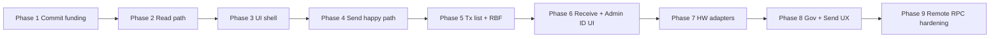

# Admin Wallet (Mini Wallet) — Implementation Plan

Phase 1 delivers **US-H7** — see [`admin-wallet-regtest-commit-funding.md`](./admin-wallet-regtest-commit-funding.md).

## 1. Purpose and scope

The **Admin Wallet** is the signer's BIP-86 Taproot (`m/86'/0'/73'/n/n`) BTC custody layer used for mining-fee inputs, change, and (per PRD §4) Send/Receive. It is distinct from the **Admin ID** (`m/84'/0'/73'/0/0`, P2WPKH), which authenticates to the orchestrator and signs SPS-65 messages and must never sign Bitcoin transactions.

**In scope for this program**

- Authorities: **Strata Administrator** and **Alpen Administrator** only.
- Stack: `bdk_wallet` + **Bitcoin Core–compatible JSON-RPC** (`BITCOIN_RPC_URL`) — referred to below as **chain RPC** (protocol/transport), not “users must run Bitcoin Core.”
- Governance commit/reveal: funding moves to Admin Wallet + BDK; protocol in [`proposal-broadcast-commit-reveal.md`](./proposal-broadcast-commit-reveal.md) unchanged.
- Later: PRD §4 wallet UI (Alta handoff), Send validations, fee-bump, receive rotation, Admin ID display, shared Send UX, direct Trezor/Ledger (no HWI).

**Explicit exclusions (not planned in any phase below)**

- Payout Administrator (`block_payout`, P2TR Admin ID for payout, US-I*, PRD §6).
- HWI (`hwi` CLI, POC-miniwallet HWI integration).
- BDK Electrum (`bdk_electrum`) and standalone Electrum servers.
- Esplora or other indexers in this program.

**External references (visual / POC only — not workspace deps)**

- Alta UI: `miniwallet/Alpen-v0.1-Alta-handoff/Alpen v0.1 - Alta/` — WalletPanel, S9/S11 broadcast UX.
- POC: `miniwallet/poc-miniwallet/frontend` — reference only.

## 2. Traceability

| Phase | Name | Stories / specs |
|---|---|---|
| 1 | Regtest commit funding | US-H7, [`admin-wallet-regtest-commit-funding.md`](./admin-wallet-regtest-commit-funding.md) |
| 2 | Wallet core read path | PRD §4.1–4.2 (balance, UTXOs, addresses) |
| 3 | Wallet UI shell | PRD §4, Alta WalletPanel |
| 4 | Send BTC happy path | PRD §4.3.5 (regtest, dev mnemonic) |
| 5 | Transactions + fee-bump | PRD §4.3.3 (RBF-first) |
| 6 | Receive rotation + Admin ID UI | PRD §4.1–4.2, §4.3.4 |
| 7 | Hardware wallet adapters | PRD §3.2 (Trezor/Ledger PSBT, no HWI) |
| 8 | Shared Send + governance broadcast UX | US-H4, Alta S9/S11, PRD §5.3.2 |
| 9 | Hardening + remote testnet/mainnet RPC | PRD §2 (no local node assumption) |

## 3. Architecture

### Components

```text
React (desktop-app/src)
  └─ IPC invoke (no secrets)
       └─ Tauri admin_wallet module
            ├─ bdk_wallet (descriptors, sync, build, sign)
            ├─ bdk_bitcoind_rpc → chain RPC (BITCOIN_RPC_URL)
            └─ CommitFunding (Phase 1) → WalletService (Phase 4+)
```

- **Secrets and signing** stay in Rust (Tauri). React shows addresses, balances, and confirmation UX only.
- **CommitFunding** (Phase 1): pluggable commit payer — legacy `sendtoaddress` vs BDK Admin Wallet. Evolves into **WalletService** for general Send and governance fee inputs.
- **Reveal** remains operator-key + existing `broadcast_tx` path until a later phase explicitly changes HW signing for reveal.

### Chain RPC end state

| Environment | Chain RPC | Local `bitcoind` |
|---|---|---|
| Dev / CI (today → Phase 1) | `http://127.0.0.1:18443` via `scripts/bitcoind-asm-runner.sh` | Yes, scripts/CI only |
| Production end state (Phase 9) | Remote testnet/mainnet RPC (trusted preset or custom URL per PRD §2) | No product assumption |

**What goes away:** Local full node as a product requirement; server-side `sendtoaddress` on `BITCOIN_WALLET_NAME` for product flows.

**What stays:** A Bitcoin Core–compatible RPC **client** in the app for sync, fee estimates, and broadcast.

### Phase dependency diagram



## 4. Phased plan

### Phase 1 — Regtest commit funding (BDK + chain RPC)

**Goal:** US-H7 — fund governance commit from Admin Wallet on regtest; CI keeps legacy funding.

**In scope**

- Workspace crates: `bdk_wallet`, `bdk_bitcoind_rpc`.
- Descriptors: `tr(m/86'/0'/73'/0/*)` and `tr(m/86'/0'/73'/1/*)` on regtest.
- `CommitFunding` trait: `BitcoindSendToAddress` (default) | `BdkAdminWalletMnemonic`.
- Replace commit `sendtoaddress` only inside `broadcast_commit_then_reveal`; reveal unchanged.
- Env: `COMMIT_FUNDING`, `ADMIN_WALLET_REGTEST_MNEMONIC`, `ALLOW_DEV_MNEMONIC_SIGNING`, regtest guards.
- Minimal broadcast UI: mode, Admin Wallet address, balance.
- Tests: unit derivation; CI default legacy; manual regtest with flag.

**Out of scope**

- Full wallet tabs, Send form, HW commit sign, mainnet/testnet, Electrum/Esplora, Payout.

**Done when**

- With `COMMIT_FUNDING=admin_wallet` on regtest, an approved proposal commit is paid from `m/86'/0'/73'/0/0` and change goes to `…/1/*`; reveal and orchestrator PATCH match US-H6 behavior.
- CI/E2E pass with default legacy funding unchanged.

**Primary code areas**

- `desktop-app/src-tauri/Cargo.toml` — BDK deps
- `desktop-app/src-tauri/src/infrastructure/admin_wallet/`
- `desktop-app/src-tauri/src/application/proposals.rs` — funding hook
- `desktop-app/src/screens/` (broadcast screen) — funding mode + balance
- `docs/specs/admin-wallet-regtest-commit-funding.md`

---

### Phase 2 — Wallet core read path

**Goal:** BDK sync, balance, UTXOs, address list for Admin Wallet without Send UI.

**In scope:** `WalletService` read APIs over IPC; chain RPC sync; external/internal index display.

**Out of scope:** Send, fee-bump, HW signing, governance UX merge.

**Done when:** Signer sees correct balance and funded addresses on regtest via chain RPC.

**Primary code areas:** `admin_wallet` module, IPC commands, thin React hooks.

---

### Phase 3 — Wallet UI shell

**Goal:** Port Alta WalletPanel layout (tabs: Balance, Addresses, Transactions, Receive, Send placeholder).

**In scope:** React structure, routing, empty/loading states; visual parity with `miniwallet/Alpen-v0.1-Alta-handoff/`.

**Out of scope:** Production Send, HW flows, remote mainnet.

**Done when:** Wallet section navigable with read-only data from Phase 2.

**Primary code areas:** `desktop-app/src/screens/wallet/`, shared components.

---

### Phase 4 — Send BTC happy path (regtest, dev mnemonic)

**Goal:** PRD §4.3.5 Send with validations (address network, amount, fee default from chain RPC, change to `…/1/*`).

**In scope:** Build/sign/broadcast via BDK; dev mnemonic on regtest; Confirm gate.

**Out of scope:** Hardware confirm, mainnet, governance-specific Send chrome.

**Done when:** Regtest send succeeds with change to first unused internal index.

**Primary code areas:** `WalletService` send path, Send screen, validation helpers.

---

### Phase 5 — Transactions + fee-bump (RBF-first)

**Goal:** Unconfirmed tx list and fee bump per PRD §4.3.3.

**In scope:** RBF bump via BDK + chain RPC; error surfaces for non-RBF txs.

**Out of scope:** CPFP policy, payout txs.

**Done when:** User can bump an unconfirmed Admin Wallet send on regtest.

**Primary code areas:** tx list IPC, bump command, UI actions.

---

### Phase 6 — Receive rotation + Admin ID UI

**Goal:** PRD §4.1–4.2 Admin ID display/copy; PRD §4.3.4 receive address + QR + one-time-use rotation.

**In scope:** Admin ID `m/84'/0'/73'/0/0` in UI; receive index rotation after credit.

**Out of scope:** HW verify-on-device (Phase 7).

**Done when:** Receive rotates after incoming funds; Admin ID visible per PRD.

**Primary code areas:** wallet Receive tab, settings/header Admin ID.

---

### Phase 7 — Hardware wallet direct adapters (no HWI)

**Goal:** Trezor/Ledger PSBT sign for Admin Wallet paths per PRD §3.2; reuse existing device adapters where possible.

**In scope:** Direct device APIs already in Tauri; PSBT preview on device.

**Out of scope:** HWI CLI, POC Electrum path.

**Done when:** Regtest/testnet send and (optionally) commit can be HW-signed without mnemonic.

**Primary code areas:** `infrastructure/hw_wallet/`, PSBT pipeline in `admin_wallet`.

---

### Phase 8 — Shared Send + governance broadcast UX

**Goal:** US-H4 fee control; Alta S9/S11-style shared Send + governance broadcast screens.

**In scope:** Unified fee entry (0.1 sat/vB steps); pending-quorum “Send” flow per PRD §5.3.2.3; commit funding uses Admin Wallet by default.

**Out of scope:** Payout swimlane.

**Done when:** Governance broadcast and wallet Send share components and validation patterns.

**Primary code areas:** broadcast screen refactor, shared `send/` components.

---

### Phase 9 — Hardening + remote testnet/mainnet RPC

**Goal:** No local node assumption; trusted/custom RPC URLs; production capability flags.

**In scope:** Network presets, TLS/auth for remote RPC, remove dev mnemonics from release builds, deprecate `BITCOIN_WALLET_NAME` for product flows.

**Out of scope:** Electrum/Esplora implementation.

**Done when:** Testnet/mainnet operate against remote chain RPC only; documentation and runbooks updated.

**Primary code areas:** `broadcast_env.rs`, config UI, release CI matrix without bundled bitcoind for app users.

## 5. Current baseline

| Area | Today |
|---|---|
| Governance broadcast | Desktop `broadcast_commit_then_reveal` — commit via `sendtoaddress`, reveal via operator key + `send_raw_transaction` |
| Chain access | `HttpBitcoinRpcClient` in `infrastructure/bitcoin_rpc.rs` |
| Operator / reveal | `OPERATOR_SECRET_KEY_HEX`, `ALLOW_DEV_OPERATOR_KEY` on regtest |
| Admin ID HW | BIP-84 Trezor paths in `hw_wallet/trezor.rs`; frontend `m/84'/0'/73'/0/0` |
| Broadcast UI | `/proposals/:actionId/broadcast`, orchestrator claim + PATCH |
| BDK | Not in workspace yet |
| Product RPC assumption | Local regtest `bitcoind` in scripts; `BITCOIN_WALLET_NAME` for legacy commit funding |

Spec: [`proposal-broadcast-commit-reveal.md`](./proposal-broadcast-commit-reveal.md).

## 6. Configuration

| Variable | Role | Direction |
|---|---|---|
| `BITCOIN_RPC_URL` | Chain RPC base URL | Keep; document as chain RPC, not “Core-only” |
| `BITCOIN_RPC_USER` / `BITCOIN_RPC_PASS` | RPC auth | Keep |
| `BITCOIN_NETWORK` | `regtest` / `testnet` / `mainnet` | Keep |
| `BITCOIN_WALLET_NAME` | Legacy bitcoind wallet for `sendtoaddress` | Deprecate for product flows after Phase 1 migration |
| `COMMIT_FUNDING` | `bitcoind` (default) \| `admin_wallet` | Phase 1+ |
| `ADMIN_WALLET_REGTEST_MNEMONIC` | Dev Admin Wallet seed | Regtest only |
| `ALLOW_DEV_MNEMONIC_SIGNING` | Gate dev signing | Align with existing `dev_secrets.rs` |

Local `bitcoind` remains in `scripts/bitcoind-asm-runner.sh` and CI until Phase 9; end users target remote RPC.

## 7. Risks and future backends

**Remote RPC limits:** Public or shared Bitcoin Core RPC endpoints may rate-limit, lag on descriptor rescans, or lack wallet-related RPCs BDK expects. Phase 9 hardening must validate sync latency and failure modes on testnet before mainnet.

**Future (out of program):** If remote chain RPC cannot support descriptor sync and transaction history at scale, re-evaluate **Esplora** or **Electrum** as a BDK backend in a separate program. Do not implement those backends in the phases above.

## 8. Explicitly not in this program

- Payout Administrator flows (PRD §6, US-I*, Slice 4 payout stories in the story map).
- HWI and POC-miniwallet Electrum integration.
- `bdk_electrum` / standalone Electrum servers.
- Requiring signers to run a local full node in production.
- Changing commit/reveal protocol semantics in [`proposal-broadcast-commit-reveal.md`](./proposal-broadcast-commit-reveal.md) beyond commit **funding source**.
