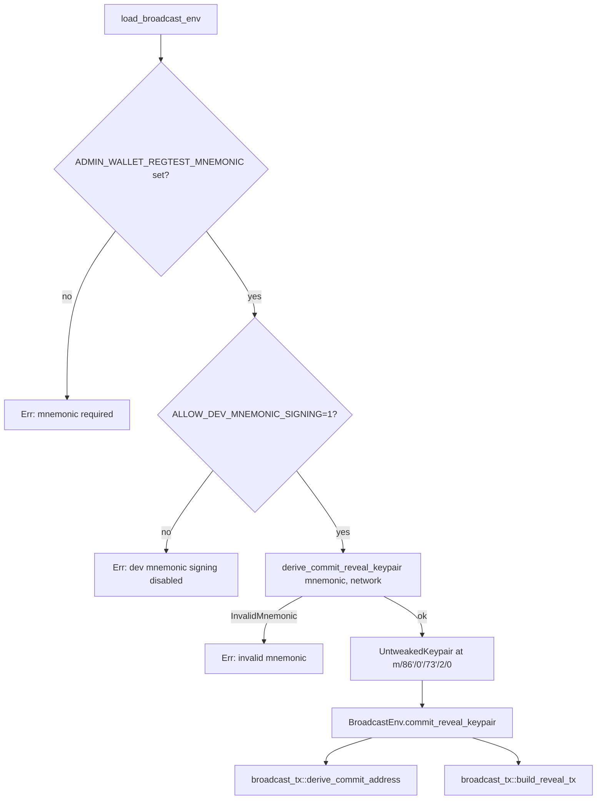

# Spec: Retire operator hot key (interim Admin Wallet derivation)

## Objective

Eliminate `OPERATOR_SECRET_KEY_HEX` and `ALLOW_DEV_OPERATOR_KEY` as parallel secret
material in the desktop process. Derive the SPS-50 commit/reveal **internal key** (an
`UntweakedKeypair` consumed by `broadcast_tx::derive_commit_address` and
`broadcast_tx::build_reveal_tx`) from the Admin Wallet seed at a dedicated
BIP-86 path:

```
m/86'/0'/73'/2/0
```

This consolidates all signing material into a single custody surface (the Admin
Wallet seed), preparing the codebase for Phase 7's hardware-wallet swap with **no
further changes to `broadcast_env` or `broadcast_tx` public API**.

This phase keeps `ADMIN_WALLET_REGTEST_MNEMONIC` as the dev secret source and
keeps `ALLOW_DEV_MNEMONIC_SIGNING` as the single opt-in guard. The well-known
test-key rejection logic is removed — superseded by the mnemonic guard.

## Requirements Alignment

- **PRD §3.2 (HW-mediated signing):** No signing material should live outside
  the Admin Wallet's secret zone. Carrying `OPERATOR_SECRET_KEY_HEX` as a parallel
  hot key indefinitely contradicts that posture. This phase brings the commit
  internal key under the same custody surface; Phase 7 then swaps the producer
  (mnemonic → HW) without further surface changes.
- **`docs/specs/admin-wallet-implementation-plan.md` §Phase 3.5:** Source-of-truth
  for in-scope/out-of-scope, derivation path choice, and "done when" gates. This
  spec is the detailed expansion of that phase.
- **`docs/specs/proposal-broadcast-commit-reveal.md`:** Orchestrator coordination
  and reveal semantics are **unchanged**; only the source of `operator_keypair`
  changes. That spec must be updated post-implementation to document the new key
  source — no behavior change to SPS-50 envelope or threshold validation.

## Scope

### Included

- New derivation helper that produces the SPS-50 commit/reveal `UntweakedKeypair`
  from the Admin Wallet mnemonic at `m/86'/0'/73'/2/0`.
- Rewrite of `broadcast_env::load_broadcast_env` to:
  - Read `ADMIN_WALLET_REGTEST_MNEMONIC` (the Admin Wallet's existing secret source).
  - Enforce the `ALLOW_DEV_MNEMONIC_SIGNING` guard before deriving.
  - Call the new helper to produce the keypair.
- Removal of: `OPERATOR_SECRET_KEY_HEX` parsing, `ALLOW_DEV_OPERATOR_KEY` parsing,
  `WELL_KNOWN_TEST_OPERATOR_KEY_HEX`, `parse_operator_keypair`,
  `reject_well_known_operator_key_unless_dev`, and all their tests.
- Cleanup of every workspace reference to `OPERATOR_SECRET_KEY_HEX` and
  `ALLOW_DEV_OPERATOR_KEY` across code, env files, scripts, CI, runbooks, and
  forward-looking docs.
- Tests: derivation helper unit tests, `load_broadcast_env` regressions, and a
  pinned-address integration test asserting determinism from a fixed mnemonic.

### Not included

- HW PSBT signing for reveal (Phase 7).
- Removal of `ADMIN_WALLET_REGTEST_MNEMONIC` (Phase 9).
- Session-bound wallet mnemonic (Phase 3.7) — the wallet is still loaded from
  env in Phase 3.5.
- Any change to SPS-50/51/65 envelope shape, threshold validation, or the
  orchestrator coordination contract.
- Any UI/UX change. The wallet panel, Send flow, and broadcast screen are
  untouched at the API surface they consume.

## Technical Design

### Derivation path

```
m/86'/0'/73'/2/0
```

Chain `2` is reserved for the SPS-50 commit/reveal internal key, distinct from
the Admin Wallet's existing chains:

- `0/*` — external receive addresses (BDK BIP-86 external descriptor).
- `1/*` — change addresses (BDK BIP-86 internal/change descriptor).
- `2/0` — **new**, single-leaf derivation for the SPS-50 commit/reveal internal key.

This is intentionally a single fixed leaf (`2/0`), not a chain with indices,
because the commit internal key is a stable per-installation signing identity,
not an address ladder.

### Module structure

| File | Responsibility (one sentence) |
| --- | --- |
| `infrastructure/admin_wallet/commit_reveal_key.rs` (**new**) | Derives the SPS-50 commit/reveal internal keypair from the Admin Wallet seed at `m/86'/0'/73'/2/0`. |
| `infrastructure/admin_wallet/mod.rs` (modified) | Re-export the new helper alongside existing wallet primitives. |
| `infrastructure/broadcast_env.rs` (modified) | Loads broadcast configuration from the process environment, sourcing the commit/reveal keypair from the Admin Wallet seed. |
| `infrastructure/broadcast_tx.rs` (**unchanged API**) | Builds commit address and reveal transaction from an `&UntweakedKeypair`. Source of that keypair changes; signature does not. |
| `application/proposals.rs` (**unchanged API**) | Wires `&UntweakedKeypair` from `BroadcastEnv` into `broadcast_commit_then_reveal` / `prepare_broadcast_bundle`. Producer changes; signatures do not. |
| `commands/proposals.rs` (**unchanged API**) | Tauri command surface; no signature changes. Call sites updated to `env.commit_reveal_keypair`. |

**Dependency direction (verified):** `broadcast_env` (infrastructure) depends on
`infrastructure/admin_wallet` (infrastructure). Both are leaf modules within the
infrastructure layer; no inversion is introduced. `application` and `commands`
continue to depend only on `infrastructure`'s public surface, not on the new
internals.

### Production code vs. test helpers

**Production functions (testable, exposed within crate):**

- `infrastructure::admin_wallet::commit_reveal_key::derive_commit_reveal_keypair(mnemonic: &str, network: Network) -> Result<UntweakedKeypair, AdminWalletError>`
- `infrastructure::broadcast_env::load_broadcast_env() -> Result<BroadcastEnv, BroadcastEnvError>` *(typed error — see `BroadcastEnvError` below)*

```rust
// infrastructure/broadcast_env.rs

#[derive(Debug, thiserror::Error)]
pub enum BroadcastEnvError {
    #[error("missing required env var: {0}")]
    MissingEnv(&'static str),
    #[error("invalid Bitcoin network '{0}'; expected bitcoin/testnet/signet/regtest")]
    InvalidNetwork(String),
    #[error("invalid magic bytes hex: {0}")]
    InvalidMagicBytes(String),
    #[error("dev mnemonic signing is disabled (set ALLOW_DEV_MNEMONIC_SIGNING=1 for regtest)")]
    MnemonicSigningDisabled,
    #[error("admin wallet error: {0}")]
    AdminWallet(#[from] AdminWalletError),
}
```

The migration from `Result<_, String>` to this typed enum is in scope for the
same diff. Call sites in `commands/proposals.rs` map `BroadcastEnvError` to
the existing IPC `String` error surface via `to_string()`; no UI contract
changes.

**Test helpers (mandatory `#[cfg(test)]` separation):**

- Canonical BIP-39 test mnemonic
  `"abandon abandon abandon abandon abandon abandon abandon abandon abandon abandon abandon about"`
  — used **only** in `#[cfg(test)]` blocks for the pinned-address regression and
  the derivation happy-path test. Never exposed in production paths, never
  promoted to a `pub` constant, and never registered as a Tauri command.
- `with_env_var(...)` style env scaffolding stays inside
  `#[cfg(test)] mod tests` in `broadcast_env.rs` (existing pattern; retained).

**No Tauri command is introduced for the derivation helper.** It is internal
infrastructure consumed only by `load_broadcast_env`.

### Helper API

```rust
// infrastructure/admin_wallet/commit_reveal_key.rs

/// Derives the SPS-50 commit/reveal internal keypair from the Admin Wallet
/// seed at `m/86'/0'/73'/2/0`.
///
/// The returned `UntweakedKeypair` is consumed directly by
/// `broadcast_tx::derive_commit_address` and `broadcast_tx::build_reveal_tx`.
///
/// # Errors
/// Returns `AdminWalletError::InvalidMnemonic` if `mnemonic` is not a valid
/// BIP-39 phrase. Returns `AdminWalletError::Descriptor` if BIP-32 derivation
/// fails — defensive only; a regression test (case 12) asserts this path is
/// unreachable for the canonical test mnemonic and the fixed derivation path.
pub(crate) fn derive_commit_reveal_keypair(
    mnemonic: &str,
    network: Network,
) -> Result<UntweakedKeypair, AdminWalletError>;
```

Internally it uses the same primitives as `load_admin_wallet`
(`bip39::Mnemonic::parse` → seed → `Xpriv::new_master` → `derive_priv` at
`m/86h/0h/73h/2/0`), but materializes a `bitcoin::secp256k1::SecretKey` and
wraps it in `UntweakedKeypair::from_secret_key`. It does **not** build a BDK
wallet (no descriptor, no chain source) — the commit internal key has no UTXO
lifecycle and never needs balance/transactions.

`pub(crate)` visibility is sufficient: only `broadcast_env` consumes it.

### `BroadcastEnv` changes

The legacy `operator_keypair: UntweakedKeypair` field is **renamed** to
`commit_reveal_keypair: UntweakedKeypair`. The new name self-documents the
SPS-50 commit/reveal internal-key semantics and removes legacy operator-hot-key
baggage at the boundary that Phase 7 will swap to HW. Call-site churn is
limited to `commands/proposals.rs` (two references) and
`application/proposals.rs` (parameter naming only — the function signatures
remain `&UntweakedKeypair`). Documentation across `proposal-broadcast-commit-reveal.md`
is updated to use the new name. All other fields on `BroadcastEnv` are
unchanged. The loader
body changes from:

```text
read OPERATOR_SECRET_KEY_HEX → reject well-known unless dev → parse hex → keypair
```

to:

```text
read ADMIN_WALLET_REGTEST_MNEMONIC
  → enforce ALLOW_DEV_MNEMONIC_SIGNING=1 (typed guard)
  → derive_commit_reveal_keypair(mnemonic, network)
  → keypair
```

All other parsing (BTC RPC URL/user/pass, wallet name, ASM RPC URL, magic
bytes, network, confirm intervals) is preserved unchanged. This is a hard
regression boundary asserted by tests.

### Flow diagram



### Failure modes (all typed, never panic)

| Condition | Error |
| --- | --- |
| `ADMIN_WALLET_REGTEST_MNEMONIC` unset | `load_broadcast_env` returns an error stating the env var is required for broadcast. |
| `ALLOW_DEV_MNEMONIC_SIGNING` unset/false/non-`1` | `load_broadcast_env` returns an error matching the Phase 1 guard contract (`WalletService::check_enabled`). |
| Mnemonic fails BIP-39 parse | `AdminWalletError::InvalidMnemonic(...)` propagated through `load_broadcast_env`. |
| BIP-32 derivation fails (defensive) | `AdminWalletError::Descriptor(...)` propagated. Should not be reachable for valid input. |

No `.unwrap()`, no `.expect()`, no panics in production paths (per
`rust-specialist` rules and `rust-backend-standards`).

### Phase 7 forward-compatibility

`BroadcastEnv.commit_reveal_keypair: UntweakedKeypair` is a **stable abstraction**.
Phase 7 swaps the **producer** (mnemonic → HW signer) without changing:

- The field type on `BroadcastEnv`.
- The `&UntweakedKeypair` argument to `broadcast_commit_then_reveal`,
  `prepare_broadcast_bundle`, `derive_commit_address`, `build_reveal_tx`.
- Any call site in `application/proposals.rs` or `commands/proposals.rs`.

Phase 7's diff is therefore scoped to the producer module
(`commit_reveal_key.rs`) and the env loader.

### Files to update (env-recipe cleanup, full enumeration)

Code / env:

- `desktop-app/src-tauri/src/infrastructure/broadcast_env.rs` — primary rewrite.
- `desktop-app/src-tauri/src/infrastructure/admin_wallet/commit_reveal_key.rs` — new.
- `desktop-app/src-tauri/src/infrastructure/admin_wallet/mod.rs` — re-export.
- `desktop-app/.env.example` — drop `OPERATOR_SECRET_KEY_HEX` and
  `ALLOW_DEV_OPERATOR_KEY` lines.

Forward-looking docs (must be cleaned):

- `docs/specs/proposal-broadcast-commit-reveal.md` — protocol-doc update to cite
  Admin Wallet-derived commit internal key.
- `docs/specs/secret-custody-wave2.md`
- `docs/specs/admin-wallet-regtest-commit-funding.md`
- `docs/security/threat-model.md`
- `docs/operations/runbook.md`
- `desktop-app/e2e-webdriver/README.md`

CI / infra recipes:

- `.github/workflows/*` — every workflow that exports the retired vars.
- `scripts/` — regtest setup/runner scripts.
- `staging/docker-compose.yml`

## Test Cases

Tests target **production functions only** (`derive_commit_reveal_keypair`,
`load_broadcast_env`, and an integration-style test through
`broadcast_tx::derive_commit_address`). Private parsing helpers are not tested
directly — they are covered through the public surface.

### `derive_commit_reveal_keypair`

1. **Happy path — pinned XOnlyPublicKey:** Given the canonical test mnemonic
   `"abandon abandon … about"` and `Network::Regtest`, the derived keypair's
   `XOnlyPublicKey` hex equals a constant pinned in the test. Constant is
   computed once during initial implementation and committed; any future drift
   (BDK version bump, derivation regression) fails this test loudly.
2. **Invalid mnemonic:** Empty string and a malformed phrase both return
   `AdminWalletError::InvalidMnemonic(...)`. No panic.
3. **Network propagation:** Calling the helper with `Network::Bitcoin` versus
   `Network::Regtest` produces **the same secret key bytes** (BIP-86 derivation
   is network-agnostic at the secret level; network only changes address
   encodings downstream). Test asserts this invariant to prevent future
   refactors from silently coupling secret derivation to network.

### `load_broadcast_env`

4. **Happy path:** With all required env vars set
   (`BITCOIN_RPC_URL`, `BITCOIN_RPC_USER`, `BITCOIN_RPC_PASS`,
   `STRATA_ADMIN_STATE_RPC_URL`, `ADMIN_WALLET_REGTEST_MNEMONIC`,
   `ALLOW_DEV_MNEMONIC_SIGNING=1`), returns a `BroadcastEnv` whose
   `operator_keypair` matches `derive_commit_reveal_keypair` output for the
   same mnemonic.
5. **Missing mnemonic:** With `ALLOW_DEV_MNEMONIC_SIGNING=1` but no
   `ADMIN_WALLET_REGTEST_MNEMONIC`, returns a typed error referencing the
   missing env var.
6. **Missing dev guard:** With `ADMIN_WALLET_REGTEST_MNEMONIC` set but
   `ALLOW_DEV_MNEMONIC_SIGNING` unset (and separately, `=0`, `=false`),
   returns a typed error referencing the guard. Matches Phase 1 contract.
7. **Invalid mnemonic:** With the guard on and a malformed mnemonic, the
   `AdminWalletError::InvalidMnemonic` is surfaced through `load_broadcast_env`.
8. **Regression — unrelated parsing preserved:** With all required vars set
   plus optional `BITCOIN_MAGIC_BYTES_HEX` (custom value), `BITCOIN_NETWORK`
   (`signet`), `BITCOIN_WALLET_NAME`, `BROADCAST_CONFIRM_POLL_MS`, and
   `BROADCAST_CONFIRM_TIMEOUT_MS`, the resulting `BroadcastEnv` carries the
   parsed values unchanged. Asserts that this refactor does not regress
   adjacent parsing behavior.
9. **Regression — invalid magic bytes still rejected:** With everything valid
   except `BITCOIN_MAGIC_BYTES_HEX` set to a 3-byte hex, the loader still
   errors. (Defensive: ensures unrelated validations remain wired.)

### Integration — pinned commit address

10. **Deterministic commit address (regression hook):** Wire
    `derive_commit_reveal_keypair(test_mnemonic, Regtest)` into
    `broadcast_tx::derive_commit_address` with a fixed payload (a small,
    explicit byte literal pinned in the test). Assert the resulting commit
    address string equals a constant pinned in the test. Any change to the
    derivation path, payload, BDK/`bitcoin` crate version, or commit-script
    construction trips this test.

### Workspace negative regression

11. **No remaining references to retired vars:** Documented as a "done when"
    gate (CI-grade), not a unit test:
    - `grep -r OPERATOR_SECRET_KEY_HEX` returns zero hits.
    - `grep -r ALLOW_DEV_OPERATOR_KEY` returns zero hits.
    Both excluding historical assessment snapshots (removed when stale).
    Suggested implementation: a short shell guard in the existing
    pre-commit/CI workflow.

### Defensive unreachability

12. **`AdminWalletError::Descriptor` is unreachable for the canonical fixture:**
    Calling `derive_commit_reveal_keypair(TEST_MNEMONIC, Network::Regtest)`
    repeatedly (e.g. 100 iterations) never returns `Descriptor(_)`. This
    guards against silent semantic drift in the BDK / `bitcoin` BIP-32
    derivation path used by the helper: any future failure flips a
    "should-never-happen" branch into an observable error, forcing a
    deliberate spec/code update instead of a silent panic-via-`expect` in
    callers.

### Authority isolation / offline fallback

Not applicable to this phase. No new authority is introduced; the manual
fallback (hex bundle export) defined in
`proposal-broadcast-commit-reveal.md` is unaffected.

## Done when

- `grep -r OPERATOR_SECRET_KEY_HEX` and `grep -r ALLOW_DEV_OPERATOR_KEY` both
  return zero hits across code, env files, runbooks, scripts, CI, and
  forward-looking docs (excluding the immutable adversarial-assessment folders).
- On regtest with `ALLOW_DEV_MNEMONIC_SIGNING=1`, commit and reveal both
  succeed; orchestrator txids and `PATCH` behavior are unchanged from Phase 1/2.
- The commit address for a given proposal is deterministic from
  `ADMIN_WALLET_REGTEST_MNEMONIC` + payload, and the pinned-address test
  passes.
- Phase 1 and Phase 2 regression suites stay green.
- `docs/specs/proposal-broadcast-commit-reveal.md` is updated to reflect the
  Admin Wallet-derived commit internal key.
- Pre-commit CI checklist passes per `CLAUDE.md`:
  - `cargo fmt --check`
  - `cargo clippy --workspace --all-targets -- -D warnings`
  - `cargo test --workspace`
  - `cd desktop-app && npm run format:check && npm run lint && npm run build`

## Decisions (resolved before implementation)

1. **Field rename `operator_keypair` → `commit_reveal_keypair`: ACCEPTED.**
   The new name self-documents the SPS-50 commit/reveal internal-key semantics
   and removes legacy operator-hot-key vocabulary at the boundary that Phase 7
   will swap to HW. Call-site churn is small (two refs in
   `commands/proposals.rs`, parameter naming in `application/proposals.rs`)
   and the readability gain is permanent.
2. **Typed error enum `BroadcastEnvError`: ACCEPTED, in same diff.**
   The legacy `Result<_, String>` is migrated to a `thiserror`-derived enum
   (see `BroadcastEnv changes` above) aligning with `rust-specialist`
   conventions. The IPC `String` surface is preserved via `to_string()` at the
   `commands/proposals.rs` boundary; no UI contract changes.

## Risks / Notes

- **Breaking change on regtest:** Commit addresses change because the internal
  key source changes. Regtest state is ephemeral; reset E2E fixtures and call
  this out in the PR description. No mainnet/testnet on-chain consequence
  exists (no live state yet).
- **Deterministic-address regression hook:** Test case 10 pins the derived
  commit address. This is the long-term regression line against silent
  derivation drift (BDK version bumps, `bitcoin` crate updates, accidental
  path changes). Treat any future failure as a load-bearing red flag, not a
  test to "fix" by re-pinning.
- **Phase 7 forward-compat:** `BroadcastEnv.commit_reveal_keypair` is the
  stable abstraction across the mnemonic-to-HW transition. Phase 7 must not
  alter the field's type or downstream signatures. If it must, this contract
  has been violated and the Phase 7 spec should call that out explicitly.
- **Phase 7 forward-compat:** `BroadcastEnv.commit_reveal_keypair` is the
  secret source for all signing material in the desktop process
  (`ADMIN_WALLET_REGTEST_MNEMONIC`). The previous failure mode — two unrelated
  hot keys drifting between env recipes — is structurally impossible. Phase 3.7
  will then bind this single source to the login session, and Phase 7 will
  swap it for HW. Each step preserves the "one custody surface" invariant.
- **Earned Trust on derivation:** The pinned-address test (case 10) is the
  empirical probe that the derivation we ship actually produces the bytes we
  designed for, in the environment where it runs. Without it, the helper is
  an assertion of intent, not a contract.
